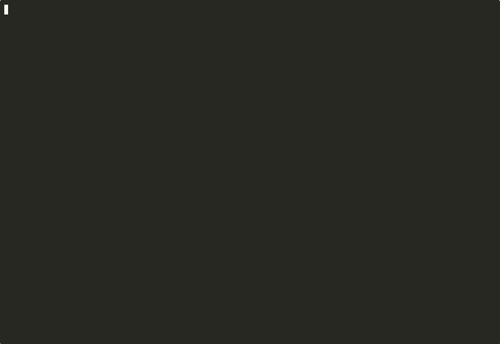
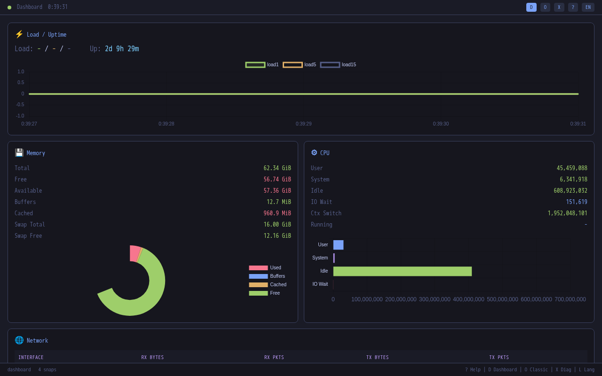

# syslenz

[](https://github.com/opaopa6969/syslenz/actions/workflows/ci.yml)
[](https://crates.io/crates/syslenz)
[](LICENSE)

> **Wireshark for /proc**



Zero config. One binary. Every Linux metric as structured, typed data.

## Why syslenz?

### For the SRE: instant deep-dive on any host

SSH in, run `syslenz`, see everything. No agents, no config, no setup. Export JSON, diff between hosts, pipe to `jq`, feed to CI. 50+ data sources out of the box.

### For the learner: a Linux internals textbook you can browse

Every field has a human-readable description at 4 detail levels. Press `?` to cycle through them. The Category Guide connects sources into narratives like "Where did all my RAM go?" and "The Life of a Packet."

### For the security auditor: compliance-ready snapshots

Capture full system state as JSON, compare across hosts, track changes over time. Kernel modules, open connections, cgroup policies, mounted filesystems -- all in one export. See [Audit Examples](docs/audit-examples.md).

## Screenshots

| Dashboard | Classic Detail | Diff View |
|-----------|---------------|-----------|
|  |  |  |

| Diagnostics | Category Guide | Web UI |
|-------------|---------------|--------|
|  |  |  |

> To capture TUI screenshots, run `scripts/capture-screenshots.sh`. To record the demo GIF, run `scripts/record-demo.sh`.

## Install

```bash
# From crates.io
cargo install syslenz

# From source
git clone https://github.com/opaopa6969/syslenz.git
cd syslenz
cargo install --path .

# With optional features
cargo install --path . --features "otel,web"

# Docker (server mode)
docker run --rm -p 9100:9100 --pid=host syslenz --serve
syslenz --connect localhost:9100

# Docker (Web UI)
docker compose --profile web up -d
# Open http://localhost:3000

# Binary releases
# See https://github.com/opaopa6969/syslenz/releases
```

## Quick Start

```bash
# Launch the TUI (Dashboard is the default view)
syslenz

# Navigate: j/k to move, Enter to drill in, Backspace to go back
# Press ? to toggle help descriptions (OFF -> NORMAL -> DETAILED -> EXTRA)
# Press d for diff view, g for graph, X for diagnostics, C for category guide
# Press q to quit

# Export a snapshot to JSON
syslenz --export snapshot.json

# Compare two hosts
syslenz --export host-a.json       # on host A
syslenz --export host-b.json       # on host B
diff <(jq . host-a.json) <(jq . host-b.json)

# Monitor a remote host via SSH
syslenz --ssh user@server

# Monitor inside a Docker container
syslenz --docker my-container

# Start the Web UI
syslenz --web 3000

# Export metrics to Prometheus
syslenz --prometheus 9101

# Export metrics via OpenTelemetry
cargo build --features otel
syslenz --otel http://localhost:4317
```

## Configuration

```toml
# ~/.config/syslenz/config.toml

[general]
lang = "en"                 # "en" or "ja"
interval_ms = 1000          # Auto-refresh interval
default_view = "dashboard"  # "dashboard" or "classic"

[web]
port = 3000

[otel]
endpoint = "http://localhost:4317"
interval_secs = 5

[ssh]
hosts = ["user@server1", "user@server2"]

[[alert]]
source = "meminfo"
field = "MemAvailable"
condition = "< 500000000"
severity = "critical"
message = "Memory critically low"
```

CLI flags override config values. See `docs/en/config.md` for the full reference.

## Key CLI Flags

| Flag | Description |
|------|-------------|
| `--classic` | Classic sidebar mode (instead of Dashboard) |
| `--lang ja` | Japanese UI |
| `--ssh user@host` | Remote monitoring via SSH |
| `--docker container` | Docker container monitoring |
| `--serve 0.0.0.0:9100` | TCP server mode |
| `--connect host:9100` | Connect to TCP server |
| `--web 3000` | Web UI on port 3000 |
| `--export file.json` | Export snapshot as JSON |
| `--import file.json` | Replay mode from snapshot |
| `--otel endpoint` | OpenTelemetry export (requires `otel` feature) |
| `--prometheus [port]` | Prometheus /metrics endpoint |
| `--widget` | X11 floating widget (requires `x11widget` feature) |

## Data Sources (50+)

<details>
<summary><strong>/proc (43 sources -- Linux)</strong></summary>

| Category | Sources |
|----------|---------|
| System | uptime, loadavg, version, cmdline, modules, filesystems, devices, consoles, misc, dma |
| Memory | meminfo, vmstat, zoneinfo, buddyinfo, slabinfo, pagetypeinfo, swaps |
| CPU | cpuinfo, stat, interrupts, softirqs, schedstat, timer_list, pressure |
| Storage | mounts, partitions, diskstats, locks |
| Network | net/dev, net/tcp, net/udp, net/unix, net/arp, net/route, net/sockstat, net/snmp, net/netstat, net/wireless |
| Security | crypto, cgroups, iomem, ioports |
| Processes | processes (all PIDs with name, state, RSS, threads, UID) |

</details>

<details>
<summary><strong>/sys (3 sources)</strong></summary>

| Source | Description |
|--------|-------------|
| df | Filesystem disk space usage (via statfs) |
| thermal | CPU/GPU temperature from thermal zones |
| file-nr | System-wide file descriptor usage |

</details>

<details>
<summary><strong>Network Deep-Dive (5 sources)</strong></summary>

| Source | Description |
|--------|-------------|
| ip/route | Full routing table with metrics and default gateway |
| ip/neighbor | ARP/NDP cache with reachability state |
| ss | Socket statistics (TCP established, TIME_WAIT, orphaned) |
| dns | DNS configuration + resolution speed test |
| conntrack | Connection tracking table usage |

</details>

<details>
<summary><strong>Plugins (unlimited)</strong></summary>

Drop any executable in `~/.config/syslenz/plugins/`. It outputs JSON to stdout, syslenz picks it up.

Example plugins included: **JVM** (jstat), **Docker** (container stats).

See `plugins/examples/` for details.

</details>

<details>
<summary><strong>Cross-Platform</strong></summary>

| Platform | Sources | Method |
|----------|---------|--------|
| Linux | 51+ | /proc + /sys + commands |
| macOS | 24 | sysctl + vm_stat + system commands |
| Windows | 24 | PowerShell + WMI |

</details>

## TUI Views and Keybindings

| Key | View | Description |
|-----|------|-------------|
| `D` | Dashboard | System overview: load, memory, CPU, network |
| `O` | Classic | Sidebar + detail (traditional mode) |
| `W` | Welcome | Keybinding reference |
| `X` | Diagnostics | Auto-detected issues with suggestions |
| `C` | Category Guide | Educational content by topic |

| Key | Action |
|-----|--------|
| `j`/`k` | Navigate sources / fields |
| `Enter` / `Backspace` | Drill in / go back |
| `Tab` | Toggle sidebar / content focus |
| `/` | Search sources |
| `d` | Diff view |
| `g` | Graph (sparkline) |
| `?` | Cycle help level (OFF / NORMAL / DETAILED / EXTRA) |
| `L` | Toggle language (EN/JA) |
| `c` | Copy to clipboard |
| `e` | Export snapshot to JSON |
| `a` | Toggle auto-refresh |
| `r` | Manual refresh |
| `q` | Quit |

## Auto-Diagnostics

Automatically detects 25+ patterns including:

- Memory pressure, swap exhaustion, OOM kills
- CPU overload, load spikes, pressure stalls
- Disk usage, temperature warnings
- Network: SYN flood, CLOSE_WAIT leak, TIME_WAIT excess, orphaned TCP
- Zombie processes, D-state stuck processes
- File descriptor exhaustion, DNS misconfiguration, conntrack overflow

Press `X` in the TUI to see all active diagnostics with severity and suggested actions.

## Architecture

```
CLI args / config.toml
        |
        v
    +--------+       +----------+       +-----------+
    | main() | ----> | Snapshot  | ----> | TUI / Web |
    +--------+       | .capture()| <---- | render()  |
        |            +----------+       +-----------+
        |                 |
        v                 v
   +---------+     +------------+
   | Remote  |     | Parsers    |
   | (SSH /  |     | /proc (43) |
   |  Docker |     | /sys  (3)  |
   |  TCP)   |     | net   (5)  |
   +---------+     | plugins    |
                   +------------+
                         |
                         v
                 +---------------+
                 | Export        |
                 | JSON / OTEL  |
                 | Prometheus   |
                 +---------------+
```

Each parser reads a `/proc` or `/sys` file and returns a `Vec<Field>` with typed values (`Bytes`, `Integer`, `Float`, `Duration`, `Text`, `Table`). The `Snapshot` struct collects all parser outputs into a single point-in-time capture. The TUI and Web UI render from shared `ViewData` structs. The diff engine compares two snapshots with type-aware thresholds.

## Documentation

- [English docs](docs/en/index.md)
- [Japanese docs](docs/ja/index.md)
- [OpenTelemetry / Prometheus](docs/opentelemetry.md)
- [Audit Examples](docs/audit-examples.md)

## Verifying Downloads

Each release includes SHA256 checksums for all binaries. After downloading:

```bash
# Verify a single file
sha256sum -c syslenz-linux-x86_64.tar.gz.sha256

# Or verify all files at once using the consolidated checksums file
sha256sum -c checksums.txt

# On macOS, use shasum instead
shasum -a 256 -c syslenz-macos-aarch64.tar.gz.sha256
```

## Contributing

1. Fork the repository
2. Create a feature branch: `git checkout -b my-feature`
3. Make your changes and add tests
4. Run checks: `cargo fmt --check && cargo clippy && cargo test`
5. Submit a pull request

### Development setup

```bash
git clone https://github.com/opaopa6969/syslenz.git
cd syslenz
cargo build
cargo test
cargo run
```

### Feature flags

| Feature | Description | Build command |
|---------|-------------|---------------|
| `otel` | OpenTelemetry OTLP export | `cargo build --features otel` |
| `web` | Web UI with Chart.js | `cargo build --features web` |
| `x11widget` | X11 floating widget | `cargo build --features x11widget` |

### Releasing a new version

1. Update `version` in `Cargo.toml`
2. Add a changelog entry in `CHANGELOG.md` under `## [x.y.z] - YYYY-MM-DD`
3. Commit, tag, and push:
   ```bash
   git commit -am "Release vX.Y.Z"
   git tag vX.Y.Z
   git push && git push --tags
   ```
4. The release workflow automatically:
   - Validates the CHANGELOG entry exists
   - Builds binaries for Linux (x86_64, aarch64, musl), macOS (x86_64, aarch64), and Windows
   - Generates SHA256 checksums
   - Creates a GitHub Release with all assets
   - Publishes to [crates.io](https://crates.io/crates/syslenz)

### Publishing to crates.io

Publishing happens automatically via the release workflow. To set up the required secret:

1. Generate a token at https://crates.io/settings/tokens
2. Add it as `CARGO_REGISTRY_TOKEN` in your repository's Settings > Secrets and variables > Actions

To test packaging locally:

```bash
# Check what files will be included
cargo package --list

# Dry-run publish (does not actually upload)
cargo publish --dry-run
```

## License

MIT

---

v1.3.0 | [Changelog](CHANGELOG.md) | [GitHub](https://github.com/opaopa6969/syslenz)
