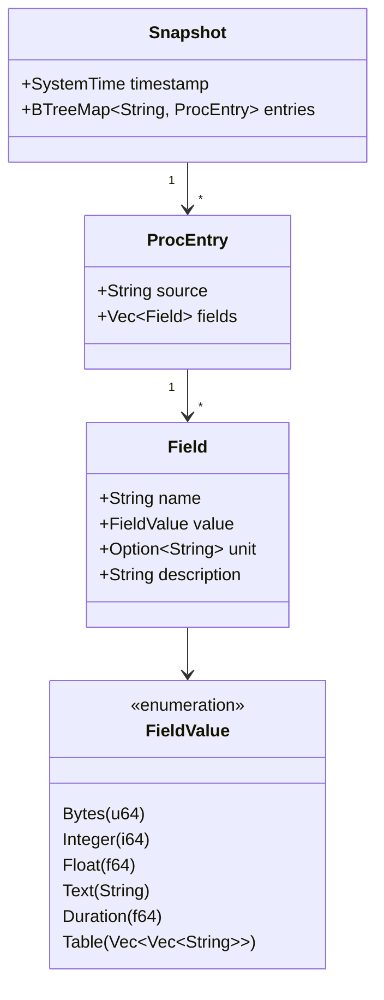
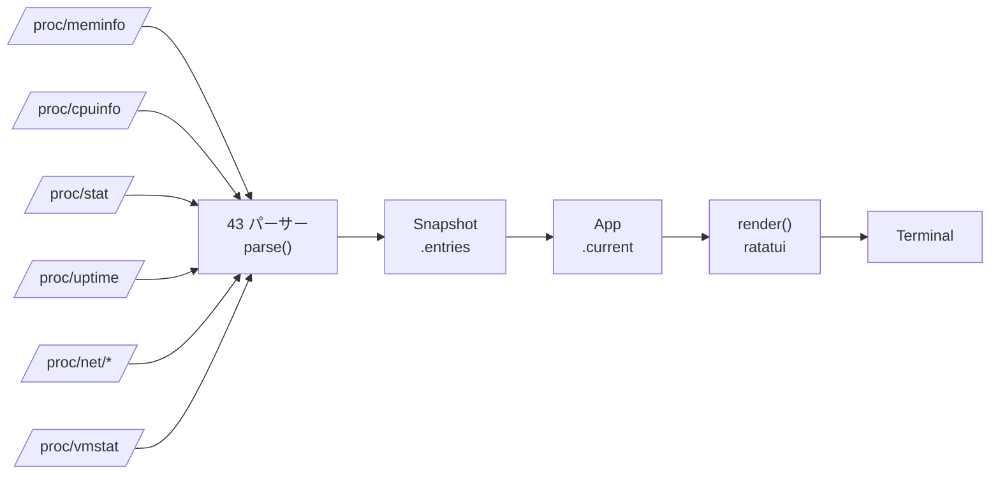
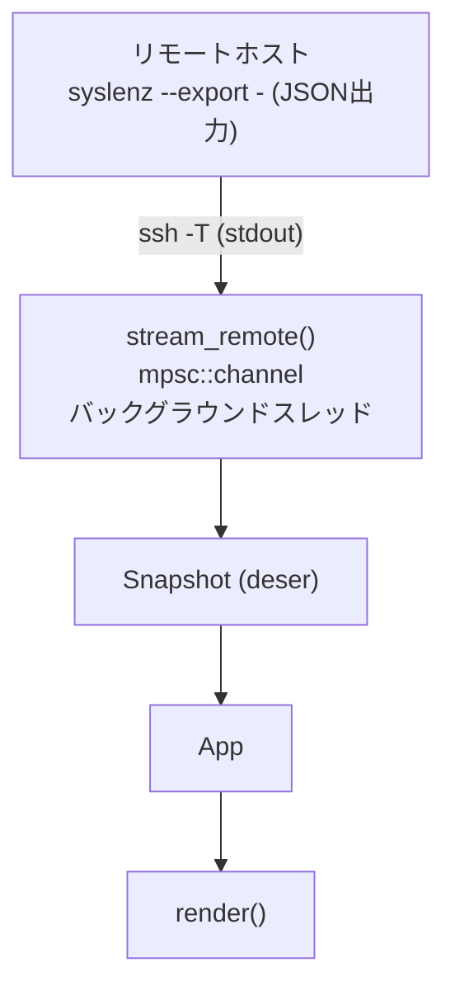
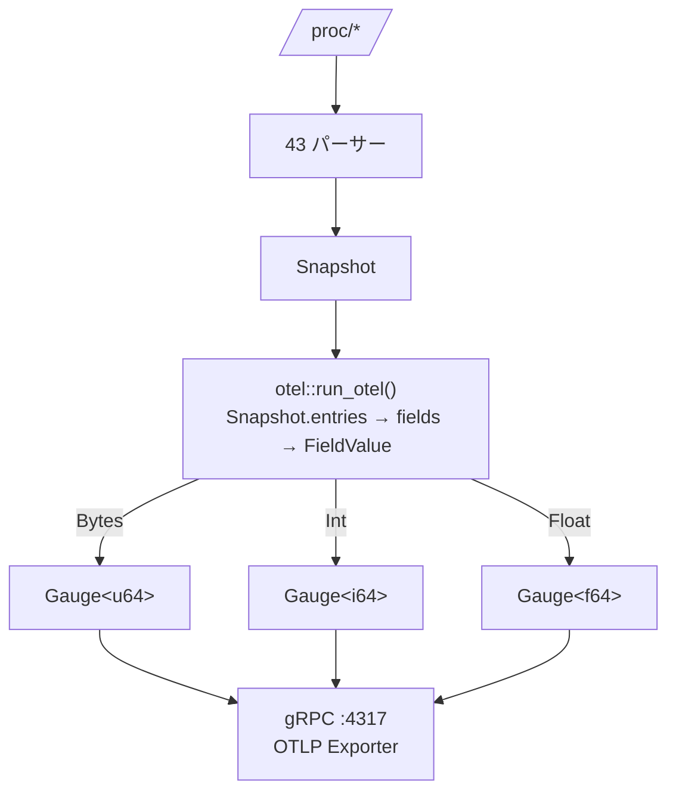
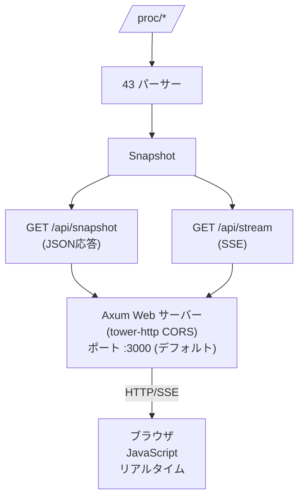
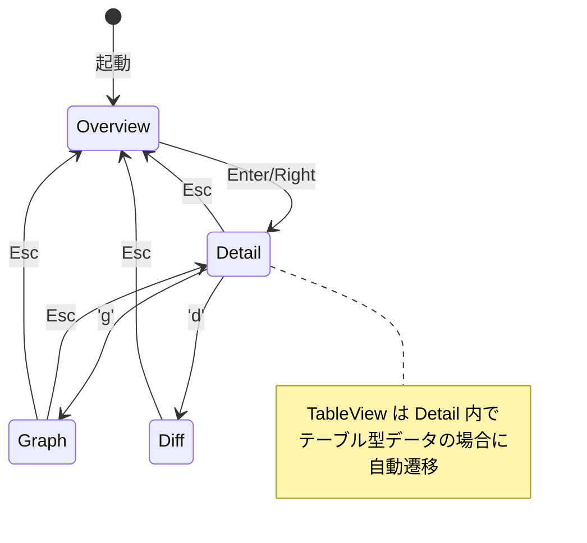
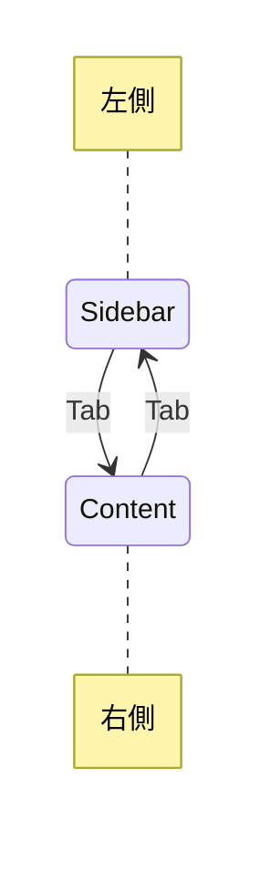
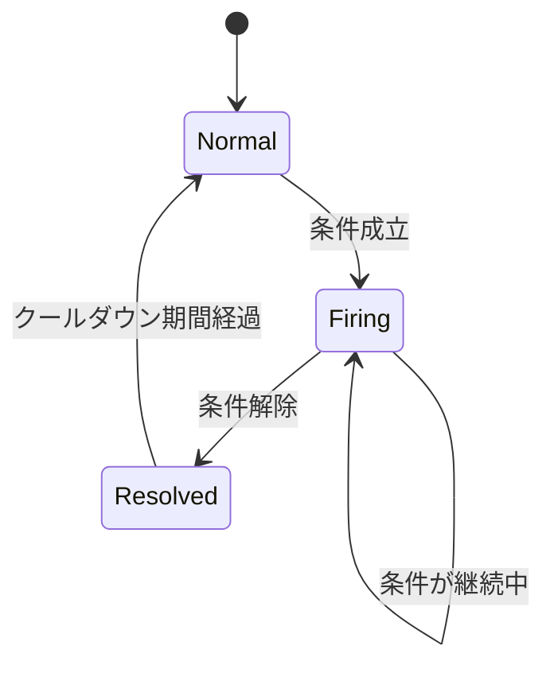
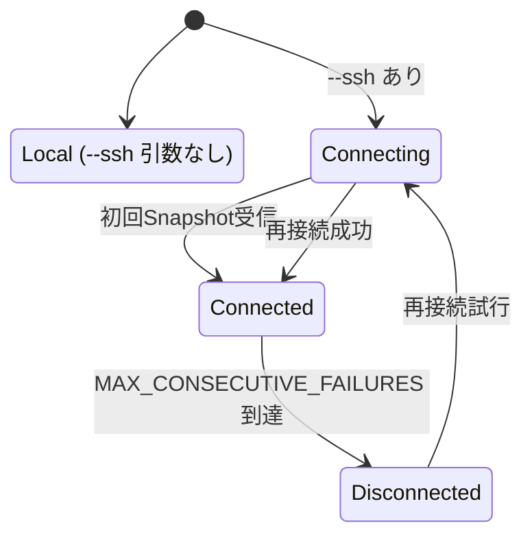
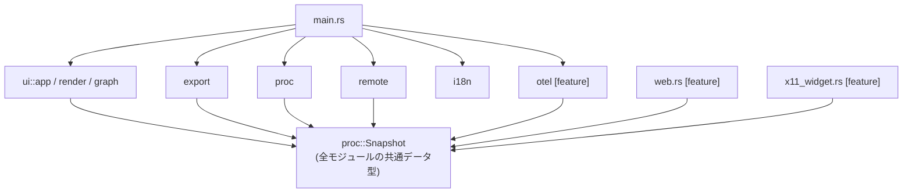

# syslenz アーキテクチャドキュメント

DGEセッションに基づくアーキテクチャ設計書。
Linux /proc ファイルを解析する Rust TUI ツール。

---

## 1. 現在のアーキテクチャ

### モジュール構成

```
syslenz/
├── src/
│   ├── main.rs            CLI引数解析 + TUIイベントループ
│   ├── proc/
│   │   ├── mod.rs          コア型定義 (Snapshot, ProcEntry, Field, FieldValue)
│   │   │                   + Snapshot::capture() + diff_snapshots()
│   │   ├── meminfo.rs      /proc/meminfo パーサー
│   │   ├── cpuinfo.rs      /proc/cpuinfo パーサー
│   │   ├── stat.rs         /proc/stat パーサー
│   │   ├── uptime.rs       /proc/uptime パーサー
│   │   ├── loadavg.rs      /proc/loadavg パーサー
│   │   ├── version.rs      /proc/version パーサー
│   │   ├── mounts.rs       /proc/mounts パーサー
│   │   ├── partitions.rs   /proc/partitions パーサー
│   │   ├── net_dev.rs      /proc/net/dev パーサー
│   │   ├── diskstats.rs    /proc/diskstats パーサー
│   │   ├── processes.rs    /proc/[pid] パーサー
│   │   ├── swaps.rs        /proc/swaps パーサー
│   │   ├── buddyinfo.rs    /proc/buddyinfo パーサー
│   │   ├── cgroups.rs      /proc/cgroups パーサー
│   │   ├── cmdline.rs      /proc/cmdline パーサー
│   │   ├── consoles.rs     /proc/consoles パーサー
│   │   ├── crypto.rs       /proc/crypto パーサー
│   │   ├── devices.rs      /proc/devices パーサー
│   │   ├── filesystems.rs  /proc/filesystems パーサー
│   │   ├── interrupts.rs   /proc/interrupts パーサー
│   │   ├── iomem.rs        /proc/iomem パーサー
│   │   ├── ioports.rs      /proc/ioports パーサー
│   │   ├── locks.rs        /proc/locks パーサー
│   │   ├── modules.rs      /proc/modules パーサー
│   │   ├── vmstat.rs       /proc/vmstat パーサー
│   │   ├── zoneinfo.rs     /proc/zoneinfo パーサー
│   │   ├── softirqs.rs     /proc/softirqs パーサー
│   │   ├── misc.rs         /proc/misc パーサー
│   │   ├── pressure.rs     /proc/pressure パーサー (PSI)
│   │   ├── net_tcp.rs      /proc/net/tcp パーサー
│   │   ├── net_udp.rs      /proc/net/udp パーサー
│   │   ├── net_unix.rs     /proc/net/unix パーサー
│   │   ├── net_arp.rs      /proc/net/arp パーサー
│   │   ├── net_route.rs    /proc/net/route パーサー
│   │   ├── net_sockstat.rs /proc/net/sockstat パーサー
│   │   ├── net_snmp.rs     /proc/net/snmp パーサー
│   │   ├── net_netstat.rs  /proc/net/netstat パーサー
│   │   ├── net_wireless.rs /proc/net/wireless パーサー
│   │   ├── slabinfo.rs     /proc/slabinfo パーサー
│   │   ├── pagetypeinfo.rs /proc/pagetypeinfo パーサー
│   │   ├── schedstat.rs    /proc/schedstat パーサー
│   │   ├── dma.rs          /proc/dma パーサー
│   │   ├── timer_list.rs   /proc/timer_list パーサー
│   │   ├── platform_macos.rs   macOS対応 (sysctl, vm_stat等)
│   │   └── platform_windows.rs Windows対応 (PowerShell, WMI)
│   ├── ui/
│   │   ├── mod.rs          UIモジュール公開
│   │   ├── app.rs          App状態 + ナビゲーションロジック
│   │   ├── render.rs       ratatuiによるTUI描画
│   │   └── graph.rs        スパークライン可視化
│   ├── export.rs           JSON import/export
│   ├── remote.rs           SSH経由リモートキャプチャ
│   ├── i18n.rs             国際化 (en/ja)
│   ├── otel.rs             OpenTelemetryエクスポート [feature: otel]
│   ├── web.rs              Axum WebUI [feature: web]
│   └── x11_widget.rs       X11フローティングウィジェット [feature: x11widget]
├── Cargo.toml
└── Cargo.lock
```

### データ型階層



### App 状態構造

| フィールド | 型 | 説明 |
|---|---|---|
| `snapshots` | `Vec<Snapshot>` | 履歴 |
| `current` | `Snapshot` | 現在のスナップショット |
| `diffs` | `Vec<DiffItem>` | 前回との差分 |
| `view` | `View` | 現在のビュー |
| `focus` | `Focus` | フォーカス位置 |
| `selected_source` / `selected_field` | | 選択状態 |
| `sidebar_scroll` / `field_scroll` / `table_scroll` | | スクロール位置 |
| `search_query` / `searching` / `filtered_keys` | | 検索状態 |
| `graph_field` | | グラフ表示対象 |
| `remote_host` / `remote_rx` | | リモート接続状態 |
| `locale` | `Locale` | 言語設定 |
| `auto_refresh` / `refresh_interval_ms` | | 自動更新設定 |
| `status_message` | | ステータスバーメッセージ |

---

## 2. 目標アーキテクチャ

DGE実装後の構造変更。

### 新規モジュール

```
syslenz/
├── src/
│   ├── config.rs     <<NEW>>  設定読み込み (XDG, TOML)
│   ├── alert.rs      <<NEW>>  アラート評価 + 状態マシン
│   ├── proc/
│   │   └── (各パーサーに parse_content() 追加)
│   └── ui/
│       └── app.rs    (HostState 抽出)
├── tests/            <<NEW>>  テストインフラ
│   ├── parser_tests.rs
│   ├── export_tests.rs
│   └── fixtures/
└── ...
```

### 主要な構造変更

#### 2.1 HostState の分離 (マルチホスト対応)

変更前:

```rust
App {
    current: Snapshot,
    snapshots: Vec<Snapshot>,
    remote_host: Option<String>,
    remote_rx: Option<Receiver<Snapshot>>,
    // ...UIの状態...
}
```

変更後:

```rust
HostState {
    label: String,              // "localhost" | "user@server1"
    current: Snapshot,
    history: Vec<Snapshot>,
    connection: ConnectionState,
    rx: Option<Receiver<Snapshot>>,
}

App {
    hosts: Vec<HostState>,      // 全ホスト
    active_host: usize,         // アクティブなホストのインデックス
    alerts: Vec<AlertState>,    // アラート状態
    config: Config,             // TOML設定
    // ...UIの状態...
}
```

#### 2.2 パーサーの parse_content() 分離

変更前 (各パーサー):

```rust
pub fn parse() -> Result<ProcEntry> {
    let content = std::fs::read_to_string("/proc/meminfo")?;
    // パース処理 ...
}
```

変更後:

```rust
pub fn parse() -> Result<ProcEntry> {
    let content = std::fs::read_to_string("/proc/meminfo")?;
    parse_content(&content)
}

pub fn parse_content(content: &str) -> Result<ProcEntry> {
    // パース処理 (純粋関数、テスト可能)
}
```

全43パーサーに適用。これによりファイルI/Oなしでユニットテスト可能になる。

#### 2.3 設定優先チェーン

```
  優先度: CLI引数 > 環境変数 > TOMLファイル > デフォルト値

  設定ファイルパス:
    $XDG_CONFIG_HOME/syslenz/config.toml
    ~/.config/syslenz/config.toml (フォールバック)

  TOMLの構造例:
    [general]
    locale = "ja"
    refresh_interval_ms = 1000

    [[hosts]]
    label = "web-server"
    ssh = "user@192.168.1.10"

    [[alerts]]
    name = "high-memory"
    source = "meminfo"
    field = "MemAvailable"
    condition = "< 512MB"
```

---

## 3. データフロー図

### 3.1 ローカルモード



### 3.2 SSHモード



### 3.3 マルチホストモード (目標)

```mermaid
flowchart LR
    L[localhost] --> LP["parse()"] --> LS[Snapshot]
    S1[user@srv1] --> S1P[ssh] --> S1J[JSON] --> S1S[Snapshot]
    S2[user@srv2] --> S2P[ssh] --> S2J[JSON] --> S2S[Snapshot]
    LS --> Hosts["hosts: Vec&lt;HostState&gt;"]
    S1S --> Hosts
    S2S --> Hosts
    Hosts --> Active["active_host = N"]
    Active --> Render["render()<br/>ホスト切替 / タブ表示"]
```

### 3.4 OTELモード



### 3.5 Webモード



---

## 4. 状態管理

### 4.1 View 状態遷移



### 4.2 Focus 状態



### 4.3 アラート状態マシン (目標)



遷移条件:

| From → To | 条件 |
|---|---|
| Normal → Firing | `eval(field, condition) == true` |
| Firing → Firing | `eval() == true` (継続) |
| Firing → Resolved | `eval() == false` |
| Resolved → Normal | cooldown タイマー満了 |

### 4.4 接続状態マシン (目標)



---

## 5. Feature フラグ構成

### フラグ一覧

| Feature | 追加される依存関係 |
|---|---|
| `(default)` | `ratatui`, `crossterm`, `serde`, `serde_json`, `toml`, `anyhow` |
| `otel` | `opentelemetry`, `opentelemetry_sdk`, `opentelemetry-otlp`, `tokio` |
| `web` | `axum`, `tokio`, `tower-http`, `tokio-stream` |
| `x11widget` | `x11rb` |

### コンパイル時ゲート構造

```
  main.rs:
    mod otel;                         // 常にコンパイル (内部で #[cfg] ガード)
    #[cfg(feature = "web")]
    mod web;                          // web feature のみ
    #[cfg(feature = "x11widget")]
    mod x11_widget;                   // x11widget feature のみ

  otel.rs:
    #[cfg(feature = "otel")]   → 実装
    #[cfg(not(feature = "otel"))] → スタブ (エラーメッセージ返却)

  ビルドコマンド:
    cargo build                       # デフォルト (TUIのみ)
    cargo build --features otel       # OTEL対応
    cargo build --features web        # Web UI対応
    cargo build --features x11widget  # X11ウィジェット対応
    cargo build --all-features        # 全機能
```

### 共有依存関係

```
  otel と web は tokio を共有:
    otel  ──> tokio (rt-tokio 経由で必要)
    web   ──> tokio (axum の非同期ランタイム)

  Cargo.toml で optional 共有:
    tokio = { version = "1", optional = true, features = ["full"] }
```

---

## 6. クロスプラットフォーム戦略

### プラットフォーム別データソース

| Platform | データソース | パーサー数 |
|---|---|---|
| Linux | `/proc/*` ファイル | 43 パーサー |
| macOS | `sysctl`, `vm_stat`, `system_profiler`, `df`, `ps` 等 | 9 ソース |
| Windows | `PowerShell`, `WMI (Get-CimInstance)`, `systeminfo` | 7 ソース |

### コンパイル時分岐

```
  proc/mod.rs:
    #[cfg(target_os = "linux")]
    pub mod meminfo;          // 43個の Linux パーサー
    ...

    #[cfg(target_os = "macos")]
    pub mod platform_macos;   // macOS 統合パーサー

    #[cfg(target_os = "windows")]
    pub mod platform_windows; // Windows 統合パーサー

  Snapshot::capture():
    #[cfg(target_os = "linux")]   → 43パーサー個別呼び出し
    #[cfg(target_os = "macos")]   → platform_macos::capture()
    #[cfg(target_os = "windows")] → platform_windows::capture()
```

### 統一インターフェース

```
  全プラットフォームで同じ型を返す:

    Snapshot {
        timestamp: SystemTime,
        entries: BTreeMap<String, ProcEntry>,
    }

  → UI層・export層・otel層はプラットフォームを意識しない
  → SSH経由なら異種OS間でもSnapshotを交換可能
```

---

## 7. テストアーキテクチャ

### テスト戦略

| レイヤー | テスト内容 |
|---|---|
| ユニットテスト (純粋関数) | `format_bytes()`, `format_duration()`, `diff_snapshots()`, `i18n::Locale::from_str()`, `FieldValue::display()` |
| パーサーテスト (フィクスチャ文字列) | `parse_content(&str)` × 43パーサー、正常系 + エッジケース + 空入力 |
| エクスポートテスト | `export → import` ラウンドトリップ、JSON互換性 |
| スモークテスト (Linux限定) | `Snapshot::capture()` がパニックしない、`App::new()` が正常に初期化される |
| リモートテスト | `capture_remote()` 無効ホストでエラー (既存テスト) |

### パーサーテストのパターン

```rust
// tests/parser_tests.rs (目標パターン)

#[test]
fn test_meminfo_parse_content() {
    let content = "\
MemTotal:        8000000 kB
MemFree:         2000000 kB
MemAvailable:    4000000 kB
";
    let entry = meminfo::parse_content(content).unwrap();
    assert_eq!(entry.fields.len(), 3);
    assert!(matches!(entry.fields[0].value, FieldValue::Bytes(8192000000)));
}
```

### CIマトリクス

| ジョブ | features | 検証内容 |
|---|---|---|
| default | (なし) | コア機能 |
| otel | `--features otel` | OTEL コンパイル |
| web | `--features web` | Web UI コンパイル |
| x11widget | `--features x11..` | X11 コンパイル |
| all-features | `--all-features` | 全機能結合 |
| clippy | `--all-features` | lint |
| fmt | - | フォーマットチェック |

OS マトリクス:

| OS | テスト範囲 |
|---|---|
| Linux | 全テスト実行 (43パーサー + スモーク) |
| macOS | platform_macos テストのみ |
| Windows | platform_windows テストのみ |

---

## 8. 依存関係図

### モジュール間依存関係



### 詳細依存マトリクス

```
  ───────────> は「依存している」を意味する

  main.rs ──────> proc, ui::app, ui::render, export, remote, i18n, otel
                  [条件付き] web, x11_widget

  ui::app ──────> proc (Snapshot, DiffItem, FieldValue, diff_snapshots)
                  i18n (Locale)
                  remote (stream_remote 経由の Receiver)

  ui::render ───> ui::app (App, View, Focus)
                  ui::graph (sparkline)
                  i18n (ラベル翻訳)
                  proc (FieldValue, DiffItem)

  ui::graph ────> proc (FieldValue)

  export ───────> proc (Snapshot)

  remote ───────> proc (Snapshot)

  otel ─────────> proc (Snapshot, FieldValue)

  web ──────────> proc (Snapshot)
                  i18n (Locale)

  x11_widget ──> proc (Snapshot)

  i18n ─────────> (依存なし、自己完結)

  proc::* ──────> (外部依存なし、std のみ使用)
```

### 外部クレート依存

```
  コア (常に含まれる):
    syslenz
    ├── ratatui ──── crossterm
    ├── serde ────── serde_json
    ├── toml
    └── anyhow

  otel feature:
    syslenz
    ├── opentelemetry
    ├── opentelemetry_sdk ──── tokio (rt-tokio)
    └── opentelemetry-otlp ── tonic (gRPC)

  web feature:
    syslenz
    ├── axum ──────── tokio
    ├── tower-http ── (CORS)
    └── tokio-stream

  x11widget feature:
    syslenz
    └── x11rb
```

---

## 補足: 設計原則

1. **Snapshot 中心設計**: 全モジュールが `Snapshot` 型を共通言語として使用。
   取得元（ローカル、SSH、インポート）に関わらず同じ型で処理。

2. **パーサー独立性**: 各 `/proc` パーサーは他のパーサーに依存しない。
   追加・削除が容易。

3. **Feature ゲートによるゼロコスト抽象化**: 不要な機能はコンパイルされない。
   デフォルトビルドは最小限の依存関係。

4. **プラットフォーム透過性**: `Snapshot::capture()` が OS 差異を吸収。
   UI/export/otel 層は OS を意識しない。

5. **オフライン再生**: export/import により、キャプチャしたスナップショットを
   別環境で閲覧可能。時系列データの保存にも対応。

---

## 3. Article Overlay アーキテクチャ (Session 018/019)

### 3.1 新規モジュール

```
src/article.rs
  - EducationArticle schema
  - Metric/Group/Concept resolver
  - static article registry
  - SEE ALSO links
```

### 3.2 App 状態拡張

```rust
App {
  article_overlay: Option<ArticleOverlayState>,
}

ArticleOverlayState {
  article_id: String,
  scroll: usize,
  selected_link: usize,
}
```

### 3.3 表示レイヤ

- TUI: 既存 view の上に overlay を重ね描き
- Web: `#article-overlay` を最前面表示
- 共通: 記事解決ロジックは `src/article.rs` に集約

### 3.4 Web API

- `GET /api/article?source=...&field=...&locale=...`
- 返却: `id/title/body/links`

### 3.5 スケール戦略（記事数増加対応）

1. MVP: static registry（高速で壊れにくい）
2. 次段: `docs/articles/*` から生成される index へ移行
3. 最終: 記事整合 CI（欠落リンク・重複ID・言語欠損）

### 3.6 品質ガード

- id 命名規約: `source.field` / `source.stem_distribution` / `concept.*`
- すべての article link は実在IDのみ許可
- fallback 記事を必須化（未定義時の空表示防止）

