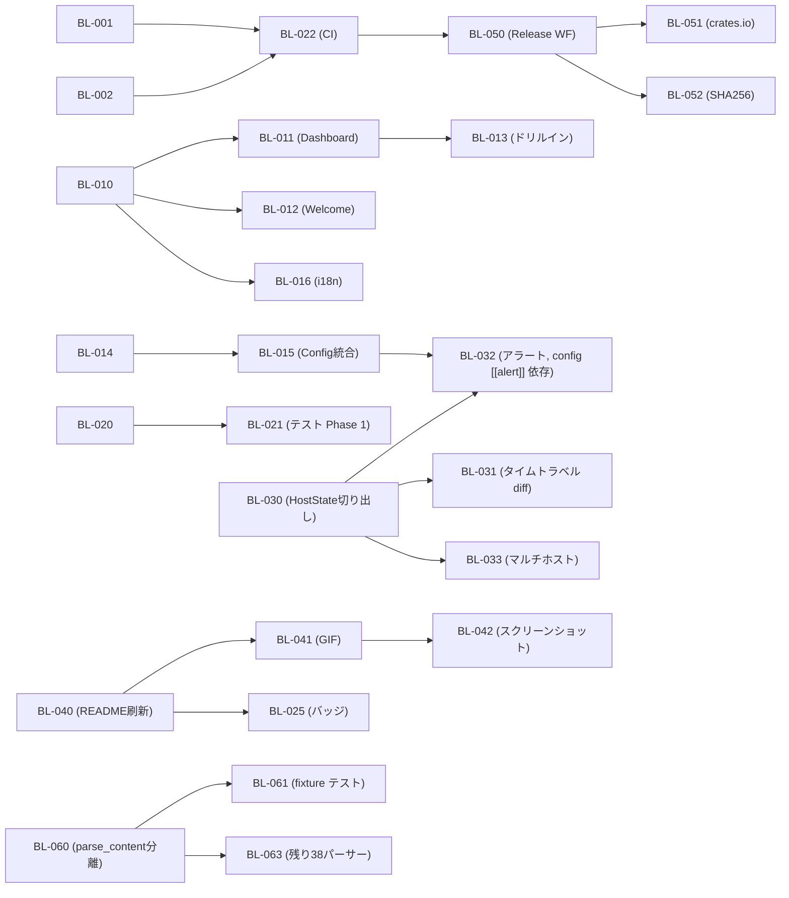

# syslenz 実装バックログ

DGE Session 001-008 で発見された全 Gap を優先度付きバックログとして整理する。

---

## サマリーテーブル

| Phase | 名称 | アイテム数 | 推定合計工数 | 優先度 |
|-------|------|-----------|-------------|--------|
| Phase 0 | 法務・メタデータ | 2 | S (1-2h) | P0 |
| Phase 1 | コア UI 改善 | 7 | L (1-2d) | P0 |
| Phase 2 | 品質基盤 | 6 | L (1-2d) | P0 |
| Phase 3 | 監視機能 | 5 | XL (3-5d) | P1 |
| Phase 4 | ドキュメント・マーケティング | 5 | L (1-2d) | P1 |
| Phase 5 | 配布・リリース | 3 | M (3-8h) | P1 |
| Phase 6 | テスト拡充 | 4 | XL (3-5d) | P2 |
| Phase 7 | 将来 | 7 | - | P3 |
| **合計** | | **39** | **約 12-18d** | |

---

## 依存関係グラフ (クリティカルパス)

クリティカルパス:

- BL-001/002 → BL-022 → BL-050 → BL-051
- BL-010 → BL-011 → BL-013
- BL-030 → BL-031 → BL-032

---

## Phase 0: 法務・メタデータ (P0)

### BL-001: LICENSE ファイル作成 (MIT)
- **Priority**: P0
- **Category**: Infra
- **Effort**: S (1-2h)
- **Depends on**: なし
- **Gap**: G11-1 (Session 004)
- **Files**: `/LICENSE`
- **Description**: MIT License の全文を含む LICENSE ファイルを作成する。著作権者名と年 (2026) を記載。README に "MIT" と記載があるがファイルが存在しないため、法的にはライセンスが付与されていない状態。
- **Acceptance Criteria**:
  - [ ] `/LICENSE` ファイルが存在し、MIT License の正式な全文を含む
  - [ ] `Copyright (c) 2026` と著作権者名が記載されている
  - [ ] GitHub のリポジトリページで "MIT License" と自動認識される

### BL-002: Cargo.toml メタデータ追加
- **Priority**: P0
- **Category**: Infra
- **Effort**: S (1-2h)
- **Depends on**: BL-001
- **Gap**: G11-2, G11-3 (Session 004)
- **Files**: `/Cargo.toml`
- **Description**: `license`, `description`, `repository`, `homepage`, `keywords`, `categories` フィールドを Cargo.toml の `[package]` セクションに追加する。crates.io publish の前提条件。
- **Acceptance Criteria**:
  - [ ] `license = "MIT"` が設定されている
  - [ ] `description` が "Wireshark for /proc" を含む
  - [ ] `repository` に GitHub URL が設定されている
  - [ ] `keywords` に `["linux", "proc", "tui", "system-monitor", "sysadmin"]` が設定されている
  - [ ] `categories` に `["command-line-utilities", "os::linux-apis"]` が設定されている
  - [ ] `cargo package --list` がエラーなく完了する

---

## Phase 1: コア UI 改善 (P0)

### BL-010: View enum に Welcome, Dashboard 追加
- **Priority**: P0
- **Category**: Core
- **Effort**: S (1-2h)
- **Depends on**: なし
- **Gap**: G2-1, G3-2 (Session 003)
- **Files**: `src/ui/app.rs`
- **Description**: `View` enum に `Welcome` と `Dashboard` の 2 バリアントを追加。`App` 構造体に `selected_dashboard_section: usize` と `came_from_dashboard: bool` フィールドを追加。`App::new()` と `App::from_remote()` の初期ビューを `View::Dashboard` に変更。`App::from_imported()` は `View::Overview` を維持。
- **Acceptance Criteria**:
  - [ ] `View::Welcome` と `View::Dashboard` が enum に存在する
  - [ ] `App::new()` の初期 view が `View::Dashboard` である
  - [ ] `App::from_imported()` の初期 view が `View::Overview` のままである
  - [ ] コンパイルが通る (`cargo build`)

### BL-011: Dashboard 画面実装
- **Priority**: P0
- **Category**: UI
- **Effort**: M (3-8h)
- **Depends on**: BL-010
- **Gap**: G2-2 (Session 003)
- **Files**: `src/ui/render.rs`, `src/ui/app.rs`
- **Description**: 5 ソース (loadavg, meminfo, stat, uptime, net/dev) の厳選フィールドを表示するダッシュボード画面を実装する。3 行構成レイアウト: 上段 (loadavg + uptime サマリー)、中段 (meminfo + stat の 2 カラム)、下段 (net/dev テーブル)。サイドバーなし全幅表示。j/k でセクション選択、選択中セクションはボーダー色変更。`get_field_display()` ヘルパー関数を追加。
- **Acceptance Criteria**:
  - [ ] 起動時にダッシュボードが全幅で表示される
  - [ ] uptime、load_1/5/15、MemTotal/Free/Available、CPU user/system/idle、net/dev RX/TX が表示される
  - [ ] j/k でセクション (0-3) を移動でき、選択中セクションのボーダーが黄色になる
  - [ ] ターミナル 80x24 でレイアウトが崩れない

### BL-012: Welcome 画面実装
- **Priority**: P0
- **Category**: UI
- **Effort**: S (1-2h)
- **Depends on**: BL-010
- **Gap**: G3-1, G3-2 (Session 003)
- **Files**: `src/ui/render.rs`, `src/main.rs`
- **Description**: キーバインド一覧とツール名・タグラインを中央寄せで表示する Welcome 画面を実装する。`W` キーでいつでも表示可能。Paragraph ウィジェット 1 つで実装。7-8 行のキーバインド一覧 (j/k, Enter, d, /, g, ?, L) と "Press Enter or D for Dashboard" の CTA を含む。
- **Acceptance Criteria**:
  - [ ] `W` キーで Welcome 画面が表示される
  - [ ] "syslenz" と "Wireshark for /proc" のタグラインが表示される
  - [ ] 主要キーバインド (7-8 個) が色付きで一覧表示される
  - [ ] Enter キーでダッシュボードに遷移する
  - [ ] ターミナル 80x24 で中央に収まる

### BL-013: Dashboard からのドリルイン + 戻り対応
- **Priority**: P0
- **Category**: UI
- **Effort**: S (1-2h)
- **Depends on**: BL-011
- **Gap**: G2-3 (Session 003)
- **Files**: `src/ui/app.rs`
- **Description**: Dashboard の各セクションで Enter を押すと対応ソースの Detail ビューに遷移する機能を実装する。`came_from_dashboard: bool` を使い、Dashboard から入った Detail は BS/Esc で Dashboard に戻る。サイドバーから入った Detail は Overview に戻る (既存動作維持)。セクション → ソースのマッピング: 0=loadavg, 1=meminfo, 2=stat, 3=net/dev。
- **Acceptance Criteria**:
  - [ ] Dashboard でセクション選択後 Enter で Detail に遷移する
  - [ ] Detail から BS/Esc で Dashboard に戻れる
  - [ ] サイドバーから入った Detail は Overview に戻る (既存動作が壊れない)

### BL-014: config.rs 新規作成
- **Priority**: P0
- **Category**: Core
- **Effort**: M (3-8h)
- **Depends on**: なし
- **Gap**: G9-1, G9-2, G9-3 (Session 006)
- **Files**: `src/config.rs` (新規)
- **Description**: `Config` 構造体を定義し、`~/.config/syslenz/config.toml` (XDG_CONFIG_HOME 対応) から TOML 設定を読み込む機能を実装する。4 セクション: `[general]` (lang, interval_ms, sources)、`[otel]` (endpoint, interval_secs)、`[web]` (port)、`[ssh]` (host)。ファイルが存在しない場合やパースエラー時はデフォルト値で動作。優先順位: CLI > 環境変数 > config.toml > デフォルト値。
- **Acceptance Criteria**:
  - [ ] `Config::load()` がファイル不在時に `Default` を返す
  - [ ] 壊れた TOML でもパニックせずデフォルトにフォールバックする
  - [ ] `XDG_CONFIG_HOME` が設定されている場合はそのパスを使う
  - [ ] 全 Option フィールドが `None` のとき正常動作する

### BL-015: main.rs に Config::load() 統合
- **Priority**: P0
- **Category**: Core
- **Effort**: S (1-2h)
- **Depends on**: BL-014
- **Gap**: G9-2 (Session 006)
- **Files**: `src/main.rs`
- **Description**: main.rs の CLI 引数パース前に `Config::load()` を呼び出し、CLI 引数が未指定の場合に config.toml の値をフォールバックとして使用するロジックを追加する。対象: lang, interval, otel endpoint, web port。
- **Acceptance Criteria**:
  - [ ] config.toml に `lang = "ja"` を設定し、`--lang` 未指定で起動すると日本語表示になる
  - [ ] `--lang en` を指定すると config.toml の値を上書きして英語表示になる
  - [ ] config.toml が存在しない環境でも既存動作が変わらない

### BL-016: Dashboard/Welcome の i18n キー追加
- **Priority**: P0
- **Category**: UI
- **Effort**: S (1-2h)
- **Depends on**: BL-011, BL-012
- **Gap**: G3-3 (Session 003)
- **Files**: `src/i18n.rs`
- **Description**: T 構造体に Welcome 画面 (8 キー) と Dashboard 画面 (2 キー) の i18n 定数を追加する。en/ja 両方の翻訳テーブルにエントリを追加。対象キー: welcome_nav, welcome_drill, welcome_diff, welcome_search, welcome_graph, welcome_help, welcome_lang, welcome_cta, view_dashboard, view_welcome。
- **Acceptance Criteria**:
  - [ ] `L` キーで言語切替すると Welcome/Dashboard のテキストが日英で切り替わる
  - [ ] 追加した 10 キー全てに en/ja 両方の翻訳が存在する
  - [ ] `t(Locale::Ja, T::WELCOME_CTA)` が `"?"` を返さない

---

## Phase 2: 品質基盤 (P0)

### BL-020: FieldValue に PartialEq derive
- **Priority**: P0
- **Category**: Core
- **Effort**: S (1-2h)
- **Depends on**: なし
- **Gap**: G10-3 (Session 007)
- **Files**: `src/proc/mod.rs`
- **Description**: `FieldValue` enum に `#[derive(PartialEq)]` を追加する。Float の比較精度に注意し、必要に応じて手動 `PartialEq` 実装を検討する。Table は `Vec<Vec<String>>` なのでそのまま derive で対応可能。テストでの値比較に必須。
- **Acceptance Criteria**:
  - [ ] `FieldValue::Bytes(100) == FieldValue::Bytes(100)` が `true` を返す
  - [ ] `FieldValue::Text("a".into()) != FieldValue::Text("b".into())` が `true` を返す
  - [ ] コンパイルが通る

### BL-021: テスト Phase 1 (T1-T11)
- **Priority**: P0
- **Category**: Test
- **Effort**: M (3-8h)
- **Depends on**: BL-020
- **Gap**: G10-1 (Session 007)
- **Files**: `src/proc/mod.rs`, `src/export.rs`, `src/i18n.rs`, `Cargo.toml`
- **Description**: /proc に依存しない 11 個のユニットテストを実装する。`Cargo.toml` の `[dev-dependencies]` に `tempfile = "3"` を追加。テスト内容:
  - T1: `format_bytes` の境界値 (0, 1024, 1048576, 1073741824)
  - T2: `format_duration` の境界値 (0.5秒, 90秒, 7200秒, 90061秒)
  - T3: `snapshot_export_import_roundtrip`
  - T4: `series_export_import_roundtrip`
  - T5: `diff_identical_returns_empty`
  - T6: `diff_detects_change`
  - T7: `diff_ignores_small_float`
  - T8: `i18n_all_keys_have_translations` (全キーで "?" が返らない)
  - T9: `i18n_source_descriptions_complete` (43 ソース全て)
  - T10: `locale_from_str_variants` ("ja", "jp", "en", "unknown")
  - T11: `systemtime_iso8601_roundtrip`
- **Acceptance Criteria**:
  - [ ] `cargo test` で 11 テスト全てが PASS する
  - [ ] /proc がない環境 (macOS) でもテストが実行可能
  - [ ] `make_test_snapshot()` ヘルパーが `#[cfg(test)]` 内に存在する

### BL-022: CI ワークフロー作成
- **Priority**: P0
- **Category**: Infra
- **Effort**: M (3-8h)
- **Depends on**: BL-001, BL-002
- **Gap**: G11-4 (Session 004)
- **Files**: `.github/workflows/ci.yml`
- **Description**: GitHub Actions の CI ワークフローを作成する。トリガー: push to main, pull_request to main。ステップ: `cargo fmt --check`, `cargo clippy -- -D warnings`, `cargo build`, `cargo test`。matrix: `default features`, `--all-features`, `--no-default-features` の 3 パターン。`dtolnay/rust-toolchain@stable` + `Swatinem/rust-cache@v2` で高速化。
- **Acceptance Criteria**:
  - [ ] PR を出すと CI が自動実行される
  - [ ] fmt, clippy, build, test の 4 ステップが実行される
  - [ ] 3 feature パターンの matrix で並列実行される
  - [ ] 全ジョブが現在のコードで GREEN になる

### BL-023: CHANGELOG.md 作成
- **Priority**: P0
- **Category**: Docs
- **Effort**: S (1-2h)
- **Depends on**: なし
- **Gap**: G11-5 (Session 004)
- **Files**: `/CHANGELOG.md`
- **Description**: [Keep a Changelog](https://keepachangelog.com/) 形式で CHANGELOG.md を作成する。初回エントリとして `[0.1.0] - Unreleased` に現在の全機能 (43 /proc sources, TUI, diff, sparkline, JSON export, SSH, OTEL, Web UI, X11 widget, i18n) を記載。
- **Acceptance Criteria**:
  - [ ] CHANGELOG.md が Keep a Changelog 形式に準拠している
  - [ ] `## [Unreleased]` セクションが存在する
  - [ ] `## [0.1.0]` セクションに主要機能が記載されている

### BL-024: deny.toml 作成 (ライセンス監査)
- **Priority**: P0
- **Category**: Infra
- **Effort**: S (1-2h)
- **Depends on**: BL-022
- **Gap**: G11-7 (Session 004)
- **Files**: `/deny.toml`, `.github/workflows/ci.yml` (更新)
- **Description**: `cargo-deny` 用の `deny.toml` を作成し、許可ライセンス (MIT, Apache-2.0, BSD-2-Clause, BSD-3-Clause, ISC, Zlib) を定義する。ci.yml に `cargo deny check licenses` ステップを追加。GPL 汚染を自動検出する安全網。
- **Acceptance Criteria**:
  - [ ] `cargo deny check licenses` がエラーなく完了する
  - [ ] deny.toml に許可ライセンスリストが定義されている
  - [ ] CI で依存クレートのライセンスチェックが自動実行される

### BL-025: README バッジ追加
- **Priority**: P0
- **Category**: Docs
- **Effort**: S (1-2h)
- **Depends on**: BL-022
- **Gap**: G11-6 (Session 004)
- **Files**: `/README.md`
- **Description**: README の先頭に CI status、crates.io version、License の 3 つのバッジを追加する。
- **Acceptance Criteria**:
  - [ ] CI status バッジが表示され、ビルド状態が可視化されている
  - [ ] License バッジが "MIT" と表示されている
  - [ ] GitHub でバッジが正しくレンダリングされる

---

## Phase 3: 監視機能 (P1)

### BL-030: HostState 構造体切り出し (App リファクタ)
- **Priority**: P1
- **Category**: Core
- **Effort**: L (1-2d)
- **Depends on**: なし
- **Gap**: G7, G7-3 (Session 005)
- **Files**: `src/ui/app.rs`
- **Description**: `App` 構造体から Snapshot 管理をホストごとの `HostState` 構造体に分離する。`HostState` は `host: String`, `snapshots: Vec<Snapshot>`, `current: Snapshot`, `diffs: Vec<DiffItem>`, `remote_rx: Option<mpsc::Receiver<Snapshot>>`, `connection_status: ConnectionStatus` を持つ。`App.hosts: Vec<HostState>` + `App.active_host: usize` を追加。`active_host_state(&self) -> &HostState` ヘルパーで段階的に移行。G5/G6/G7 全ての基盤となるリファクタリング。
- **Acceptance Criteria**:
  - [ ] `HostState` 構造体が定義されている
  - [ ] `App.current` への参照が `self.hosts[self.active_host].current` 経由に置き換わっている
  - [ ] ローカルモード (--ssh なし) で既存動作が一切変わらない
  - [ ] 既存テスト (T1-T11) が全て PASS する

### BL-031: タイムトラベル diff
- **Priority**: P1
- **Category**: Core
- **Effort**: M (3-8h)
- **Depends on**: BL-030
- **Gap**: G5, G5-1 (Session 005)
- **Files**: `src/ui/app.rs`, `src/main.rs`, `src/ui/render.rs`
- **Description**: Diff ビュー内で比較対象のスナップショットを選択できる機能を実装する。`HostState` に `diff_target_index: Option<usize>` を追加。`[` で 1 つ前、`]` で 1 つ後、`{` (Shift+[) で 10 個前、`}` (Shift+]) で 10 個後、Home で最古、End で直前 (None) に戻る。ステータスバーに "current vs T-N (HH:MM:SS)" を表示。`diff_snapshots()` の呼び出し元で `old` を `snapshots[i]` に差し替えるだけで、diff ロジック本体の変更は不要。
- **Acceptance Criteria**:
  - [ ] Diff ビューで `[` / `]` キーで比較対象を変更できる
  - [ ] ステータスバーに "T-N" の形式で比較対象の位置が表示される
  - [ ] `diff_target_index` が `None` のとき従来通りの動作 (直前との diff)
  - [ ] `snapshots` が空のときパニックしない

### BL-032: アラートシステム
- **Priority**: P1
- **Category**: Core
- **Effort**: XL (3-5d)
- **Depends on**: BL-014, BL-030
- **Gap**: G6, G6-1, G6-2 (Session 005)
- **Files**: `src/config.rs` (更新), `src/ui/app.rs`, `src/ui/render.rs`, `src/main.rs`
- **Description**: config.toml の `[[alert]]` セクションから `AlertRule` を読み込み、毎リフレッシュ時にルールを評価するアラートシステムを実装する。`AlertRule` 構造体 (source, field, op, threshold, severity, message)。比較演算子 6 種 (>, <, >=, <=, ==, !=)。数値フィールドのみ対象。TUI 表示 3 箇所: (1) ステータスバーのアラートカウンター `[!N WARN] [!!N CRIT]`、(2) サイドバーのソース名着色 (warning=黄, critical=赤)、(3) Detail ビューのフィールド背景色。デバウンス: 同一ルールの連続発火防止 (Normal -> Firing -> Resolved サイクル)。不正な condition はスキップして警告表示 (アプリ起動は止めない)。
- **Acceptance Criteria**:
  - [ ] config.toml に `[[alert]]` を書くとルールが読み込まれる
  - [ ] 閾値超過時にステータスバーにアラートカウンターが表示される
  - [ ] サイドバーで該当ソース名が severity に応じた色で表示される
  - [ ] 同一ルールで毎秒アラートが発火しない (デバウンス動作)
  - [ ] 不正な condition でアプリがクラッシュしない

### BL-033: マルチホスト対応
- **Priority**: P1
- **Category**: Core
- **Effort**: XL (3-5d)
- **Depends on**: BL-030
- **Gap**: G7 (Session 005)
- **Files**: `src/ui/app.rs`, `src/main.rs`, `src/ui/render.rs`, `src/remote.rs`
- **Description**: `--ssh` フラグの複数指定に対応し、タブ方式でホストを切り替える機能を実装する。clap の `Vec<String>` 化。ローカルホストは常に `hosts[0]`。タブバーをステータスバーの上に表示 (ホスト名 + 接続状態色)。`Ctrl+1`-`Ctrl+9` または `F1`-`F9` でタブ切り替え。各ホストは独立した `HostState` (Snapshot管理、接続状態、アラートイベント) を持つ。
- **Acceptance Criteria**:
  - [ ] `syslenz --ssh user@host1 --ssh user@host2` で 2 ホストが監視される
  - [ ] タブバーにホスト名と接続状態 (色) が表示される
  - [ ] タブ切り替えで表示内容がホストごとに切り替わる
  - [ ] 1 ホストの SSH 切断が他ホストに影響しない

### BL-034: ConnectionStatus 表示
- **Priority**: P1
- **Category**: UI
- **Effort**: S (1-2h)
- **Depends on**: BL-030
- **Gap**: G5-2 (Session 005)
- **Files**: `src/ui/app.rs`, `src/ui/render.rs`
- **Description**: SSH リモートモードでの接続状態をステータスバーに常時表示する。`ConnectionStatus` enum: `Local`, `Connected { last_seen }`, `Disconnected { last_seen, since }`, `Connecting`。接続中=緑、接続断=黄、再接続中=灰。最終受信時刻を表示 (例: `[SSH: user@host] Connected (last: 14:23:06)`)。
- **Acceptance Criteria**:
  - [ ] リモートモードでステータスバーに接続状態が表示される
  - [ ] SSH 切断時に色が緑から黄色に変わる
  - [ ] ローカルモードでは接続状態表示がない (ノイズにならない)

---

## Phase 4: ドキュメント・マーケティング (P1)

### BL-040: README 全面刷新
- **Priority**: P1
- **Category**: Docs
- **Effort**: M (3-8h)
- **Depends on**: なし
- **Gap**: G12-1, G12-2, G12-3, G12-4, G13-4, G13-5 (Session 008)
- **Files**: `/README.md`
- **Description**: README を "ユーザーが知りたい順" に再構成する。新タグライン: `> Wireshark for /proc` (後半 "schema-driven..." を削除)。新リード文: "Explore every Linux /proc file as structured, typed data... No config. No daemon. Just run it." "Why syslenz?" セクション追加 (3 ペルソナ: Instant deep-dive / Structured export / Learn Linux internals)。Supported Sources を `
` タグで折りたたみ。新構造: タイトル → GIF → 価値提案 → Why → Install → Features+Screenshots → Usage → Keybindings → Sources(折りたたみ) → Roadmap → License。
- **Acceptance Criteria**:
  - [ ] タグラインが "Wireshark for /proc" のみ (後半なし)
  - [ ] "Why syslenz?" セクションに 3 ペルソナ別ベネフィットがある
  - [ ] Supported Sources が `
` で折りたたまれている
  - [ ] GIF 用のプレースホルダー (``) がある

### BL-041: vhs でヒーロー GIF 作成
- **Priority**: P1
- **Category**: Docs
- **Effort**: M (3-8h)
- **Depends on**: BL-040
- **Gap**: G13-1, G13-2 (Session 008)
- **Files**: `docs/demo.tape` (新規), `docs/assets/demo.gif` (生成物)
- **Description**: charmbracelet/vhs を使用して README 用のヒーロー GIF (15 秒以内) を作成する。シナリオ: 起動 → meminfo 選択 → フィールドスクロール → net/tcp 移動 → diff ビュー → graph ビュー。撮影環境: 120x35 ターミナル、Catppuccin Mocha テーマ、14pt 等幅フォント。`.tape` ファイルをリポジトリに含めて再現可能にする。
- **Acceptance Criteria**:
  - [ ] `docs/demo.tape` が存在する
  - [ ] `vhs docs/demo.tape` で GIF が生成される
  - [ ] GIF が 15 秒以内である
  - [ ] GIF 横幅が 1200px で GitHub 上で適切に表示される

### BL-042: スクリーンショット 3 枚撮影
- **Priority**: P1
- **Category**: Docs
- **Effort**: S (1-2h)
- **Depends on**: BL-041
- **Gap**: G13-1 (Session 008)
- **Files**: `docs/assets/main-view.png`, `docs/assets/diff-view.png`, `docs/assets/graph-view.png`
- **Description**: README の Features セクション用にスクリーンショット 3 枚を撮影する。(1) main-view: サイドバー + meminfo フィールドテーブル、(2) diff-view: 赤/緑ハイライトの diff 表示、(3) graph-view: sparkline グラフ表示。横幅 800px 以内。vhs の Screenshot コマンドまたは手動キャプチャ。
- **Acceptance Criteria**:
  - [ ] 3 枚の PNG が `docs/assets/` に存在する
  - [ ] 各スクリーンショットが対応する機能を明確に示している
  - [ ] README から正しく参照されている

### BL-043: OTEL ドキュメント
- **Priority**: P1
- **Category**: Docs
- **Effort**: M (3-8h)
- **Depends on**: なし
- **Gap**: G8-1, G8-3, G8-4 (Session 006)
- **Files**: `docs/otel.md` (新規), `docs/otel-quickstart/docker-compose.yml` (新規), `docs/otel-quickstart/otel-collector-config.yaml` (新規), `docs/otel-quickstart/prometheus.yml` (新規)
- **Description**: OTEL export のユースケース文書と Quick Start 環境を作成する。ユースケースは "一時的なデバッグツール" として位置づけ。node_exporter との比較表 (syslenz の独自メトリクス: pressure, buddyinfo, slabinfo, net/tcp 等)。主要メトリクス名一覧 (30+)。docker-compose で OTel Collector + Prometheus + Grafana を一発起動する手順。
- **Acceptance Criteria**:
  - [ ] `docs/otel.md` にユースケースと主要メトリクス表が記載されている
  - [ ] `docker-compose up -d` で Collector + Prometheus + Grafana が起動する
  - [ ] node_exporter との比較表が含まれている
  - [ ] Quick Start の手順が 4 ステップ以内で完了する

### BL-044: 監査ワークフロー例
- **Priority**: P1
- **Category**: Docs
- **Effort**: S (1-2h)
- **Depends on**: なし
- **Gap**: G1-7 (Session 002)
- **Files**: `docs/audit-example.md` (新規)
- **Description**: セキュリティ監査ペルソナ向けに、JSON export を使った監査ワークフローの具体例を文書化する。シナリオ: syslenz で全ホストの /proc をキャプチャ → JSON export → jq で分析 → レポート添付。net/tcp のコネクション一覧、modules のカーネルモジュール一覧、cgroups の例を含む。
- **Acceptance Criteria**:
  - [ ] `docs/audit-example.md` にコマンド例付きのワークフローが記載されている
  - [ ] JSON export → jq でのフィルタリング例が含まれている
  - [ ] セキュリティ関連ソース (net/tcp, modules, cgroups) の具体例がある

---

## Phase 5: 配布・リリース (P1)

### BL-050: リリースワークフロー作成
- **Priority**: P1
- **Category**: Infra
- **Effort**: M (3-8h)
- **Depends on**: BL-022
- **Gap**: G4-1, G4-2 (Session 004)
- **Files**: `.github/workflows/release.yml` (新規)
- **Description**: タグ push (`v*`) でトリガーされるリリースワークフローを作成する。`cross` を使った 4 ターゲットの並列ビルド: x86_64-unknown-linux-gnu, aarch64-unknown-linux-gnu, x86_64-unknown-linux-musl, aarch64-unknown-linux-musl。各バイナリを tar.gz にパッケージ。CHANGELOG.md に該当バージョンのエントリがあることを検証。`softprops/action-gh-release` で GitHub Release を作成しアセットを添付。
- **Acceptance Criteria**:
  - [ ] `git tag v0.1.0 && git push --tags` で自動ビルドが開始される
  - [ ] 4 ターゲットのバイナリが GitHub Release に添付される
  - [ ] CHANGELOG にエントリがない場合はビルドが失敗する
  - [ ] リリースノートが自動生成される

### BL-051: crates.io 公開準備
- **Priority**: P1
- **Category**: Infra
- **Effort**: S (1-2h)
- **Depends on**: BL-002, BL-050
- **Gap**: G4-4 (Session 004)
- **Files**: `.github/workflows/release.yml` (更新)
- **Description**: release.yml に `cargo publish` ステップを追加する。`secrets.CARGO_REGISTRY_TOKEN` の設定が必要。`cargo package --list` で不要ファイルが含まれないことを確認。
- **Acceptance Criteria**:
  - [ ] release.yml に `cargo publish` ステップが含まれている
  - [ ] `cargo package --list` に不要ファイル (target/, .git/) が含まれない
  - [ ] CARGO_REGISTRY_TOKEN シークレットの設定手順が文書化されている

### BL-052: SHA256 チェックサム生成
- **Priority**: P1
- **Category**: Infra
- **Effort**: S (1-2h)
- **Depends on**: BL-050
- **Gap**: G4-5 (Session 004)
- **Files**: `.github/workflows/release.yml` (更新)
- **Description**: release.yml の Package ステップに `sha256sum` を追加し、各バイナリの `.sha256` ファイルを生成して GitHub Release アセットに添付する。
- **Acceptance Criteria**:
  - [ ] GitHub Release に各 `.tar.gz` に対応する `.sha256` ファイルが存在する
  - [ ] `sha256sum -c syslenz-x86_64-unknown-linux-gnu.tar.gz.sha256` で検証が通る

---

## Phase 6: テスト拡充 (P2)

### BL-060: パーサー parse_content() 分離 (優先 5)
- **Priority**: P2
- **Category**: Core
- **Effort**: M (3-8h)
- **Depends on**: なし
- **Gap**: G10-2 (Session 007)
- **Files**: `src/proc/uptime.rs`, `src/proc/loadavg.rs`, `src/proc/meminfo.rs`, `src/proc/version.rs`, `src/proc/stat.rs`
- **Description**: 優先 5 パーサー (uptime, loadavg, meminfo, version, stat) の `parse()` 関数から I/O を分離し、`pub fn parse_content(content: &str) -> anyhow::Result<ProcEntry>` を追加する。既存の `parse()` は `parse_content` を呼ぶラッパーに変更。破壊的変更なし。
- **Acceptance Criteria**:
  - [ ] 5 パーサーに `parse_content()` が追加されている
  - [ ] 既存の `parse()` が `parse_content()` を呼んでいる
  - [ ] 既存動作 (TUI表示、export) に変更がない

### BL-061: テスト Phase 2 (T12-T16: パーサー fixture テスト)
- **Priority**: P2
- **Category**: Test
- **Effort**: M (3-8h)
- **Depends on**: BL-060
- **Gap**: G10-2 (Session 007)
- **Files**: `src/proc/uptime.rs`, `src/proc/loadavg.rs`, `src/proc/meminfo.rs`, `src/proc/version.rs`, `src/proc/stat.rs`
- **Description**: 分離した `parse_content()` に対して、fixture 文字列を入力として値の正確性を検証するテストを追加する。
  - T12: uptime (`"12345.67 98765.43\n"`)
  - T13: loadavg (`"0.50 0.75 1.00 3/150 12345\n"` — `/` 区切りパース)
  - T14: meminfo (代表的 5 行 — kB -> Bytes 変換)
  - T15: version (実際の /proc/version テキスト)
  - T16: stat (CPU 行 + その他行)
- **Acceptance Criteria**:
  - [ ] 5 テストが `cargo test` で PASS する
  - [ ] fixture 入力から期待される FieldValue が生成される
  - [ ] /proc がない環境 (macOS) でもテストが実行可能

### BL-062: テスト Phase 3 (T17-T18: CI smoke test)
- **Priority**: P2
- **Category**: Test
- **Effort**: S (1-2h)
- **Depends on**: BL-022
- **Gap**: G10-7 (Session 007)
- **Files**: `tests/smoke.rs` (新規)
- **Description**: `#[cfg(target_os = "linux")]` 付きの smoke test を作成。T17: 43 パーサー全てが panic せずに Ok or Err を返す (`let _ = xxx::parse();` パターン)。T18: `Snapshot::capture()` が成功し entries が 10 個以上含まれ、meminfo/uptime/loadavg が存在する。root 権限が必要な `/proc/slabinfo` 等は Err 許容。
- **Acceptance Criteria**:
  - [ ] GitHub Actions (ubuntu-latest) で T17, T18 が PASS する
  - [ ] root 権限不足による Err はテスト失敗にならない
  - [ ] macOS ではテストがスキップされる (`#[cfg(target_os = "linux")]`)

### BL-063: 残り 38 パーサーの parse_content() 分離
- **Priority**: P2
- **Category**: Core
- **Effort**: XL (3-5d)
- **Depends on**: BL-060
- **Gap**: G10-2 (Session 007)
- **Files**: `src/proc/*.rs` (38 ファイル)
- **Description**: BL-060 で確立したパターンに従い、残り 38 パーサー全てに `parse_content()` を追加する。1 パーサーあたり約 5 分。段階的に PR を分割して実施可能。
- **Acceptance Criteria**:
  - [ ] 全 43 パーサーに `parse_content()` が追加されている
  - [ ] 既存動作に変更がない
  - [ ] `cargo build` と `cargo test` が PASS する

---

## Phase 7: 将来 (P3)

### BL-070: Homebrew formula (macOS 対応後)
- **Priority**: P3
- **Category**: Infra
- **Effort**: M (3-8h)
- **Depends on**: BL-050, macOS 対応 (platform_macos.rs 完成)
- **Gap**: G4-3 (Session 004)
- **Files**: `Formula/syslenz.rb` (新規) or Homebrew tap リポジトリ
- **Description**: macOS の /proc 代替 (sysctl) 対応完了後に Homebrew formula を作成する。現状は Linux のみ対応のため見送り。
- **Acceptance Criteria**:
  - [ ] `brew install syslenz` で macOS にインストールできる
  - [ ] macOS で基本機能 (sysctl ベース) が動作する

### BL-071: アラート外部通知 (alert.action 拡張)
- **Priority**: P3
- **Category**: Core
- **Effort**: M (3-8h)
- **Depends on**: BL-032
- **Gap**: G6-3 (Session 005)
- **Files**: `src/config.rs`, `src/ui/app.rs`
- **Description**: config.toml の `[[alert]]` に `action` フィールドを追加し、外部コマンド実行に対応する。例: `action = "notify-send 'syslenz: {message}'"` で Linux デスクトップ通知、`action = "curl -X POST ..."` で Slack 通知。
- **Acceptance Criteria**:
  - [ ] `action = "echo {message}"` でアラート発火時にコマンドが実行される
  - [ ] action 未指定時は TUI 表示のみ (既存動作維持)

### BL-072: SSH ControlMaster 最適化
- **Priority**: P3
- **Category**: Core
- **Effort**: M (3-8h)
- **Depends on**: BL-033
- **Gap**: G7-1 (Session 005)
- **Files**: `src/remote.rs`
- **Description**: SSH 接続を毎回張り直す現状のオーバーヘッドを、SSH ControlMaster によるパーシステント接続で最適化する。10+ ホスト環境での帯域とレイテンシを改善。
- **Acceptance Criteria**:
  - [ ] SSH ControlMaster ソケットが再利用される
  - [ ] 10 ホスト接続時のネットワーク負荷が大幅に減少する

### BL-073: OTEL メトリクス層 (--otel-level core|full)
- **Priority**: P3
- **Category**: Core
- **Effort**: S (1-2h)
- **Depends on**: なし
- **Gap**: G8-2 (Session 006)
- **Files**: `src/otel.rs`, `src/main.rs`
- **Description**: `--otel-level core|full` フラグを追加し、export するメトリクスの層を選択可能にする。`core` は主要 10 メトリクス (meminfo/loadavg/stat/net_dev 等)、`full` は全メトリクス。Grafana ダッシュボード作成者のノイズ軽減。
- **Acceptance Criteria**:
  - [ ] `--otel-level core` で export されるメトリクスが 10 個程度に絞られる
  - [ ] デフォルト (`full`) では全メトリクスが export される

### BL-074: --tutorial フラグ / チュートリアルモード
- **Priority**: P3
- **Category**: UI
- **Effort**: L (1-2d)
- **Depends on**: BL-012
- **Gap**: G1-6 (Session 002)
- **Files**: `src/ui/app.rs`, `src/ui/render.rs`, `src/main.rs`
- **Description**: `--tutorial` フラグでインタラクティブなチュートリアルモードを起動する。ステップバイステップで「j/k でソース選択 → Enter で詳細 → d で diff → g でグラフ」を体験させる。教育ユースケース (Linux 学習者 / CS 学生) 向け。
- **Acceptance Criteria**:
  - [ ] `syslenz --tutorial` でチュートリアルが開始される
  - [ ] 各ステップでガイドテキストが表示される
  - [ ] 全ステップ完了後に通常モードに遷移する

### BL-075: Web UI 言語切り替え対応
- **Priority**: P3
- **Category**: UI
- **Effort**: M (3-8h)
- **Depends on**: なし
- **Gap**: (Session 002 より派生)
- **Files**: `src/web.rs`
- **Description**: Web UI 側でも i18n 対応を実装し、ブラウザから言語切り替えを可能にする。
- **Acceptance Criteria**:
  - [ ] Web UI に言語切り替えボタンがある
  - [ ] 日本語/英語の切り替えが即座に反映される

### BL-076: rate 計算 (bytes/sec) Dashboard 拡張
- **Priority**: P3
- **Category**: UI
- **Effort**: M (3-8h)
- **Depends on**: BL-011
- **Gap**: G2-5 (Session 003)
- **Files**: `src/ui/render.rs`, `src/ui/app.rs`
- **Description**: Dashboard の net/dev セクションに RX/TX のレート (bytes/sec) を表示する。前回スナップショットとの差分をリフレッシュ間隔で割って計算。`diff_snapshots` の拡張が必要。
- **Acceptance Criteria**:
  - [ ] net/dev セクションに "RX/s", "TX/s" 列が表示される
  - [ ] スナップショットが 2 つ以上ある場合にレートが計算される
  - [ ] 1 スナップショットのみの場合は "-" と表示される

### BL-080: Article schema + resolver 実装 (Metric/Group/Concept)
- **Priority**: P1
- **Category**: Core
- **Effort**: M (3-8h)
- **Depends on**: なし
- **Gap**: G-EDU-18-2, G-EDU-18-5
- **Files**: `src/article.rs` (新規), `src/main.rs`
- **Description**: EducationArticle と resolver を実装。`*_min/*_max/*_count` を group 記事に集約し、未定義時は fallback 記事を返す。
- **Acceptance Criteria**:
  - [ ] `source+field` から article が一意に解決される
  - [ ] group 解決ルールが動作する
  - [ ] fallback 記事が常に返る
  - **Status**: Implemented via `src/article.*`, resource loaders, and `resources/articles` markdown corpus (current load + export tools).

### BL-081: TUI Article Overlay MVP (`A`)
- **Priority**: P1
- **Category**: UI
- **Effort**: M (3-8h)
- **Depends on**: BL-080
- **Gap**: G-EDU-18-1, G-EDU-18-3
- **Files**: `src/ui/app.rs`, `src/ui/render.rs`, `src/main.rs`
- **Description**: `A` キーで記事オーバーレイを開閉。本文スクロール、閉じる操作、SEE ALSO選択を実装。
- **Acceptance Criteria**:
  - [ ] `A` で overlay が開閉する
  - [ ] `j/k`, `PgUp/PgDn` でスクロールできる
  - [ ] `Esc/q` で閉じる
  - **Status**: TUI overlay completed (see `src/ui/*` updates, key handlers `A`, navigation, scroll, links).

### BL-082: SEE ALSO jump 実装 (metric/article)
- **Priority**: P1
- **Category**: UI
- **Effort**: M (3-8h)
- **Depends on**: BL-081
- **Gap**: G-EDU-18-3
- **Files**: `src/ui/app.rs`, `src/article.rs`
- **Description**: overlay 内リンク選択と `Enter` による遷移を実装。metric は Detail へ、article は overlay 内遷移。
- **Acceptance Criteria**:
  - [ ] metric link で source/field にフォーカス遷移する
  - [ ] article link で別記事へ遷移する
  - **Status**: SEE ALSO navigation available via `src/ui/app.rs`/`render.rs` with jump helpers.

### BL-083: Web Article Overlay parity
- **Priority**: P1
- **Category**: UI
- **Effort**: L (1-2d)
- **Depends on**: BL-080
- **Gap**: G-EDU-18-4
- **Files**: `src/web.rs`
- **Description**: Web に記事オーバーレイを実装。`/api/article` 追加、`A` ショートカット、SEE ALSO クリック遷移を提供。
- **Acceptance Criteria**:
  - [ ] Webで `A` またはボタンから記事表示できる
  - [ ] SEE ALSO クリックで metric/article ジャンプする
  - [ ] 未定義メトリクスで fallback 記事が表示される
  - **Status**: Web overlay + SSE controls implemented, includes API `/api/article`, buttons/shortcuts for article display and axis/refresh toggles.

### BL-084: Article Authoring Guide + Quality Gate
- **Priority**: P1
- **Category**: Docs
- **Effort**: M (3-8h)
- **Depends on**: BL-080
- **Gap**: G-EDU-18-6
- **Files**: `docs/` (新規ガイド), `tests/` (整合チェック)
- **Description**: 記事テンプレート・命名規約・レビュー基準を明文化し、リンク切れ/重複ID/言語欠落を検出するテストを追加。
- **Acceptance Criteria**:
  - [ ] 記事作成ガイドが存在する
  - [ ] CIで整合チェックが実行される
  - **Status**: Base guide drafted in `docs/` updates; translation/state validation pending (no automated checks yet).

### BL-085: Top 50 Metrics Article Pack
- **Priority**: P1
- **Category**: Docs
- **Effort**: XL (3-5d)
- **Depends on**: BL-084
- **Gap**: G-EDU-18-6
- **Files**: `docs/articles/en/*`, `docs/articles/ja/*`
- **Description**: 高頻度メトリクス 50 本 + 主要グループ記事を作成し、初学者〜上級者向けに運用知識を提供する。
- **Acceptance Criteria**:
  - [ ] 50本以上の metric/group article が揃う
  - [ ] EN/JA 両言語が揃う
  - **Status**: Content expansion ongoing; current corpus includes 680 articles via `resources/articles-md`, covering source guides + many metrics (coverage 100% with mostly source guides). Additional high-priority metrics still queued.

- BL-090: Provide Japanese-localized descriptions for residual English vmstat/meminfo/pressure sections (Casebook, archetype, manifest lines) so Japanese mode always shows Japanese text.
- BL-091: Add toggleable real-time refresh and axis scaling controls to both TUI and Web dashboards (new keys/buttons + binding logic).
- BL-092: Keep a modal overlay open long enough to scroll/copy row contents; add explicit open/close actions instead of immediate enter-as-toggle.
- BL-093: Surface flag/enum annotations for numeric metrics (bit meanings + enumerations) in overlay views via a metadata lookup per field.
- BL-094: Replace single-snapshot metrics with optional streaming/ring-buffer mode so graphs can pause and scroll history; include UX for toggling live vs paused state.
