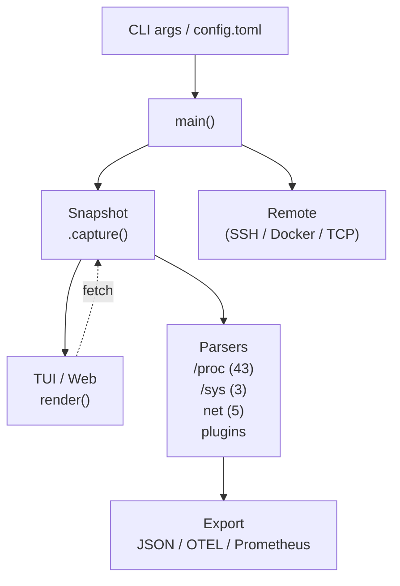

# Architecture

[日本語版](../ja/architecture.md)

[← Index](index.md)

---

## Table of Contents

- [Overview](#overview)
- [Technology Stack](#technology-stack)
- [Module Map](#module-map)
- [Data Model](#data-model)
- [Data Flow](#data-flow)
- [TUI Layer (ratatui)](#tui-layer-ratatui)
- [HTTP Server Layer (axum)](#http-server-layer-axum)
- [TCP Server Layer](#tcp-server-layer)
- [Remote Monitoring](#remote-monitoring)
- [Diff Engine](#diff-engine)
- [i18n and Help System](#i18n-and-help-system)
- [Settings GUI](#settings-gui)
- [Plugin System](#plugin-system)
- [Feature Flags](#feature-flags)
- [Roadmap: Fleet View and Auth](#roadmap-fleet-view-and-auth)

---

## Overview

syslenz is a single-binary Rust tool that reads Linux kernel data from `/proc` and `/sys`, structures it into typed fields, and renders it through multiple frontends: a terminal UI (TUI), a web dashboard, and a JSON export pipeline.



---

## Technology Stack

| Component | Crate / Technology | Notes |
|-----------|--------------------|-------|
| Language | Rust, edition 2024 | Requires rustc 1.85+ |
| TUI | ratatui 0.29 | Terminal rendering |
| Terminal I/O | crossterm 0.28 | Input events, raw mode |
| HTTP server | axum 0.8 + tokio 1 | Optional (`web` feature) |
| SSE streaming | tokio-stream, tower-http | Web UI live updates |
| OpenTelemetry | opentelemetry 0.28 + OTLP | Optional (`otel` feature) |
| Serialization | serde 1 + serde_json 1 | Snapshot JSON I/O |
| Config | toml 0.8 | `~/.config/syslenz/config.toml` |
| Error handling | anyhow 1 | |
| X11 widget | x11rb | Optional (`x11widget` feature) |

---

## Module Map

```
src/
├── main.rs                 CLI parsing (no external crate), TUI event loop
├── config.rs               Config struct, TOML loading, CLI override merging
├── proc/
│   ├── mod.rs              Core types: Snapshot, ProcEntry, Field, FieldValue
│   │                       Snapshot::capture(), diff_snapshots()
│   ├── meminfo.rs          /proc/meminfo
│   ├── cpuinfo.rs          /proc/cpuinfo
│   ├── stat.rs             /proc/stat
│   ├── uptime.rs           /proc/uptime
│   ├── loadavg.rs          /proc/loadavg
│   ├── vmstat.rs           /proc/vmstat  (165 fields)
│   ├── net_dev.rs          /proc/net/dev
│   ├── net_tcp.rs          /proc/net/tcp
│   ├── net_udp.rs          /proc/net/udp
│   ├── net_snmp.rs         /proc/net/snmp
│   ├── net_netstat.rs      /proc/net/netstat
│   ├── processes.rs        /proc/[pid]/stat, status, cmdline
│   ├── pressure.rs         /proc/pressure/{cpu,memory,io}  (PSI)
│   ├── ...                 (38 more parsers)
│   ├── platform_macos.rs   macOS: sysctl, vm_stat, netstat, launchd (24 sources)
│   └── platform_windows.rs Windows: PowerShell, WMI (24 sources)
├── ui/
│   ├── mod.rs              UI module exports
│   ├── app.rs              App state, navigation, multi-host tab logic
│   ├── render.rs           ratatui rendering for all views
│   └── graph.rs            Sparkline and bar graph rendering
├── export.rs               JSON snapshot import/export, time-series export
├── remote.rs               SSH remote capture, Docker exec capture
├── serve.rs                TCP server (--serve), SNAPSHOT + METRICS protocol
├── web.rs                  Axum HTTP server, all routes, Settings GUI HTML
├── alert.rs                AlertRule, condition parser, debounce state machine
├── diagnostics.rs          27 check functions, DiagnosticResult, related_metrics
├── education.rs            Category Guide content, learning paths
├── history.rs              Snapshot ring buffer for time-travel diff
├── i18n.rs                 EN/JA field descriptions at 4 help levels
├── otel.rs                 OpenTelemetry OTLP export, Prometheus text format
├── prometheus.rs           Prometheus /metrics format_prometheus()
├── metric_kind.rs          MetricKind enum (8 variants)
├── common_metric.rs        CommonMetric enum (15 cross-platform metrics)
├── schema/                 JSON schema for export format
└── plugin/                 Plugin loader (executable stdout → ProcEntry)
```

---

## Data Model

### Core types

```rust
/// A single data source (e.g. "meminfo", "loadavg")
pub struct ProcEntry {
    pub name: String,
    pub fields: Vec<Field>,
}

/// One field within a source
pub struct Field {
    pub name: String,
    pub value: FieldValue,
    pub unit: Option<String>,
}

/// Typed field value
pub enum FieldValue {
    Bytes(u64),
    Integer(i64),
    Float(f64),
    Duration(f64),      // seconds
    Text(String),
    Table(Vec<Vec<String>>),
}

/// Point-in-time capture of all sources
pub struct Snapshot {
    pub timestamp: SystemTime,
    pub entries: Vec<ProcEntry>,
}
```

### MetricKind (v1.4)

`MetricKind` classifies any field into one of 8 variants for SDK and OTEL use:

`Counter`, `Gauge`, `Histogram`, `Summary`, `StateSet`, `Info`, `GaugeHistogram`, `Unknown`

### CommonMetric (v1.4)

15 cross-platform metrics available on Linux, macOS, and Windows: CPU utilization, memory used/available, swap used, disk read/write bytes, network rx/tx bytes, load averages, uptime, process count, open FDs, CPU temperature, disk usage percent.

---

## Data Flow

1. `main()` parses CLI flags and loads `config.toml`
2. `Snapshot::capture()` calls every enabled parser in sequence
3. The result is passed to the active frontend:
   - **TUI**: `App` holds the current snapshot; `render()` draws it every tick
   - **Web**: `AppState` holds current + history; SSE pushes updates to browsers
   - **Export**: `export_json()` writes to file and exits
4. On each refresh tick, a new `Snapshot` is captured and diffed against the previous one

---

## TUI Layer (ratatui)

The TUI runs in a crossterm raw-mode event loop in `main.rs`. All rendering logic lives in `src/ui/render.rs`.

### Views

| View | Key | Description |
|------|-----|-------------|
| Dashboard | `D` | Full-width overview with bar graphs and sparklines |
| Classic (Overview) | `O` | Sidebar (source list) + Detail panel |
| Diagnostics | `X` | Auto-diagnostic results with jump navigation |
| Category Guide | `C` | Educational content organised by topic |
| Welcome | `W` | Keybinding reference and tips |
| Diff | `d` | Side-by-side or delta diff of two snapshots |
| Graph | `g` | Sparkline history for the selected field |

### ViewData

All views share a `ViewData` struct that the Web UI fetches from `/api/view`. This keeps TUI and Web UI display identical without duplicating rendering logic.

### Multi-host tabs

`App.hosts: Vec<HostState>` tracks one `HostState` per connection. `F1`–`F9` switch `App.active_host`. Each `HostState` maintains its own snapshot history, diff target, and connection status.

---

## HTTP Server Layer (axum)

Started by `--web [port]` (requires `web` feature). Implemented in `src/web.rs`.

### Routes

| Method | Path | Handler |
|--------|------|---------|
| GET | `/` | `index_handler` — Web UI SPA |
| GET | `/api/snapshot` | `snapshot_handler` — current snapshot JSON |
| GET | `/api/history` | `history_handler` — snapshot history array |
| GET | `/api/sources` | `sources_handler` — available source names |
| GET | `/api/stream` | `sse_handler` — Server-Sent Events live stream |
| GET | `/api/view` | `view_handler` — rendered ViewData |
| GET | `/api/field-help` | `field_help_handler` — field description at given level |
| GET | `/settings` | `settings_page_handler` — Settings GUI HTML |
| GET | `/api/v1/settings` | `settings_api_handler` — config as JSON |
| POST | `/api/v1/settings/alerts` | `settings_alerts_handler` — write alert rules |

All `/api/v1/*` responses include `X-Syslenz-API-Version: 1`.

### AppState

```rust
struct AppState {
    current: Mutex<Snapshot>,
    history: Mutex<Vec<Snapshot>>,
    tx: broadcast::Sender<String>,   // SSE channel
    locale: Locale,
    config_path: Option<PathBuf>,
    alert_rules: Mutex<Vec<AlertRule>>,
    history_config: HistoryTomlConfig,
    diagnostic_runbooks: Vec<RunbookConfig>,
}
```

### Security

The HTTP server has no authentication in the current release. It is safe to use on loopback. For network-accessible deployments, bind only to loopback or front with a reverse proxy providing TLS and auth.

---

## TCP Server Layer

`--serve [bind_addr]` (default `0.0.0.0:9100`) starts a lightweight TCP server in `src/serve.rs`.

Protocol: one command per connection, plain text.

| Command | Response |
|---------|----------|
| `SNAPSHOT\n` | JSON-encoded `Snapshot`, then `\n` |
| `METRICS\n` | Prometheus text format |

SDKs (`syslenz4j`, `syslenz4py`, `syslenz4node`) connect to this endpoint.

**Security**: no authentication. Bind to `127.0.0.1:9100` on shared or internet-facing hosts.

---

## Remote Monitoring

| Mode | CLI flag | Implementation |
|------|----------|----------------|
| SSH | `--ssh user@host` | `remote.rs`: runs `syslenz --export /dev/stdout` on the remote host via SSH, streams JSON |
| Docker | `--docker container` | `remote.rs`: `docker exec` equivalent |
| TCP | `--connect host:port` | Connects to a `--serve` instance |

Multiple flags of the same type can be combined; each creates one `HostState` entry.

---

## Diff Engine

`diff_snapshots(old: &Snapshot, new: &Snapshot) -> Vec<DiffItem>` in `proc/mod.rs`.

- Matches entries by `ProcEntry.name`, fields by `Field.name`
- Type-aware comparison: `Bytes` and `Integer` use a configurable threshold (default 0); `Float` uses 0.001 epsilon
- Returns `Added`, `Removed`, `Changed(old, new)` per field
- Time-travel diff: `HostState.diff_target_index` selects which historical snapshot to compare against

---

## i18n and Help System

Explicit localized field-description overrides live in `src/i18n.rs`, keyed by
`(source_name, field_name)`. Fields without an override use the description
provided by their parser.

Each field has up to 4 levels:
- **OFF**: no help panel
- **NORMAL**: one-line description
- **DETAILED**: 2–4 sentences with context
- **EXTRA**: full explanation + SEE ALSO cross-links + learning breadcrumb

`L` key toggles locale at runtime between `en` and `ja`. As of v1.7.0, the
English and Japanese override tables each contain the same 584 field keys
(584/584 aligned overrides). In Japanese mode, fields without an override fall
back to the parser's English description; the TUI marks them as translation
pending.

---

## Settings GUI

`/settings` serves a self-contained HTML page (inline JS/CSS, no external CDN). The page:

1. Fetches current config via `GET /api/v1/settings`
2. Renders an editable alert rule table
3. Posts changes via `POST /api/v1/settings/alerts`
4. `settings_alerts_handler` writes the updated `[[alert]]` sections to `config_path` and reloads `alert_rules` in `AppState` in-memory

No restart is needed for alert rule changes to take effect.

---

## Plugin System

Plugins are executables placed in `~/.config/syslenz/plugins/`. On each capture:

1. syslenz runs each plugin binary
2. The plugin writes a JSON array of `ProcEntry`-compatible objects to stdout
3. syslenz appends these as additional `ProcEntry` values to the `Snapshot`

Bundled examples: `plugins/jvm/` (jstat + jcmd), `plugins/examples/docker-stats.sh`.

---

## Feature Flags

| Flag | Adds | Crates |
|------|------|--------|
| `web` (default on) | HTTP server, Settings GUI | axum, tokio, tower-http, tokio-stream |
| `otel` | OTLP export, Prometheus endpoint | opentelemetry, opentelemetry_sdk, opentelemetry-otlp, tokio |
| `x11widget` | X11 floating widget | x11rb |

Build with all features:

```bash
cargo build --release --features "web,otel,x11widget"
```

---

## Roadmap: Fleet View and Auth

**Fleet View** (`/fleet`) is designed to show a status matrix of multiple monitored hosts in a single browser view, with per-host metric summaries and auto-refresh. It is **not yet implemented**.

**Authentication** (Basic Auth and Token Auth, configurable via `[web]` section in `config.toml`) is designed as the security layer for the HTTP server. It is **not yet implemented**.

These features are the primary targets for the next major release.
