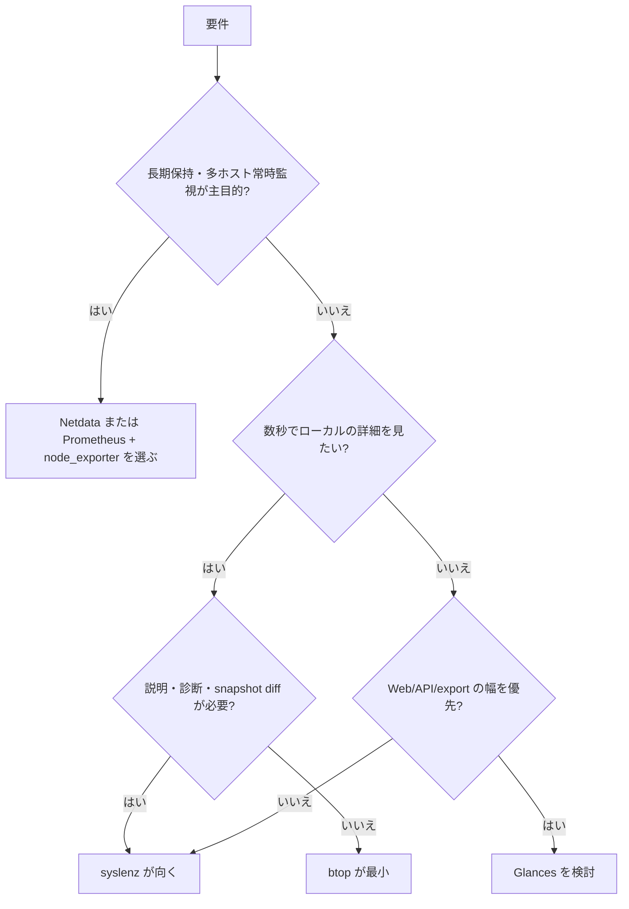

# 0. 要約

syslenz は、Linux の `/proc`・`/sys` を一つのローカルな TUI/Web/API に束ね、観測・診断・学習まで扱う位置にいる。
最大の弱点は、常時稼働の多ホスト監視、認証、長期保存では Netdata/Glances/Prometheus 系に対してまだ選定理由を作れていないこと。
次の一手は、認証付きの安全な読み取り API と、JSON/Prometheus/OTel を同じスキーマで再利用できる「portable snapshot」を先に固めること。

# 1. このrepoは何か

一言でいえば、syslenz は「Wireshark for `/proc`」を掲げる Linux システム観測アプリである。README だけでなく `src/`、`docs/features/`、`sdk/`、`providers/` を確認すると、単なる TUI ではなく、収集・表示・診断・出力・組み込み連携を一つのプロジェクトで提供している。

- **提供価値**: SSH 先でエージェントや外部 SaaS を設定せずに、50以上のデータソースを構造化・型付きで見て、JSON スナップショット、差分、グラフ、診断結果として持ち出せる。各フィールドの説明、カテゴリガイド、記事オーバーレイにより、熟練者の調査だけでなく Linux 学習も支援する。
- **実際の利用単位**: `syslenz` 本体を起動する利用者向けアプリが中心だが、Web/API、Prometheus/OTel、Java SDK、Provider を組み合わせて価値を出す。したがって比較対象は `/proc` パーサーのライブラリではなく、ローカル観測から外部連携までを担うツール全体とした。
- **想定利用者**: SRE/システム管理者、セキュリティ監査者、Linux 学習者、教育者、アプリ内メトリクスをホスト観測に寄せたい開発者。
- **客観指標**: HEAD は `5ee7ac8`（2026-06-12）。`src/` は Rust 86 files / 50,445 LOC、`tests/` は9 files / 9,793 LOC、`src` と `tests` に `#[test]`/`#[tokio::test]` が232個、Cargo の直接依存は16、feature は4。Cargo package version は1.7.0、license はMIT。

この構成から、syslenz は「htop の代替」だけではないと読める。表示面の比較だけをすると教育、差分、構造化出力、SDK という勝ち筋を落とす。一方で、Netdata のようなサービス/エージェント製品の代替と見ると、認証・保持・運用面の不足がそのまま弱点になる。

# 1.5 調査の型

`target_type: hybrid` とした。コアは MIT の単体バイナリだが、Web UI/API、Prometheus/OTel exporter、Java SDK、外部 Provider を組み合わせて利用できるためである。比較軸は「観測機能」だけでなく、導入の軽さ、出力の再利用性、拡張/連携面、運用時の安全性を含めた。

競合については、GitHub の公開 README、コードページ、manifest、collector 一覧を読んだ。ネットワーク制約により比較対象を checkout してテスト実行することはできなかったため、競合の実行時間、配布サイズ、実測テスト数は不明とし、公開コードから確認できる構造だけを4.5節に載せる。

# 2. 比較対象と選定理由

| 製品 | 何ができるか | 採用状況（2026-07-31確認） | ライセンス | うちとの決定的な違い | なぜ比較対象に選んだか |
|---|---|---|---|---|---|
| [btop](https://github.com/aristocratos/btop) | CPU、メモリ、ディスク、ネットワーク、プロセスを高速な対話型 TUI で表示。プロセス操作、フィルタ、テーマ、GPU 等に対応。 | ★33.6k / v1.4.7、2026-05-01 | Apache-2.0 | 表示と操作に特化し、Web/API、診断記事、構造化スナップショットは主目的ではない。 | syslenz の「SSHしてすぐ見る」体験に対する最も直接的な TUI 比較。 |
| [Glances](https://github.com/nicolargo/glances) | クロスプラットフォーム監視。TUI、Web、REST/XML-RPC、client/server、JSON/CSV、Prometheus 等への export、コンテナや MCP に対応。 | ★33k / 4.5.5、2026-06-13公開情報 | LGPL-3.0-only | 連携先とプラグインの幅が広いが、syslenz の4段階ヘルプ・記事・カテゴリ学習は独自機能。 | TUI/Web/API/export を同じ導入単位で比較できる最も近い OSS。 |
| [node_exporter](https://github.com/prometheus/node_exporter) | *NIX カーネルのハードウェア/OS メトリクスを Prometheus 形式で HTTP 提供。collector の有効/無効、textfile、TLS 設定に対応。 | ★13.4k / v1.11.1、2026-04-07 | Apache-2.0 | UI・診断・教育は持たず、Prometheus の収集基盤として使う前提。 | syslenz の Prometheus 出力が本番監視基盤で何を置き換え、何を補完するかを判定するため。 |
| [Netdata](https://github.com/netdata/netdata) | 常時稼働のリアルタイム・フルスタック監視。多数の collector、アラート、ML、クラウド連携、ダッシュボード、マルチノード運用を提供。 | ★78.9k / v2.10.3、2026-04-27 | GPL-3.0（Agent）。UI/Cloud は別ライセンス・クローズド部分を含む。 | syslenz のローカル・単発調査に対し、Netdata は保持・集約・常時運用を前提にする。 | 「SaaSを使わずに監視したい」という隣接需要で、syslenz が追うべきでない領域も明確になる。 |

市場は一枚岩ではなく、軽量 TUI（btop）、個人/小規模の多出力監視（Glances）、標準収集基盤（node_exporter）、常時稼働型プラットフォーム（Netdata）に分かれている。stars は Netdata が突出するが、人気の大小は syslenz の教育・ローカル調査という差別化の有無を直接示さない。Glances が Web/API/export/MCP まで広げているため、syslenz の連携面は「ある」だけでは差別化にならず、安全性とスキーマの一貫性で勝つ必要がある。

# 3. ポジショニング

比較軸は「常時運用・集約が重い」から「単発のローカル調査が軽い」、「観測データ中心」から「解釈・学習まで広い」とした。位置は各 README/公開機能表からの定性的整理であり、数値スコアではないため、採用状況の棒グラフは描かない。

syslenz の狙いは btop と Netdata の中間というより、「軽量に入って、観測結果を人が理解できる形にする」別の軸である。Glances は近いが、豊富な export とプラグインの集合に対して、syslenz は型付きデータ、診断、教育を一体化している。この整理は定性的な比較なので、勝敗の数値根拠としては使わず、比較範囲の説明に限定する。

# 4. 機能比較

凡例: ○=ある / △=部分的・要設定 / ×=無い。重み: ◎=この立ち位置で必須 / ○=効く / △=あれば良い / —=不要（むしろ入れない方が良い）。

| 機能 | 重み | syslenz | btop | Glances | node_exporter | Netdata |
|---|---:|---|---|---|---|---|
| 追加設定なしのローカル起動 | ◎ | ○ | ○ | △ | × | × |
| `/proc`/`/sys` の広い収集範囲 | ◎ | ○ | △ | ○ | ○ | ○ |
| 構造化 JSON スナップショット | ◎ | ○ | × | ○ | △ | △ |
| 時系列の差分・履歴 | ◎ | ○ | △ | △ | △ | ○ |
| TUI の対話的ドリルダウン | ◎ | ○ | ○ | ○ | × | △ |
| Web UI / HTTP API | ○ | ○ | × | ○ | △ | ○ |
| 自動診断と対処案 | ◎ | ○ | × | △ | × | ○ |
| フィールド説明・学習コンテンツ | ◎ | ○ | × | × | × | △ |
| Prometheus / OpenTelemetry 連携 | ◎ | ○ | × | ○ | ○ | ○ |
| 外部 Provider / plugin 拡張 | ○ | ○ | × | ○ | ○ | ○ |
| リモート・多ホスト | ○ | △（SSH/Docker/connect） | × | ○ | △（Prometheus前提） | ○ |
| 認証・TLS を含む安全な公開 | ◎ | ×（現状、認証なし） | — | △（設定依存） | △（TLS設定） | ○ |
| 長期保存・アラート運用 | ○ | △（履歴/alert rule） | × | △ | ○（Prometheusと併用） | ○ |
| クロスプラットフォーム | △ | △（Linux中心、移植コードあり） | ○ | ○ | ○（*NIX） | ○ |

痛い×は認証・TLSを含む安全な公開である。syslenz は Web/API を持つのに、README 自身が認証未実装と注意しており、これは機能不足というより運用上の採用停止条件になる。逆に TUI、JSON、診断、学習は単独の○×より組み合わせが価値で、btop/Glances の個別機能を足し算しても同じ体験にはならない。Prometheus/OTel export は競合にもあるため、差別化ではなく互換性の土台と読むべきである。

# 4.5 コード・実装の比較

| 観点 | syslenz | btop | Glances | node_exporter | 出典 |
|---|---:|---:|---:|---:|---|
| 主実装 | Rust | C++23 | Python | Go | 各リポジトリの manifest/build 定義 |
| 自repoで確認したソース量 | 86 Rust files / 50,445 LOC | 不明（checkout不可） | 不明（checkout不可） | 不明（checkout不可） | syslenz HEAD のローカル計測。競合は公開コードページを閲覧 |
| 直接/基本依存 | Cargo dependencies 16 | CMake上の Threads + 標準/同梱ライブラリ。完全数は不明 | runtime 6、optional dependency group 16 | `go.mod` の直接 require 24 | Cargo.toml、btop CMakeLists、Glances pyproject、node_exporter go.mod |
| テストの確認 | test属性232、tests 9 files | `tests/` ディレクトリを確認、実行数は不明 | pytest を開発依存として確認、実行数は不明 | collector ごとの *_test.go を確認、実行数は不明 | 各公開コードページ |
| API/拡張の単位 | provider、HTTP API、SDK、exporter、feature flag | UI/collector の組み込み型 | plugin/output/export の多数の optional 拡張 | collector interface と Prometheus scrape | 各リポジトリの公開コード・README |
| ライセンス上の扱いやすさ | MIT | Apache-2.0 | LGPL-3.0-only | Apache-2.0 | LICENSE/COPYING/manifest |

実装の差は、単なる言語の優劣ではなく前提の差である。btop は単一の高速 TUI に複雑さを閉じ込め、node_exporter は collector と Prometheus の契約に集中する。Glances は optional dependency を増やして出力先を広くし、syslenz は Rust の型と feature flag で本体を一つに保ちながら UI/連携を分岐させている。比較対象の checkout と実行はできていないため、依存数・テスト数・配布サイズの完全な横並びは分からない。

# 5. 採用状況

| 製品 | GitHub stars | 最新リリース | 参照日 |
|---|---:|---|---|
| syslenz | 不明 | Cargo 1.7.0（HEAD 2026-06-12） | 2026-07-31 |
| btop | 33.6k | v1.4.7（2026-05-01） | 2026-07-31 |
| Glances | 33k | 4.5.5（2026-06-13） | 2026-07-31 |
| node_exporter | 13.4k | v1.11.1（2026-04-07） | 2026-07-31 |
| Netdata | 78.9k | v2.10.3（2026-04-27） | 2026-07-31 |

syslenz の star 数はこの調査では信頼できる公開表示を確認できなかったため、不明とした。競合はすべて活発なリリース系列を持つが、star 数の差は「同じ顧客を奪える差」ではない。syslenz は普及度を追う前に、初回起動、診断成功、snapshot の再利用といった自分の価値に直結する指標を持つべきである。

# 5.5 調査者の見立て

本当の勝負所は、メトリクス数ではなく「取得した事実を、次の調査行動につなげること」だと思う。50以上の source は入口として強いが、診断・説明・diff が同じ typed snapshot を共有できるかが、btop/Glances との差になる。

数字に出ていない懸念は、機能面が広がるほど syslenz が「小さなローカル調査ツール」から「未完成の監視プラットフォーム」に見えることだ。特に認証なし Web/API は、README に注意書きがあっても、利用者の誤公開を完全には防がない。

自分なら、まず portable snapshot と安全な read-only API を製品の中心契約にする。TUI、Web、JSON、Prometheus、SDK はその契約の別表示・別入力として整理し、常時稼働・クラウド集約は明確に別スコープに置く。

この見立てが外れるとしたら、利用者の大半が「学習/単発調査」ではなく、認証付きの多ホスト常時監視を最初から求めている場合である。また Glances が同等の説明・診断体験を実装し、Netdata が軽量な単発 snapshot を提供し始めるなら、現在の差別化は弱まる。

# 6. 提案（優先順）

| 順 | 提案 | 分類 | 根拠 | 最小の一手 | 効きそうな指標 |
|---:|---|---|---|---|---|
| 1 | 認証・TLSまたは安全な read-only proxy を先に提供する | 埋める | 機能表の◎で現状×。Web/API はあるのに公開安全性が採用阻害要因 | `/api/snapshot` 等を read-only とし、loopback既定、token/TLS、公開時の起動警告を実装仕様化 | 認証付き起動率、公開経路の脆弱性報告数、設定ミスの再現テスト |
| 2 | portable snapshot schema を固定し、TUI/Web/JSON/Prometheus/OTel/SDK の共通契約にする | 伸ばす | syslenz の typed data、diff、export、SDK が一つの勝ち筋になる | schema version、取得時刻、host identity、source metadata を含む fixture と互換性テストを追加 | 同一snapshotを読む consumer 数、schema破壊なしのリリース率、再現可能なdiff数 |
| 3 | 「診断→根拠フィールド→次の確認」の導線を磨く | 伸ばす | 学習・診断は競合の単機能と最も差が出る | 各診断に source/field、観測値、閾値、確認コマンド、関連記事を必須化 | 診断から詳細/記事へ進む率、誤診断報告、解決までの操作数 |
| 4 | multi-host を snapshot 比較中心で完成させる | 埋める | remote は部分的で、Netdata/Glances が運用面で優位 | Fleet View ではなく、SSH/connect で取得した複数snapshotの名前付き比較と保存を先に出す | 2台以上の比較成功率、比較完了時間、再利用されたsnapshot数 |
| 5 | 常時保存・クラウド・Netdata級のフル監視プラットフォーム化は当面やらない | やらない | Netdata と正面衝突し、認証・保持・運用責任が増えて教育/単発調査の差別化を薄める | roadmap から「常時集約」を外し、必要な場合は Prometheus/OTel export で連携する | scope creep のissue数、snapshot/診断機能への開発比率 |
| 6 | 自前の exporter/DB/ダッシュボードを増やすより既存標準へ寄せる | やらない | node_exporter、Prometheus、Glances が既に広い連携面を持つ。車輪の再発明になる | exporter は標準名・ラベル・schema version の互換性を優先し、独自保存は最小化 | 外部Prometheus/Grafanaでの接続成功率、独自仕様の増加数 |

優先順位の中心は、機能追加ではなく「安全に取り出せて、同じデータを別の面で使える」契約である。認証だけを足しても、API の値が TUI/診断/SDK とずれていれば運用価値は上がらないため、1と2は同じ設計作業として扱う。4は Fleet View の大きな UI を先に作る提案ではなく、syslenz の既存 snapshot/diff の強みを多ホストに延長する小さな段階である。

# 7. 選択の分岐

この分岐は syslenz を選ばない条件も明示している。学習・原因調査・ローカルデータ保持が要件なら syslenz、最小の TUI なら btop、広い export/plugin なら Glances、常時運用なら Netdata または Prometheus 系という使い分けである。認証付き Web/API が必須で、将来の追加作業を許容しない場合は、現状の syslenz を選ぶべきではない。

# 8. 出典

| URL | 参照日 | 何の根拠に使ったか |
|---|---|---|
| [syslenz README](https://github.com/opaopa6969/syslenz/blob/main/README.md) | 2026-07-31 | 目的、TUI/Web/API、50+ data sources、教育、診断、SDK、認証未実装の記述 |
| [syslenz Cargo.toml](https://github.com/opaopa6969/syslenz/blob/main/Cargo.toml) | 2026-07-31 | version 1.7.0、MIT、Rust依存、feature構成 |
| [syslenz source tree](https://github.com/opaopa6969/syslenz/tree/main/src) | 2026-07-31 | collector/UI/Web/export/remote/SDK と本体構成。LOC等は調査時HEADをローカル計測 |
| [syslenz tests](https://github.com/opaopa6969/syslenz/tree/main/tests) | 2026-07-31 | テスト構成。232 test attributes等はローカル計測 |
| [btop repository](https://github.com/aristocratos/btop) | 2026-07-31 | stars、release、機能、Apache-2.0 |
| [btop CMakeLists.txt](https://github.com/aristocratos/btop/blob/main/CMakeLists.txt) | 2026-07-31 | C++23、source target、Threads/GPU、実装構成 |
| [Glances repository](https://github.com/nicolargo/glances) | 2026-07-31 | stars、LGPL、TUI/Web/API/client-server/export/MCP、release |
| [Glances pyproject.toml](https://github.com/nicolargo/glances/blob/develop/pyproject.toml) | 2026-07-31 | runtime 依存6、optional group、pytest、LGPL-3.0-only |
| [Glances package metadata](https://deps.dev/pypi/glances) | 2026-07-31 | stars概数、4.5.5の公開日、ライセンス補助確認 |
| [node_exporter repository](https://github.com/prometheus/node_exporter) | 2026-07-31 | stars、release、collector、Prometheus用途、Apache-2.0 |
| [node_exporter go.mod](https://github.com/prometheus/node_exporter/blob/master/go.mod) | 2026-07-31 | 直接 require 24、Go 1.25、依存構成 |
| [node_exporter collector tree](https://github.com/prometheus/node_exporter/tree/master/collector) | 2026-07-31 | collector の実装・テストの構造、OS別対応 |
| [Netdata repository](https://github.com/netdata/netdata) | 2026-07-31 | stars、release、フルスタック監視、GPL-3.0 |
| [Netdata README](https://github.com/netdata/netdata/blob/master/README.md) | 2026-07-31 | Agent資源量の主張、Agent/UI/Cloudのライセンスと機能差 |
| [Netdata LICENSE](https://github.com/netdata/netdata/blob/master/LICENSE) | 2026-07-31 | ライセンス文書の存在と構成 |

競合コードを checkout して build/test する試みは、実行環境の DNS 制限により失敗した。そのため競合について「実行した」「配布サイズを測った」「テストが何件 pass した」とは書いていない。公開コードページを閲覧した事実は上記出典に対応させ、測れない値は不明とした。
