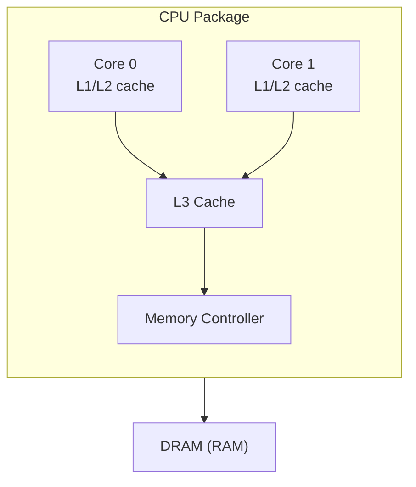

# Hardware Components Overview

[日本語版](../ja/concept.hardware-components.md)

---

Understanding hardware components helps interpret metrics correctly.

**Latency hierarchy:**
- L1 cache: ~1ns
- L2 cache: ~5ns
- L3 cache: ~20ns
- DRAM: ~100ns
- NVMe SSD: ~100μs
- SATA SSD: ~500μs
- HDD: ~10ms

This is why cache eviction (workingset refaults) is expensive.

---

## See also

- `sourceguide.vmstat` — vmstat overview
- `sourceguide.meminfo` — memory info overview
- `sourceguide.pressure` — PSI pressure stall information
