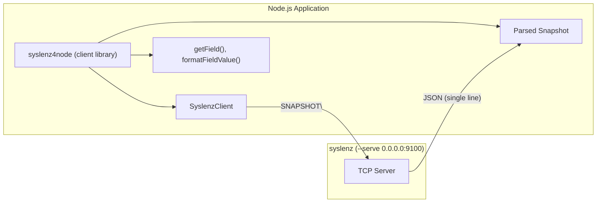

# syslenz4node

Node.js client library for connecting to [syslenz](https://github.com/opaopa6969/syslenz) TCP servers (`--serve` mode) and reading system snapshots.

## Overview

`syslenz4node` connects to a running syslenz instance over TCP, requests a system snapshot, and returns parsed JSON data. It has zero external dependencies -- only Node.js built-in modules (`net`) are used.

### Architecture



## Installation

```bash
npm install syslenz4node
```

## Requirements

- Node.js 18 or later
- ESM modules (`"type": "module"` in your package.json, or use `.mjs` files)
- A running syslenz instance in `--serve` mode

## Usage

### Start syslenz in serve mode

```bash
syslenz --serve 0.0.0.0:9100
```

### One-shot snapshot

```js
import { fetchSnapshot } from "syslenz4node";

const snapshot = await fetchSnapshot("localhost:9100");
console.log("Timestamp:", snapshot.timestamp);

for (const [name, entry] of Object.entries(snapshot.entries)) {
  console.log(`[${name}] source: ${entry.source}`);
  for (const field of entry.fields) {
    console.log(`  ${field.name}: ${JSON.stringify(field.value)}`);
  }
}
```

### Using the client class

```js
import { SyslenzClient } from "syslenz4node";

const client = new SyslenzClient({ host: "localhost", port: 9100 });

// Fetch a full snapshot
const snapshot = await client.getSnapshot();

// Look up a specific field across all entries
const cpu = await client.getField("cpu_total");
if (cpu) {
  console.log(`CPU usage: ${cpu.display} (from ${cpu.entry})`);
}

client.close();
```

### Streaming snapshots

```js
import { streamSnapshots } from "syslenz4node";

for await (const snapshot of streamSnapshots({
  host: "localhost",
  port: 9100,
  interval: 2000,
})) {
  const ts = snapshot.timestamp;
  const entryCount = Object.keys(snapshot.entries).length;
  console.log(`[${ts}] ${entryCount} entries`);
}
```

### Working with field values

Field values are tagged enums (matching the Rust types):

```js
import { unwrapFieldValue, formatFieldValue, formatBytes } from "syslenz4node";

// Field value is e.g. { "Bytes": 1073741824 }
const field = snapshot.entries["system"].fields[0];

// Unwrap to get the raw value and type
const { type, value } = unwrapFieldValue(field.value);
// type = "Bytes", value = 1073741824

// Or format for display
const display = formatFieldValue(field.value);
// "1.00 GiB"
```

## Protocol

The TCP protocol is simple and text-based:

1. Client sends `SNAPSHOT\n`
2. Server responds with a single-line JSON (Snapshot format)
3. Server closes the connection after the response

The Snapshot JSON structure:

```json
{
  "timestamp": "2025-01-15T10:30:00Z",
  "entries": {
    "system": {
      "source": "procfs",
      "fields": [
        {
          "name": "mem_total",
          "value": { "Bytes": 16777216000 },
          "unit": null,
          "description": "Total physical memory"
        }
      ]
    }
  }
}
```

### FieldValue types

| Variant    | JSON example              | Raw value type |
|------------|---------------------------|----------------|
| `Bytes`    | `{"Bytes": 1024}`         | `number`       |
| `Integer`  | `{"Integer": 42}`         | `number`       |
| `Float`    | `{"Float": 3.14}`         | `number`       |
| `Text`     | `{"Text": "hello"}`       | `string`       |
| `Duration` | `{"Duration": 123.4}`     | `number` (seconds) |
| `Table`    | `{"Table": [["a","b"]]}` | `string[][]`   |

## API Reference

### `SyslenzClient`

| Method | Returns | Description |
|--------|---------|-------------|
| `constructor(options?)` | | Create client. Options: `host`, `port`, `timeout` |
| `connect()` | `Promise<void>` | Connect to the TCP server |
| `getSnapshot()` | `Promise<Snapshot>` | Fetch and parse a snapshot |
| `getField(name)` | `Promise<FieldResult \| null>` | Look up a field by name |
| `close()` | `void` | Close the connection |
| `isConnected` | `boolean` | Connection status |
| `address` | `string` | Target address (host:port) |

### Standalone functions

| Function | Description |
|----------|-------------|
| `fetchSnapshot(addr?, timeout?)` | One-shot snapshot fetch |
| `streamSnapshots(options?)` | AsyncGenerator that polls snapshots |
| `unwrapFieldValue(fv)` | Extract `{ type, value }` from a FieldValue |
| `formatFieldValue(fv)` | Human-readable string for a FieldValue |
| `formatBytes(n)` | Format bytes (e.g. `"1.5 GiB"`) |
| `formatDuration(secs)` | Format seconds (e.g. `"2h 15m"`) |

---

# syslenz4node (日本語)

[syslenz](https://github.com/opaopa6969/syslenz) TCP サーバー (`--serve` モード) に接続してシステムスナップショットを取得する Node.js クライアントライブラリです。

## 概要

`syslenz4node` は稼働中の syslenz インスタンスに TCP 接続し、システムスナップショットをリクエストして JSON データとして返します。外部依存ライブラリは不要で、Node.js 標準モジュール (`net`) のみを使用します。

## インストール

```bash
npm install syslenz4node
```

## 使い方

### syslenz をサーブモードで起動

```bash
syslenz --serve 0.0.0.0:9100
```

### ワンショット スナップショット

```js
import { fetchSnapshot } from "syslenz4node";

const snapshot = await fetchSnapshot("localhost:9100");
console.log("タイムスタンプ:", snapshot.timestamp);
```

### クライアントクラスを使用

```js
import { SyslenzClient } from "syslenz4node";

const client = new SyslenzClient({ host: "localhost", port: 9100 });

// スナップショットを取得
const snapshot = await client.getSnapshot();

// 特定のフィールドを検索
const cpu = await client.getField("cpu_total");
if (cpu) {
  console.log(`CPU 使用率: ${cpu.display}`);
}

client.close();
```

### ストリーミング

```js
import { streamSnapshots } from "syslenz4node";

for await (const snapshot of streamSnapshots({
  host: "localhost",
  port: 9100,
  interval: 2000,  // 2秒間隔でポーリング
})) {
  console.log(`[${snapshot.timestamp}] エントリ数: ${Object.keys(snapshot.entries).length}`);
}
```

## プロトコル

TCP サーバーはシンプルなテキストプロトコルを使用します:

1. クライアントが `SNAPSHOT\n` を送信
2. サーバーが Snapshot JSON を1行で返却
3. サーバーはレスポンス後に接続を閉じる

## 動作要件

- Node.js 18 以降
- ESM モジュール (`"type": "module"`)
- 外部依存なし
