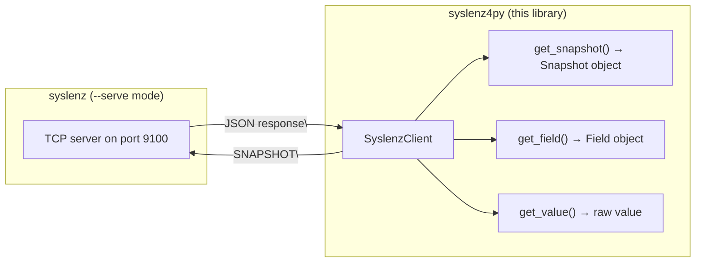

# syslenz4py

Python client library for connecting to [syslenz](https://github.com/opaopa6969/syslenz) and retrieving system snapshots.

## Overview

`syslenz4py` connects to a syslenz instance running in `--serve` mode over TCP, sends `SNAPSHOT` commands, and parses the JSON responses into typed Python objects. Zero external dependencies -- uses only the Python standard library.

### Architecture



## Installation

### pip

```bash
pip install syslenz4py
```

### From source

```bash
cd sdk/python
pip install -e .
```

## Usage

### Start syslenz in serve mode

```bash
syslenz --serve 0.0.0.0:9100
```

### Connect and get a snapshot

```python
from syslenz4py import SyslenzClient

client = SyslenzClient("localhost", 9100)
with client:
    snapshot = client.get_snapshot()
    print(f"Timestamp: {snapshot.timestamp}")
    for name, entry in snapshot.entries.items():
        print(f"  {name} ({entry.source}): {len(entry.fields)} fields")
        for field in entry.fields:
            print(f"    {field.name} = {field.value.as_str()}")
```

### Quick one-liner

```python
from syslenz4py import SyslenzClient

value = SyslenzClient("localhost").connect().get_value("mem_total")
print(f"Total memory: {value}")
```

### Get a specific field

```python
from syslenz4py import SyslenzClient

with SyslenzClient("localhost", 9100) as client:
    field = client.get_field("cpu_usage_percent")
    if field:
        print(f"CPU: {field.value.as_float():.1f}%")
```

### Periodic monitoring

```python
import time
from syslenz4py import SyslenzClient

client = SyslenzClient("localhost", 9100)
while True:
    try:
        snap = client.connect().get_snapshot()
        mem = snap.get_value("mem_used")
        cpu = snap.get_value("cpu_usage_percent")
        print(f"MEM={mem}  CPU={cpu}")
    except Exception as e:
        print(f"Error: {e}")
    time.sleep(5)
```

### Working with FieldValue types

```python
from syslenz4py import SyslenzClient

with SyslenzClient("localhost") as client:
    snap = client.get_snapshot()
    field = snap.get_field("mem_total")
    if field:
        print(f"Kind: {field.value.kind}")      # "Bytes"
        print(f"Raw:  {field.value.raw}")        # 17179869184
        print(f"Int:  {field.value.as_int()}")   # 17179869184
        print(f"Str:  {field.value.as_str()}")   # "16.0 GiB"
```

### Raw JSON access

```python
from syslenz4py import SyslenzClient

with SyslenzClient("localhost") as client:
    raw = client.get_snapshot_raw()
    print(raw)  # dict -- the full JSON as parsed by json.loads()
```

### Error handling

```python
from syslenz4py import SyslenzClient
from syslenz4py.client import ConnectionError, ProtocolError, SyslenzError

try:
    with SyslenzClient("localhost", 9100) as client:
        snap = client.get_snapshot()
except ConnectionError as e:
    print(f"Cannot reach syslenz: {e}")
except ProtocolError as e:
    print(f"Bad response: {e}")
except SyslenzError as e:
    print(f"syslenz error: {e}")
```

## Data Model

The library provides typed Python classes that mirror the Rust structures:

| Python class | Rust struct | Description |
|---|---|---|
| `Snapshot` | `Snapshot` | Point-in-time system snapshot with timestamp and entries |
| `ProcEntry` | `ProcEntry` | A group of metrics from one source |
| `Field` | `Field` | A single named metric with typed value |
| `FieldValue` | `FieldValue` | Typed value: Bytes, Integer, Float, Text, Duration, Table |

### FieldValue variants

| Kind | Python type | Example |
|---|---|---|
| `Bytes` | `int` | `FieldValue("Bytes", 1073741824)` |
| `Integer` | `int` | `FieldValue("Integer", 42)` |
| `Float` | `float` | `FieldValue("Float", 3.14)` |
| `Text` | `str` | `FieldValue("Text", "Linux 6.1")` |
| `Duration` | `float` | `FieldValue("Duration", 86400.0)` |
| `Table` | `list[list[str]]` | `FieldValue("Table", [["col1","col2"]])` |

## Protocol

The TCP protocol is simple and text-based:

1. Client opens TCP connection to `host:port`
2. Client sends `SNAPSHOT\n`
3. Server responds with a single-line JSON followed by `\n`
4. Connection closes after one exchange

This matches the `syslenz --serve` implementation in `src/serve.rs`.

## Requirements

- Python 3.8 or later
- No external dependencies

---

# syslenz4py (Japanese / 日本語)

[syslenz](https://github.com/opaopa6969/syslenz) に接続してシステムスナップショットを取得する Python クライアントライブラリです。

## 概要

`syslenz4py` は `--serve` モードで動作中の syslenz に TCP 接続し、`SNAPSHOT` コマンドを送信して JSON レスポンスを型付き Python オブジェクトにパースします。外部依存ライブラリは不要で、Python 標準ライブラリのみを使用します。

## インストール

```bash
pip install syslenz4py
```

## 使い方

### syslenz をサーブモードで起動

```bash
syslenz --serve 0.0.0.0:9100
```

### スナップショットの取得

```python
from syslenz4py import SyslenzClient

with SyslenzClient("localhost", 9100) as client:
    snapshot = client.get_snapshot()
    print(f"タイムスタンプ: {snapshot.timestamp}")
    for name, entry in snapshot.entries.items():
        print(f"  {name}: {len(entry.fields)} フィールド")
```

### 特定フィールドの取得

```python
from syslenz4py import SyslenzClient

with SyslenzClient("localhost") as client:
    field = client.get_field("mem_used")
    if field:
        print(f"メモリ使用量: {field.value.as_str()}")
```

## プロトコル

TCP サーバーは以下のシンプルなプロトコルを使用します:

1. クライアントが `SNAPSHOT\n` を送信
2. サーバーが Snapshot JSON を1行で返却
3. 接続はリクエストごとにクローズ

## 必要条件

- Python 3.8 以上
- 外部依存なし
