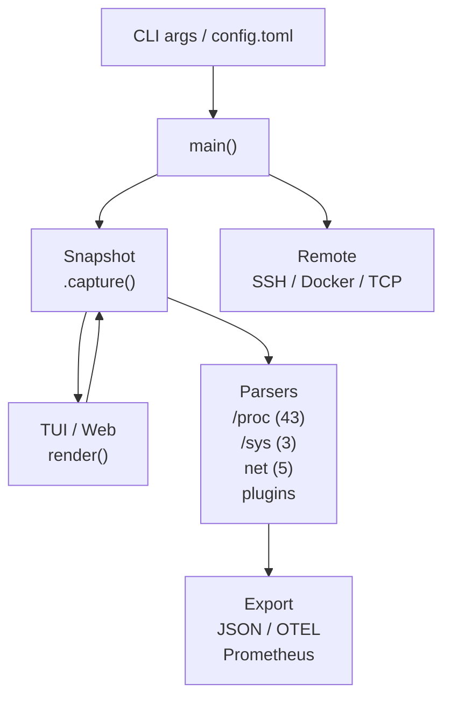
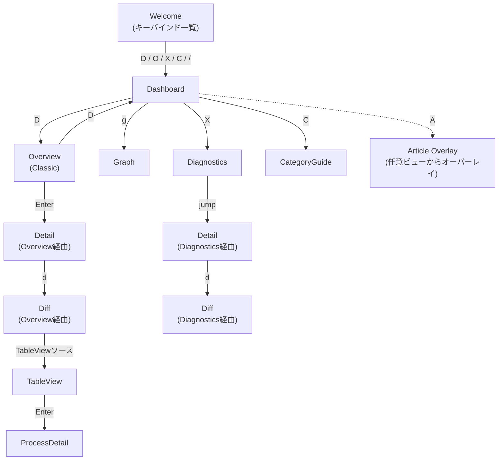
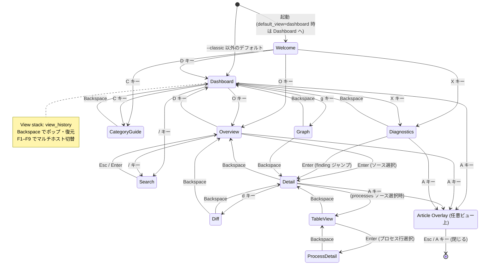
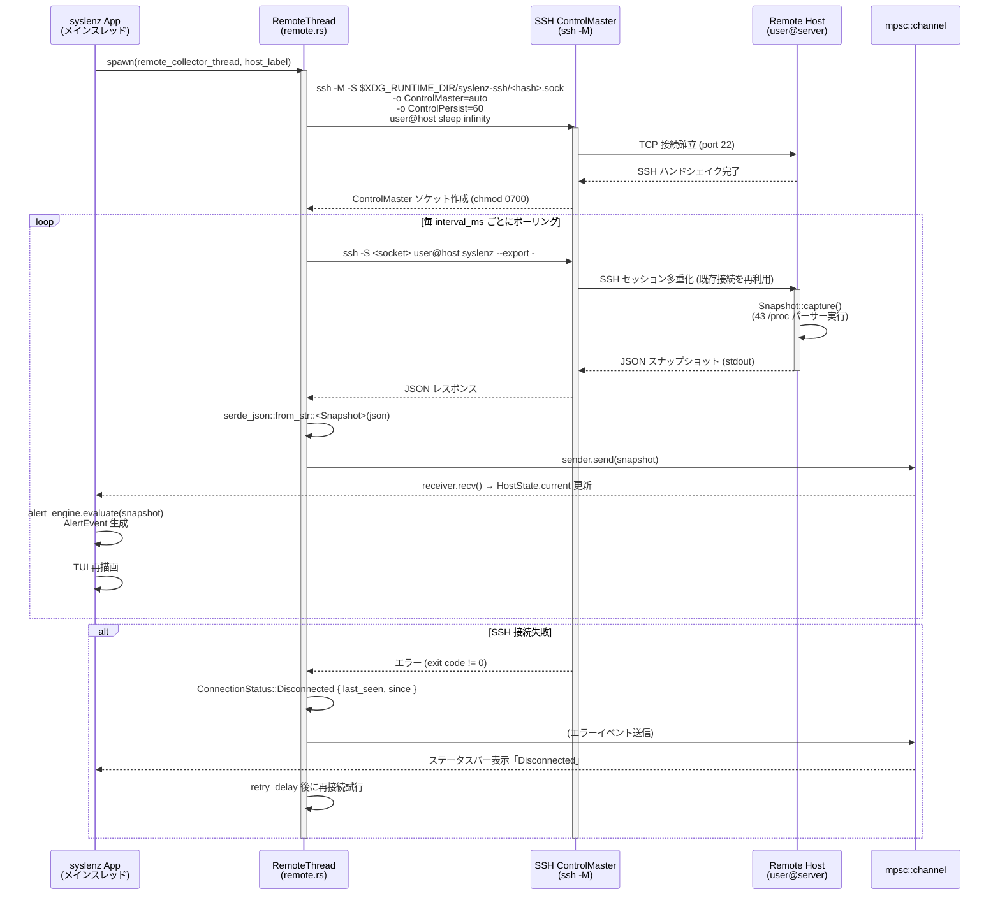

# syslenz v1.7 — 仕様書 (SPEC.md)

> **DGE toolkit v2.3.2** を使用して生成・レビューされた仕様書。  
> リポジトリ: `opaopa6969/syslenz`  
> バージョン: **v1.7.0**  
> エディション: **Rust edition 2024**

---

## 目次

1. [概要](#1-概要)
2. [機能仕様](#2-機能仕様)
3. [データ永続化層](#3-データ永続化層)
4. [ステートマシン](#4-ステートマシン)
5. [ビジネスロジック](#5-ビジネスロジック)
6. [API / 外部境界](#6-api--外部境界)
7. [UI (ratatui TUI)](#7-ui-ratatui-tui)
8. [設定](#8-設定)
9. [依存関係](#9-依存関係)
10. [非機能要件](#10-非機能要件)
11. [テスト戦略](#11-テスト戦略)
12. [デプロイ / 運用](#12-デプロイ--運用)

---

## 1. 概要

### 1.1 プロダクト概要

syslenz は **「Wireshark for /proc」** をコンセプトとする、ゼロコンフィグ・シングルバイナリの Linux システム監視・教育ツールである。

- 50+ のデータソースをリアルタイムに構造化・型付けして提示する
- TUI (ratatui)、Web UI (axum)、JSON エクスポート、Prometheus、OpenTelemetry という複数のフロントエンドを持つ
- ユーザーデータを一切外部に送信しない（100% ローカル動作）
- 4 段階のヘルプレベルと Article Overlay による **教育機能** を内蔵する
- SSH / Docker / TCP を経由したリモートホスト監視をサポートする

### 1.2 バージョン・エディション

| 項目 | 値 |
|------|----|
| バージョン | 1.7.0 |
| Rust edition | 2024 (rustc 1.85 以上が必要) |
| DGE toolkit | v2.3.2 |
| ライセンス | MIT |
| crates.io | `syslenz` |
| Docker Hub | `opaopa6969/syslenz` |
| リポジトリ | `https://github.com/opaopa6969/syslenz` |

### 1.3 設計原則

1. **ゼロコンフィグ** — 設定ファイルなしで起動できる。すべての設定はデフォルト値を持つ。
2. **シングルバイナリ** — 追加エージェント不要。1 バイナリで TUI・Web・TCP・Prometheus・OTel すべてを提供。
3. **データ主権** — ユーザーのデータはユーザーのマシンから出ない。
4. **教育ファースト** — すべてのメトリクスに 4 段階のヘルプと Article Overlay を付与。
5. **型付きデータ** — `FieldValue` enum が `Bytes / Integer / Float / Duration / Text / Table` を区別し、単純文字列で誤魔化さない。

### 1.4 アーキテクチャ概要図



---

## 2. 機能仕様

### 2.1 モード一覧

| モード | 起動方法 | 機能 |
|--------|----------|------|
| TUI (デフォルト) | `syslenz` | ratatui によるターミナル UI |
| Classic TUI | `syslenz --classic` | サイドバー + 詳細パネル (従来モード) |
| Web UI | `syslenz --web [port]` | axum HTTP サーバー、ブラウザダッシュボード (要 `web` feature) |
| TCP サーバー | `syslenz --serve [addr]` | Docker コンテナ向け TCP スナップショットサーバー |
| Prometheus | `syslenz --prometheus [addr]` | `/metrics` エンドポイント |
| OTel エクスポート | `syslenz --otel [endpoint]` | OTLP gRPC エクスポート (要 `otel` feature) |
| CLI クエリ | `syslenz --query [source]` | TUI なし CLI 出力 |
| エクスポート | `syslenz --export file.json` | スナップショット JSON 出力 |
| インポート | `syslenz --import file.json` | 過去スナップショット再生 |
| チュートリアル | `syslenz --tutorial` | 8 ステップ対話型ガイド |
| X11 ウィジェット | `syslenz --widget` | X11 フローティングウィジェット (要 `x11widget` feature) |
| systemd サービス | `syslenz --install-service` | systemd サービスファイルの生成・インストール |

### 2.2 TUI 機能

#### 2.2.1 ビュー一覧

| ビュー | enum 値 | 概要 |
|--------|---------|------|
| Dashboard | `View::Dashboard` | CPU / メモリ / ネットワーク / 負荷の概要 |
| Welcome | `View::Welcome` | キーバインド一覧・オンボーディング |
| Classic (Overview) | `View::Overview` | サイドバー + フィールド詳細パネル |
| Detail | `View::Detail` | 単一ソースの全フィールド表示 |
| Diff | `View::Diff` | スナップショット間差分表示 |
| TableView | `View::TableView` | テーブル形式で全行を表示 |
| Graph | `View::Graph` | スパークライン時系列グラフ |
| Diagnostics | `View::Diagnostics` | 自動診断エンジン結果 |
| CategoryGuide | `View::CategoryGuide` | カテゴリ別教育コンテンツ |
| Tutorial | `View::Tutorial` | 対話型 8 ステップチュートリアル |
| ProcessDetail | `View::ProcessDetail` | 個別プロセス詳細 (/proc/[pid]) |

#### 2.2.2 キーバインド

| キー | アクション |
|------|-----------|
| `j` / `k` | ソース / フィールドの移動 |
| `Enter` / `Backspace` | ドリルイン / 戻る |
| `Tab` | サイドバー / コンテンツフォーカス切替 |
| `/` | ソース検索 |
| `d` | Diff ビュー |
| `g` | グラフビュー (スパークライン) |
| `s` | グラフの Y 軸モード切替 |
| `?` | ヘルプレベルのサイクル (OFF / NORMAL / DETAILED / EXTRA) |
| `L` | 言語切替 (EN / JA) |
| `c` | クリップボードコピー |
| `e` | スナップショット JSON エクスポート |
| `a` | 自動更新トグル |
| `r` | 手動更新 |
| `D` | Dashboard ビューへ |
| `O` | Classic ビューへ |
| `W` | Welcome ビューへ |
| `X` | Diagnostics ビューへ |
| `C` | CategoryGuide ビューへ |
| `A` | Article Overlay (選択メトリクスの記事表示) |
| `[` / `]` | グラフ時間ウィンドウ切替 (30s/1m/2m/5m/15m/1h) |
| `F1`–`F9` | マルチホストタブ切替 |
| `q` | 終了 |

#### 2.2.3 ヘルプレベル

```rust
pub enum HelpLevel {
    Off,
    Normal,
    Detailed,
    ExtraDetailed,
}
```

`?` キーで順番にサイクルする。`ExtraDetailed` では学習 breadcrumbs と SEE ALSO リンクを表示する。

### 2.3 HTTP / Web UI 機能

Web UI (`--web` モード、`web` feature が必要) が提供する機能:

- リアルタイムダッシュボード (SSE ストリーム)
- サイドバーのツリー / フラット表示トグル (`t` キー)
- TableView の RT 安定性 (自動更新をまたいでビューを維持)
- TableView の `j`/`k` キー操作とハイライト
- ProcessDetail ビュー (processes 行から Enter で /proc/[pid] 詳細へ)
- グラフ Y 軸固定 (全スナップショットの min/max で正規化)
- 時間ウィンドウ選択 (`[`/`]` キー + ボタン UI)
- Settings GUI (`/settings`) — アラートルール編集

### 2.4 Settings GUI

`http://localhost:3000/settings` で動作。機能:

- 現在の設定を表示 (`~/.config/syslenz/config.toml` から読込)
- アラートルールの追加・編集・削除
- syslenz 再起動なしで設定ファイルに保存

### 2.5 Fleet View (未実装)

Fleet View (`/fleet`) は **計画中** であり、現バージョン (v1.7) では **実装されていない**。

- 複数ホストのステータスマトリクスを Web 上に表示する予定
- 将来の `/fleet` エンドポイントとして予約済み

### 2.6 教育機能

#### Article Overlay

- 691 メトリクス × EN + JA の専用記事 (合計 717 × 2 markdown ファイル)
- 各記事は実際のエピソード・ASCII 図・チューニング手順を含む
- TUI では `A` キー、Web では `A` キーで表示
- SEE ALSO ナビゲーション: 31 フィールドに 105 クロスリファレンス

#### Category Guide

Memory / CPU / Network / Storage / Process / Hardware の 6 カテゴリ別に各ソースの関係を説明する。

#### Tutorial モード

`--tutorial` フラグで起動。ライブシステムデータを使った 8 ステップの対話型ガイド。

#### Learning Breadcrumbs

EXTRA ヘルプレベルで 18 フィールド (EN/JA) に「次のステップ」ヒントを表示。

---

## 3. データ永続化層

### 3.1 設定ファイル

#### ファイルパス

```
~/.config/syslenz/config.toml
```

または `$XDG_CONFIG_HOME` が設定されている場合:

```
$XDG_CONFIG_HOME/syslenz/config.toml
```

#### 優先順位 (高い順)

1. CLI フラグ
2. 環境変数 (`$XDG_CONFIG_HOME` など)
3. `config.toml`
4. 組み込みデフォルト値

#### 設定スキーマ (TOML)

```toml
[general]
lang = "en"                 # "en" | "ja"
interval_ms = 1000          # 自動更新間隔 (ms)
default_view = "dashboard"  # "dashboard" | "classic"
history_size = 60           # リングバッファサイズ (スナップショット数)

[web]
port = 3000                 # --web のデフォルトポート

[otel]
endpoint = "http://localhost:4317"  # OTLP gRPC エンドポイント
interval_secs = 5                   # エクスポート間隔

[ssh]
hosts = ["user@server1", "user@server2"]  # --ssh のデフォルトホスト

[history]
enabled = true
interval_secs = 60
retention_days = 7
path = "/var/lib/syslenz/history"  # 省略時はデフォルトパス

[[alert]]
source = "meminfo"
field = "MemAvailable"
condition = "< 500000000"
severity = "critical"          # "info" | "warning" | "critical"
message = "Memory critically low"
action = "notify-send 'syslenz: {message}'"  # オプション: シェルコマンド
notify = ["slack:https://hooks.slack.com/...", "webhook:https://..."]  # オプション

[[diagnostic_runbook]]
pattern = "memory"
url = "https://wiki.example.com/runbooks/memory"
```

### 3.2 スナップショット JSON (エクスポート形式)

`--export` で出力される JSON は `Snapshot` 構造体を pretty-print したものである。

```json
{
  "timestamp": "<RFC 3339 または UNIX timestamp>",
  "entries": {
    "meminfo": {
      "fields": [
        {
          "name": "MemTotal",
          "value": { "Bytes": 16777216000 },
          "unit": "kB",
          "description": "Total usable RAM..."
        }
      ]
    }
  }
}
```

#### FieldValue enum

```rust
pub enum FieldValue {
    Bytes(u64),
    Integer(i64),
    Float(f64),
    Duration(f64),
    Text(String),
    Table(Vec<Vec<String>>),
}
```

### 3.3 ヒストリー JSONL

`[history]` セクションが有効な場合、スナップショットを日付パーティション分割の JSONL ファイルに定期書き込みする。

- ファイル名: `syslenz-YYYY-MM-DD.jsonl`
- デフォルトディレクトリ: `~/.local/share/syslenz/history/` (XDG 準拠)
- retention_days を超えた古いファイルは自動削除
- 1 行 = 1 スナップショット (JSON)

### 3.4 アラート設定の API 経由永続化

`POST /api/v1/settings/alerts` を呼ぶと、アラートルールを `config.toml` に書き戻す。syslenz の再起動は不要。

---

## 4. ステートマシン

### 4.1 TUI 画面遷移



### 4.2 View スタック

- `view_history: Vec<(View, Focus, usize, usize)>` によりバックナビゲーションを実装
- Diagnostics → Detail ジャンプは `view_history` にプッシュされる
- `Backspace` で `view_history` からポップして元のビュー・カーソル位置を復元

### 4.3 マルチホスト状態

複数ホスト監視時 (`--ssh`, `--docker`, `--connect` を複数指定)、各ホストは `HostState` 構造体で独立したスナップショット・アラート・接続状態を保持する。

```rust
pub struct HostState {
    pub label: String,
    pub current: Snapshot,
    pub snapshots: Vec<Snapshot>,
    pub max_snapshots: usize,
    pub receiver: Option<mpsc::Receiver<Snapshot>>,
    pub connection_status: ConnectionStatus,
    pub alert_events: Vec<AlertEvent>,
}
```

#### ConnectionStatus

```rust
pub enum ConnectionStatus {
    Local,
    Connected { last_seen: Instant },
    Disconnected { last_seen: Instant, since: Instant },
    Connecting,
}
```

### 4.4 フォーカス

```rust
pub enum Focus {
    Sidebar,
    Content,
}
```

`Tab` キーで切替。

---

## 5. ビジネスロジック

### 5.1 Snapshot::capture()

`proc::Snapshot::capture()` が中心的なデータ収集関数である。

- Linux では `#[cfg(target_os = "linux")]` ガードされた 43 個の `/proc` パーサーを呼ぶ
- `/sys` ソース (df, thermal, file-nr) を呼ぶ
- net ディープダイブ (conntrack, dns, ip/route, ip/neighbor, ss) を呼ぶ
- `plugin::load_plugins()` で `~/.config/syslenz/plugins/` の実行ファイルを実行
- macOS では sysctl + vm_stat + コマンド経由の 24 ソース
- Windows では PowerShell + WMI 経由の 24 ソース
- タイムスタンプ (`SystemTime`) を付与

### 5.2 diff_snapshots()

2 つのスナップショットを比較し、増加・減少・追加・削除されたフィールドのリストを返す。

```rust
pub struct DiffItem {
    pub source: String,
    pub field: String,
    pub before: FieldValue,
    pub after: FieldValue,
    pub delta: Option<f64>,
}
```

### 5.3 メトリクス集計 (Dashboard)

Dashboard ビューは以下のメトリクスを計算して表示する:

| 項目 | ソース | 計算方法 |
|------|--------|---------|
| CPU 使用率 | `proc/stat` | `(user+system) / total * 100` (前回スナップショットとの差分) |
| メモリ使用率 | `proc/meminfo` | `(MemTotal - MemAvailable) / MemTotal * 100` |
| 負荷平均 | `proc/loadavg` | 1 分・5 分・15 分を直読み |
| ネットワーク帯域 | `proc/net/dev` | 前回との差分 bytes/s |
| ディスク I/O | `proc/diskstats` | 前回との差分 read/write ops/s |
| アップタイム | `proc/uptime` | 直読み (秒 → days/h/m/s 変換) |

グラフビューでは `history_size` 分 (デフォルト 60 点) のスナップショットをリングバッファで保持し、スパークラインを描画する。

グラフ Y 軸は全スナップショット履歴の min/max から固定スケールを計算し、ピコン (瞬間スパイク) による再スケーリングを防ぐ。

### 5.4 アラートエンジン

#### アラートルール評価

各スナップショット更新時にすべての `AlertRule` を評価する。

```rust
pub struct AlertRule {
    pub source: String,       // e.g. "meminfo"
    pub field: String,        // e.g. "MemAvailable"
    pub condition: String,    // e.g. "< 500000000"
    pub severity: String,     // "info" | "warning" | "critical"
    pub message: String,
    pub action: Option<String>,
    pub notify: Vec<String>,  // "slack:URL" | "webhook:URL"
}
```

#### Condition 構文

`condition` は `"OP VALUE"` の形式:

| 演算子 | 例 |
|--------|----|
| `<` | `"< 500000000"` |
| `>` | `"> 90.0"` |
| `<=` | `"<= 100"` |
| `>=` | `">= 0"` |
| `==` | `"== 0"` |
| `!=` | `"!= 0"` |

数値に `_` を使えるため `"< 500_000_000"` も有効。

#### アラート発火時の動作

1. `AlertEvent` を生成して `HostState.alert_events` に追加
2. TUI のステータスバーに表示
3. `action` が設定されている場合はシェルコマンドを実行  
   (プレースホルダー: `{message}`, `{source}`, `{field}`, `{value}`, `{severity}`)
4. `notify` が設定されている場合は Slack webhook / 汎用 webhook に POST

#### FieldValue → f64 変換

| FieldValue | f64 変換 |
|------------|---------|
| `Bytes(b)` | `b as f64` |
| `Integer(i)` | `i as f64` |
| `Float(f)` | `f` |
| `Duration(d)` | `d` |
| `Text` / `Table` | 評価不可 (スキップ) |

### 5.5 自動診断エンジン

`diagnostics::analyze(snapshot, locale, runbooks)` が以下のチェックを実行する:

| チェック | ソース | しきい値例 |
|----------|--------|-----------|
| メモリ不足 | meminfo.MemAvailable | < 500 MB: WARNING, < 100 MB: CRITICAL |
| 高負荷 | loadavg.load1 | > CPU コア数: WARNING |
| スワップ使用 | meminfo.SwapUsed | > 0: INFO |
| ディスク使用率 | df.use_percent | > 85%: WARNING, > 95%: CRITICAL |
| ファイルディスクリプタ枯渇 | file-nr | > 80% of max: WARNING |
| ゾンビプロセス | processes | state == 'Z': WARNING |
| OOM kill 発生 | vmstat.oom_kill | > 0: CRITICAL |
| CPU iowait | stat.iowait | > 20%: WARNING |

各 `DiagnosticFinding` は severity・title・detail・suggestion・related_metrics・runbook_url を持つ。

`diagnostic_runbook` 設定でパターン文字列に一致するランブックURLを自動付与できる。

### 5.6 リモートモニタリング

#### SSH (BL-072)

- `ssh user@host syslenz --export -` を実行してスナップショット JSON を取得
- SSH ControlMaster (`ControlMaster=auto`, `ControlPersist=60`) でソケット再利用し、接続オーバーヘッドを削減
- ControlMaster ソケットは `$XDG_RUNTIME_DIR/syslenz-ssh/` 以下に保存 (パーミッション 0700)
- 別スレッドで定期ポーリング、`mpsc::channel` 経由で App に配信

#### Docker

- `docker exec <container> syslenz --export -` 相当の方式

#### TCP (--connect)

- `SNAPSHOT\n` を送信し JSON レスポンスを受信
- `METRICS\n` で Prometheus テキスト形式レスポンス
- `QUIT\n` または空行で切断

### 5.7 プラグインシステム

`~/.config/syslenz/plugins/` に実行権限付き実行ファイルを配置すると自動ロードされる。

- プラグインは `ProcEntry` JSON を stdout に出力する
- エントリーは `"plugin/<name>"` キーでスナップショットに追加される
- 実行タイムアウト: 5 秒

バンドル例:

| プラグイン | ソース | 方式 |
|------------|--------|------|
| JVM | jstat / jcmd | シェルスクリプト |
| Docker | docker stats | シェルスクリプト |

### 5.8 OTel エクスポート (BL-073)

`--otel-level core|full` でエクスポートするメトリクスを絞り込める。

**core** モードでエクスポートするソース:

```
meminfo, loadavg, stat, net/dev, uptime, df,
vmstat, pressure, file-nr, version
```

**full** モードでは全数値フィールドをエクスポートする。

- OTLP gRPC プロトコル
- リソース属性: hostname, OS, カーネルバージョン
- カウンター系フィールドは `gauge` として扱う (syslenz は絶対値を読むため)

### 5.9 Prometheus エクスポート

`--prometheus [addr]` (デフォルト `0.0.0.0:9101`) で `/metrics` エンドポイントを提供。

メトリクス命名規則:

```
syslenz_{source}_{field}
```

例: `syslenz_meminfo_MemAvailable`

`/` と `-` は `_` に置換してサニタイズする。

---

## 6. API / 外部境界

### 6.1 HTTP API v1 (全ルート)

Web UI (`--web` モード、axum) が提供するエンドポイント:

| メソッド | パス | 説明 |
|----------|------|------|
| GET | `/` | Web UI ダッシュボード (HTML) |
| GET | `/api/snapshot` | 最新スナップショット (JSON) |
| GET | `/api/history` | スナップショット履歴配列 (JSON) |
| GET | `/api/sources` | 利用可能なデータソース一覧 (JSON) |
| GET | `/api/stream` | Server-Sent Events ライブストリーム |
| GET | `/api/view` | レンダリング済みビューデータ (JSON) |
| GET | `/api/field-help` | フィールド説明 (ヘルプレベル指定) |
| GET | `/settings` | Settings GUI (HTML) |
| GET | `/api/v1/settings` | 現在の設定 (JSON) |
| POST | `/api/v1/settings/alerts` | アラートルール書き込み |
| GET | `/api/article` | Article Overlay コンテンツ (JSON) |

**API v1 契約**:
- レスポンスヘッダー: `X-Syslenz-API-Version: 1`
- `/api/v1/*` プレフィックスはメジャーバージョン変更なしに変更しない

#### GET /api/v1/settings レスポンス例

```json
{
  "general": { "lang": "en", "interval_ms": 1000, "default_view": "dashboard" },
  "web": { "port": 3000 },
  "otel": { "endpoint": "http://localhost:4317", "interval_secs": 5 },
  "alert": []
}
```

#### POST /api/v1/settings/alerts リクエスト例

```json
[
  {
    "source": "meminfo",
    "field": "MemAvailable",
    "condition": "< 500000000",
    "severity": "critical",
    "message": "Low memory"
  }
]
```

#### GET /api/stream (SSE)

バックグラウンドタスクが 1 秒ごとにスナップショットを取得し `broadcast::channel` でブロードキャスト。クライアントは SSE ストリームとして受信する。履歴は最大 60 スナップショットを保持。

### 6.2 TCP プロトコル

`--serve [addr]` (デフォルト `0.0.0.0:9100`) で起動するシンプルな TCP サーバー。

```
クライアント → サーバー: "SNAPSHOT\n"
サーバー → クライアント: <JSON>\n

クライアント → サーバー: "METRICS\n"
サーバー → クライアント: <Prometheus テキスト>

クライアント → サーバー: "QUIT\n" または空行
```

1 接続 1 リクエスト制 (simple protocol)。認証なし。

### 6.3 Settings GUI

`GET /settings` が返す HTML ページ。フォームから:

1. 現在の config.toml を読み込んで表示
2. アラートルールを編集
3. 送信時に `POST /api/v1/settings/alerts` を呼び出して保存

### 6.4 CLI 外部境界 (全フラグ)

| フラグ | 引数 | 説明 |
|--------|------|------|
| `--classic` | なし | Classic (Overview) モードで起動 |
| `--lang` | `en\|ja` | 言語指定 |
| `--ssh` | `user@host` | SSH リモート監視 (複数可) |
| `--docker` | `container` | Docker コンテナ監視 (複数可) |
| `--serve` | `[addr]` | TCP サーバー (デフォルト: `0.0.0.0:9100`) |
| `--connect` | `host:port` | TCP サーバーに接続 (複数可) |
| `--web` | `[port]` | Web UI (デフォルト: 3000) |
| `--export` | `file.json` | スナップショット JSON エクスポート |
| `--export-series` | `dir --interval N --count N` | 時系列スナップショットエクスポート |
| `--export-article-resources` | `dir` | Article リソース JSON エクスポート |
| `--import` | `file.json` | スナップショット再生 |
| `--query` | `[source[.field]]` | CLI クエリ (TUI なし) |
| `--json` | なし | --query の出力を JSON 形式に |
| `--prometheus` | `[addr]` | Prometheus エンドポイント (デフォルト: `0.0.0.0:9101`) |
| `--otel` | `[endpoint]` | OTel OTLP エクスポート |
| `--otel-level` | `core\|full` | OTel エクスポートレベル |
| `--interval` | `secs` | --otel / --export-series の間隔 |
| `--tutorial` | なし | チュートリアルモード |
| `--widget` | なし | X11 フローティングウィジェット |
| `--install-service` | なし | systemd サービスインストール |
| `--uninstall-service` | なし | systemd サービス削除 |

### 6.5 環境変数

| 変数 | 用途 |
|------|------|
| `XDG_CONFIG_HOME` | config.toml の親ディレクトリ |
| `XDG_RUNTIME_DIR` | SSH ControlMaster ソケットディレクトリ |
| `HOME` | config・cache のフォールバック |

---

## 7. UI (ratatui TUI)

### 7.1 技術スタック

| コンポーネント | クレート |
|--------------|---------|
| ターミナル UI | ratatui 0.29 |
| ターミナル I/O | crossterm 0.28 |
| レイアウト | ratatui `Layout::default()` (vertical/horizontal constraints) |

### 7.2 モジュール構成

```
src/ui/
├── app.rs          App 構造体・ホストステート・View enum・イベントループ
├── render.rs       各ビューのレンダリング関数
├── dashboard.rs    Dashboard ビュー描画
├── graph.rs        Graph (スパークライン) ビュー描画
├── table.rs        TableView 描画
└── ...
```

### 7.3 App 構造体 (主要フィールド)

```rust
pub struct App {
    // アクティブビュー状態
    pub snapshots: Vec<Snapshot>,
    pub current: Snapshot,
    pub diffs: Vec<DiffItem>,
    pub view: View,
    pub focus: Focus,
    pub selected_source: usize,
    pub source_keys: Vec<String>,
    pub selected_field: usize,
    pub sidebar_scroll: usize,
    pub field_scroll: usize,
    pub table_scroll: usize,
    pub running: bool,
    pub last_refresh: Instant,
    pub auto_refresh: bool,
    pub refresh_interval_ms: u64,
    pub search_query: String,
    pub searching: bool,
    pub filtered_keys: Option<Vec<usize>>,
    pub graph_field: Option<(String, String)>,
    pub status_message: Option<String>,
    pub locale: Locale,
    pub help_level: HelpLevel,
    // マルチホスト
    pub hosts: Vec<HostState>,
    pub active_host: usize,
    // Article Overlay
    pub article_overlay: Option<ArticleOverlayState>,
    // ビュー履歴 (バックナビゲーション)
    pub view_history: Vec<(View, Focus, usize, usize)>,
    // チュートリアル
    pub tutorial_step: usize,
    // グラフ時間ウィンドウ
    pub graph_time_window_secs: u64,
    // ...その他多数
}
```

### 7.4 Dashboard レイアウト

```
┌─────────────────────────────────────────────────────┐
│  syslenz v1.7  [host: local]  [EN]  [AUTO]          │  ← ヘッダー
├─────────────┬───────────────┬───────────────────────┤
│  Load Avg   │  Memory       │  Network I/O          │  ← 上段パネル
│  1m: 0.42   │  Used: 4.2GB  │  eth0: ▲1.2MB ▼320KB │
│  5m: 0.38   │  Free: 11.5GB │                       │
├─────────────┼───────────────┼───────────────────────┤
│  CPU        │  Disk I/O     │  Alerts               │  ← 下段パネル
│  ████░ 43%  │  sda: ▲2.1MB │  [WARN] MemAvailable  │
│  iowait: 3% │               │                       │
├─────────────┴───────────────┴───────────────────────┤
│  D:Dashboard  O:Classic  X:Diag  ?:Help  q:Quit     │  ← フッター
└─────────────────────────────────────────────────────┘
```

### 7.5 Classic (Overview) レイアウト

```
┌──────────────────┬──────────────────────────────────┐
│ SOURCES          │ FIELDS                           │
│ > meminfo        │ MemTotal:     16.0 GB            │
│   cpuinfo        │ MemFree:       4.2 GB            │
│   loadavg        │ MemAvailable: 11.5 GB            │
│   vmstat         │ SwapTotal:     2.0 GB            │
│   ...            │ ...                              │
├──────────────────┴──────────────────────────────────┤
│  [NORMAL] MemAvailable: RAM free + reclaimable.     │  ← ヘルプ
└─────────────────────────────────────────────────────┘
```

### 7.6 多言語対応 (i18n)

```rust
pub enum Locale {
    En,
    Ja,
}
```

- `--lang ja` または `config.toml` の `lang = "ja"` で切替
- TUI では `L` キーでライブ切替
- FieldValue の description、ヘルプテキスト、診断結果、チュートリアル、Article コンテンツすべてが EN/JA 対応

### 7.7 Web UI レンダリング

`--web` モード時は `web.rs` の axum ハンドラーが HTML + JavaScript を動的生成する。

- `build_html(lang)` 関数が完全な SPA HTML を返す (外部 CDN 依存なし)
- SSE ストリームで 1 秒ごとに自動更新
- キーバインドは TUI と基本的に同一 (`j`/`k`, `d`, `g`, `A` など)

---

## 8. 設定

### 8.1 config.toml 全フィールド

#### [general]

| キー | 型 | デフォルト | 説明 |
|-----|----|-----------|------|
| `lang` | String | `"en"` | 表示言語 (`"en"` または `"ja"`) |
| `interval_ms` | u64 | `1000` | 自動更新間隔 (ms) |
| `default_view` | String | `"dashboard"` | 起動時のビュー (`"dashboard"` または `"classic"`) |
| `history_size` | usize | `60` | リングバッファサイズ |

#### [web]

| キー | 型 | デフォルト | 説明 |
|-----|----|-----------|------|
| `port` | u16 | `3000` | HTTP サーバーポート |

#### [otel]

| キー | 型 | デフォルト | 説明 |
|-----|----|-----------|------|
| `endpoint` | String | `"http://localhost:4317"` | OTLP gRPC エンドポイント |
| `interval_secs` | u64 | `5` | エクスポート間隔 (秒) |

#### [ssh]

| キー | 型 | デフォルト | 説明 |
|-----|----|-----------|------|
| `hosts` | Vec<String> | `[]` | デフォルト SSH ホスト一覧 |

#### [history]

| キー | 型 | デフォルト | 説明 |
|-----|----|-----------|------|
| `enabled` | bool | `true` | ヒストリー記録の有効/無効 |
| `interval_secs` | u64 | `60` | 記録間隔 (秒) |
| `retention_days` | u32 | `7` | 保持日数 |
| `path` | Option<String> | `None` | 保存先ディレクトリ (省略時はデフォルト) |

#### [[alert]]

| キー | 型 | 必須 | 説明 |
|-----|----|------|------|
| `source` | String | Yes | ソース名 (e.g., `"meminfo"`) |
| `field` | String | Yes | フィールド名 (e.g., `"MemAvailable"`) |
| `condition` | String | Yes | 条件式 (e.g., `"< 500000000"`) |
| `severity` | String | Yes | `"info"` / `"warning"` / `"critical"` |
| `message` | String | Yes | アラートメッセージ |
| `action` | Option<String> | No | 発火時に実行するシェルコマンド |
| `notify` | Vec<String> | No | 通知先 (`"slack:URL"` / `"webhook:URL"`) |

#### [[diagnostic_runbook]]

| キー | 型 | 説明 |
|-----|----|------|
| `pattern` | String | マッチパターン (大文字小文字不問) |
| `url` | String | ランブック URL |

### 8.2 環境変数

| 変数 | 説明 |
|------|------|
| `XDG_CONFIG_HOME` | config.toml の配置ディレクトリのオーバーライド |
| `XDG_RUNTIME_DIR` | SSH ControlMaster ソケット配置先 |
| `HOME` | XDG が未設定時のフォールバック |

### 8.3 Feature Flags

| Feature | デフォルト | 説明 |
|---------|-----------|------|
| `web` | ON (`default` features に含む) | axum HTTP サーバー / Web UI |
| `otel` | OFF | OpenTelemetry OTLP エクスポート |
| `x11widget` | OFF | X11 フローティングウィジェット |

```bash
# web feature なし (最小バイナリ)
cargo build --no-default-features

# otel feature あり
cargo build --features otel

# 全 feature
cargo build --features "otel,web,x11widget"
```

---

## 9. 依存関係

### 9.1 ratatui TUI

| クレート | バージョン | 用途 |
|---------|-----------|------|
| `ratatui` | 0.29 | ターミナル UI レンダリング |
| `crossterm` | 0.28 | ターミナル I/O、入力イベント、raw モード |

ratatui の主要コンポーネント使用:

- `Layout::default()` — Horizontal / Vertical 分割
- `Paragraph` — テキスト表示
- `List` — ソース・フィールドリスト
- `Sparkline` — グラフビュー
- `Table` — TableView
- `Block` — ボーダー・タイトル
- `Gauge` — CPU/メモリ使用率バー
- `Canvas` / `BarChart` — Dashboard ウィジェット

### 9.2 axum HTTP (optional: `web` feature)

| クレート | バージョン | 用途 |
|---------|-----------|------|
| `axum` | 0.8 | HTTP ルーティング・ハンドラー |
| `tokio` | 1 | 非同期ランタイム (full features) |
| `tower-http` | 0.6 | CORS ミドルウェア |
| `tokio-stream` | 0.1 | SSE ストリーミング (sync feature) |

### 9.3 DGE toolkit v2.3.2

DGE (Design-Gap Exploration / Dialogue-driven Gap Extraction) ツールキット。

- `DGE/` ディレクトリに格納
- characters、templates、skills、examples、method ドキュメントを含む
- Claude Code の `.claude/skills/` にスキルをコピーして使用
- syslenz の設計レビューに DGE セッション (14 セッション) を使用済み

DGE v2.3.2 変更点 (v2.3.1 からの差分):

- tramli 品質基準への対応 (最新コミット `46e8616`)
- DGE セッションドキュメントの更新

### 9.4 その他の依存

| クレート | バージョン | 用途 |
|---------|-----------|------|
| `serde` | 1 | シリアライゼーション (derive feature) |
| `serde_json` | 1 | JSON エンコード / デコード |
| `toml` | 0.8 | config.toml パース |
| `anyhow` | 1 | エラーハンドリング |
| `libc` | 0.2 | libc バインディング |
| `ureq` | 2 | HTTP クライアント (Slack/webhook 通知) |
| `opentelemetry` | 0.28 | OTEL コア (optional: `otel`) |
| `opentelemetry_sdk` | 0.28 | OTEL SDK (rt-tokio feature, optional) |
| `opentelemetry-otlp` | 0.28 | OTLP gRPC エクスポーター (optional) |
| `x11rb` | 0.13 | X11 ウィジェット (allow-unsafe-code, optional) |

#### dev-dependencies

| クレート | バージョン | 用途 |
|---------|-----------|------|
| `tempfile` | 3 | テスト用一時ファイル |

---

## 10. 非機能要件

### 10.1 セキュリティ

#### 現状の制約

**`--serve` バインドは現状 `0.0.0.0` で無認証。**

- `--serve` (TCP, デフォルト: `0.0.0.0:9100`) — 認証なし
- `--prometheus` (HTTP, デフォルト: `0.0.0.0:9101`) — 認証なし
- `--web` (HTTP, デフォルト: `0.0.0.0:3000`) — 認証なし
- Settings GUI (`/settings`) — 認証なし

**リスク**: いずれのモードも、ネットワーク到達可能なホストからの接続を無条件に受け付ける。スナップショット JSON にはシステム情報全体が含まれるため、情報漏洩リスクがある。

**現在の推奨対応**:

```
1. --serve / --web / --prometheus は loopback (127.0.0.1) にバインドする
2. 外部公開が必要な場合は TLS + 認証付きリバースプロキシ (nginx, caddy) を前段に置く
3. Docker 使用時は --publish を必要なポートのみ公開する
```

#### 計画中の対応 (未実装)

- Web 認証: Basic Auth / Token Auth (config の `[web]` セクションで設定)
- `--serve` の認証トークン

#### SSH ControlMaster のセキュリティ

- ControlMaster ソケットディレクトリのパーミッションを `0700` に設定 (他ユーザーから保護)
- ソケットは `$XDG_RUNTIME_DIR/syslenz-ssh/` または `~/.cache/syslenz-ssh/` に配置

### 10.2 パフォーマンス

- `/proc` パーサーはすべて同期 I/O (Snapshot::capture() 全体でミリ秒単位)
- デフォルト更新間隔: 1000ms (`interval_ms`)
- リングバッファ: デフォルト 60 スナップショット (設定可能)
- Web UI バックグラウンドタスク: tokio で 1 秒ごとに非同期ポーリング
- Web UI 履歴: 最大 60 スナップショット (メモリ上)
- TCP サーバー: 1 接続 1 スレッド (シンプル実装、高並列対応は未実装)

### 10.3 クロスプラットフォーム

| プラットフォーム | ソース数 | 方式 |
|----------------|---------|------|
| Linux | 51+ | `/proc` + `/sys` + コマンド |
| macOS | 24 | sysctl + vm_stat + システムコマンド |
| Windows | 24 | PowerShell + WMI |

Linux 以外のソースは `proc/platform_macos.rs`、`proc/platform_windows.rs` に分離されている。

### 10.4 バイナリサイズと配布

- musl static link でゼロ依存バイナリを生成 (Docker, airgapped 環境向け)
- Docker Hub: `opaopa6969/syslenz` (linux/amd64 + linux/arm64)
- crates.io: `cargo install syslenz`

### 10.5 エラーハンドリング

- `config.toml` が存在しない / パース失敗: 警告を stderr に出力し、デフォルト値で起動
- `/proc` ファイル読み込み失敗: そのソースをスキップ (パニックしない)
- SSH 接続失敗: `ConnectionStatus::Disconnected` に遷移し、UI にステータス表示
- プラグイン実行失敗: そのプラグインをスキップし stderr にログ出力

---

## 11. テスト戦略

### 11.1 ユニットテスト

#### パーサーコンテンツテスト (Fixture-based)

`src/proc/mod.rs` の `parser_content_tests` モジュールに実装。

- `tests/fixtures/` 以下のサンプル `/proc` ファイルを使用
- 実際の `/proc` にアクセスせず macOS / CI でも実行可能
- 各パーサーの `parse_content(&str) -> anyhow::Result<ProcEntry>` を直接テスト

対象パーサー (主要):

| パーサー | テスト対象 |
|----------|-----------|
| meminfo | MemTotal, MemFree, MemAvailable の Bytes 変換 |
| loadavg | 3 つの浮動小数点値 |
| vmstat | 165 フィールドの Integer 変換 |
| stat | CPU 時間の Integer 変換 |
| diskstats | テーブル形式のパース |
| processes | PID ディレクトリの反復処理 |

#### アラートエンジンテスト

`src/alert.rs` の `#[cfg(test)]` モジュール:

- 条件式パーサー (`parse_condition`) の単体テスト
- `>=`, `<=`, `!=`, `==`, `>`, `<` 各演算子
- アンダースコア付き数値 (`500_000_000`) のパース
- 不正な条件式での `None` 返却

#### エクスポート / インポートテスト

`src/export.rs` の `#[cfg(test)]` モジュール:

- `export_snapshot` → `import_snapshot` のラウンドトリップ
- `export_series` → `import_series` のラウンドトリップ
- `tempfile` クレートで一時ファイルを使用

### 11.2 インテグレーションテスト

`tests/smoke.rs`:

- `cargo build` が成功することを確認
- `syslenz --query` が正常終了し meminfo・uptime を含む出力を返すことを確認
- `#[cfg(target_os = "linux")]` ガードにより Linux CI のみで実行

### 11.3 E2E テスト (Playwright)

`tests/web-ui.spec.mjs`:

- Playwright を使った Web UI の E2E テスト
- `syslenz --web` 起動後、ブラウザで主要画面を確認

### 11.4 CI

GitHub Actions (`.github/workflows/ci.yml`):

```yaml
jobs:
  test:
    runs-on: ubuntu-latest
    steps:
      - cargo fmt --check
      - cargo clippy
      - cargo test
      - cargo test --features web
```

### 11.5 テストカバレッジ方針

- **パーサー**: すべての公開 `parse_content()` 関数に fixture テストを持つ
- **アラートエンジン**: 条件式パーサーは全演算子をテスト
- **エクスポート**: ラウンドトリップテストで JSON 整合性を保証
- **TUI イベントループ**: 手動テストが主 (ratatui は自動テストが困難)
- **Web API**: Playwright E2E で主要エンドポイントを確認

---

## 12. デプロイ / 運用

### 12.1 crates.io

```bash
# インストール (Rust 1.85+ / edition 2024 が必要)
cargo install syslenz

# web feature 付き
cargo install syslenz --features web

# 全 feature
cargo install syslenz --features "otel,web"
```

バージョンタグをプッシュすると `.github/workflows/release.yml` が自動的に crates.io へパブリッシュする。

### 12.2 Docker Hub

```bash
# Docker Hub からプル (ビルド不要)
docker pull opaopa6969/syslenz

# Web UI モードで起動
docker run --rm -p 3000:3000 --pid=host opaopa6969/syslenz --web 3000

# TCP サーバーモードで起動
docker run --rm -p 9100:9100 --pid=host opaopa6969/syslenz --serve

# Prometheus エンドポイントで起動
docker run --rm -p 9101:9101 --pid=host opaopa6969/syslenz --prometheus 0.0.0.0:9101
```

#### Docker Hub タグ

| タグ | 説明 |
|------|------|
| `latest` | 最新安定版 |
| `v1.7.0` | バージョン固定タグ |
| `1.7` | フローティングマイナータグ |

#### プラットフォーム

- `linux/amd64` (x86_64-unknown-linux-musl)
- `linux/arm64` (aarch64-unknown-linux-musl)

#### Dockerfile

マルチステージビルド (scratch ベースの最終イメージ):

```dockerfile
FROM rust:slim AS builder
# musl tools + cross-compilation toolchain
# cargo build --release --features web --target {musl target}
# strip /syslenz

FROM scratch
COPY --from=builder /syslenz /syslenz
EXPOSE 3000 9100
ENTRYPOINT ["/syslenz"]
CMD ["--web", "3000"]
```

`--pid=host` が必要な理由: `/proc` の読み取りにホストの PID 名前空間へのアクセスが必要。

### 12.3 systemd サービス

```bash
# サービスインストール
syslenz --install-service

# サービス削除
syslenz --uninstall-service
```

`--install-service` は systemd サービスファイルを生成し、`systemctl enable --now syslenz` を実行する。

### 12.4 バイナリ配布 (GitHub Releases)

バージョンタグのプッシュ時に `release.yml` が以下を自動ビルド:

| プラットフォーム | ターゲット |
|----------------|-----------|
| Linux x86_64 (musl) | `x86_64-unknown-linux-musl` |
| Linux aarch64 (musl) | `aarch64-unknown-linux-musl` |
| macOS aarch64 | `aarch64-apple-darwin` |
| Windows x86_64 | `x86_64-pc-windows-msvc` |

各バイナリに SHA256 チェックサムファイルを添付。

```bash
# チェックサム検証
sha256sum -c syslenz-linux-x86_64.tar.gz.sha256
```

### 12.5 インストールスクリプト

```bash
curl -sSf https://raw.githubusercontent.com/opaopa6969/syslenz/main/scripts/install.sh | sh
```

### 12.6 リリースフロー

1. `Cargo.toml` の `version` を更新
2. `CHANGELOG.md` に新バージョンのエントリを追加
3. `git commit` → `git tag vX.Y.Z` → `git push --tags`
4. `release.yml` が以下を自動実行:
   - 各プラットフォームのバイナリビルド
   - SHA256 チェックサム生成
   - GitHub Release 作成・アップロード
   - Docker Hub へのマルチプラットフォームイメージプッシュ
   - crates.io へのパブリッシュ

### 12.7 SDK 配布

| SDK | 言語 | パッケージ | ステータス |
|-----|------|-----------|----------|
| syslenz4j | Java 17+ | Maven Central `org.unlaxer.infra:syslenz4j` | 公開済 |
| syslenz4py | Python 3.8+ | PyPI | 計画中 |
| syslenz4node | Node.js 18+ | npm | 計画中 |
| syslenz4cs | .NET 8+ | NuGet | 計画中 |

SDK は syslenz TCP サーバーに接続し、アプリケーション内部から JVM・プロセス等のカスタムメトリクスを syslenz に送信する。

### 12.8 Grafana 統合

`grafana/` ディレクトリに Grafana ダッシュボード JSON を同梱。

Prometheus エクスポーター (`--prometheus`) と組み合わせて使用:

```yaml
# docker-compose.yml での例
services:
  syslenz:
    image: opaopa6969/syslenz
    command: --prometheus 0.0.0.0:9101
    pid: host
    ports:
      - "9101:9101"
  prometheus:
    image: prom/prometheus
    ...
  grafana:
    image: grafana/grafana
    ...
```

### 12.9 ロードマップ

| 機能 | ステータス |
|------|----------|
| TUI Dashboard, Classic, Diagnostics, Category Guide | 出荷済 (v1.0) |
| アラートシステム、タイムトラベル Diff、マルチホスト | 出荷済 (v1.1–v1.2) |
| Prometheus エクスポート、GPU メトリクス、クロスプラットフォーム | 出荷済 (v1.3) |
| 教育機能: チュートリアル、breadcrumbs、tips、SDK | 出荷済 (v1.4) |
| HTTP API v1、Settings GUI (`/settings`) | 出荷済 (v1.4) |
| Article Overlay (691 メトリクス × EN + JA) | 出荷済 (v1.5–v1.6) |
| Docker Hub マルチプラットフォームイメージ | 出荷済 (v1.7) |
| Fleet View (`/fleet`) — マルチホスト Web ダッシュボード | **計画中 (未実装)** |
| Web 認証 (Basic Auth / Token) | **計画中 (未実装)** |

---

## 付録 A: データソース詳細仕様

### A.1 /proc ソース一覧 (Linux, 43 ソース)

#### A.1.1 システム情報系

| ソース | パス | 主要フィールド | 型 |
|--------|------|--------------|-----|
| `uptime` | `/proc/uptime` | `uptime` (秒), `idle` (CPU 合計アイドル秒), `idle_pct` | Duration, Float |
| `loadavg` | `/proc/loadavg` | `load_1min`, `load_5min`, `load_15min`, `running_threads`, `total_threads`, `last_pid` | Float, Integer |
| `version` | `/proc/version` | `kernel_version` (文字列全体), `os_type`, `gcc_version` | Text |
| `cmdline` | `/proc/cmdline` | `cmdline` (起動時カーネルコマンドライン) | Text |
| `filesystems` | `/proc/filesystems` | テーブル: 各ファイルシステムタイプと nodev フラグ | Table |
| `devices` | `/proc/devices` | キャラクタ・ブロックデバイス番号とドライバ名テーブル | Table |
| `consoles` | `/proc/consoles` | アクティブコンソール一覧 | Table |
| `misc` | `/proc/misc` | その他デバイス一覧 | Table |
| `dma` | `/proc/dma` | DMA チャンネル割当 | Table |
| `modules` | `/proc/modules` | ロード済みカーネルモジュール (名前・サイズ・使用数・依存) | Table |

#### A.1.2 メモリ系

| ソース | パス | 主要フィールド | 備考 |
|--------|------|--------------|------|
| `meminfo` | `/proc/meminfo` | MemTotal, MemFree, MemAvailable, Buffers, Cached, SwapTotal, SwapFree, Dirty, Writeback, HugePages_Total, HugePages_Free など | kB 値は Bytes に変換 |
| `vmstat` | `/proc/vmstat` | 165 フィールド (nr_free_pages, pgpgin, pgpgout, pswpin, pswpout, oom_kill, thp_fault_alloc など) | すべて Integer |
| `swaps` | `/proc/swaps` | テーブル: デバイス・タイプ・サイズ・使用量 | Table |
| `buddyinfo` | `/proc/buddyinfo` | NUMA ノード別・ゾーン別のバディアロケータ空きページ数 | Table |
| `slabinfo` | `/proc/slabinfo` | カーネルスラブキャッシュ (名前・アクティブ・合計・オブジェクトサイズ) | Table |
| `pagetypeinfo` | `/proc/pagetypeinfo` | ページタイプ別の空きページカウント | Table |
| `zoneinfo` | `/proc/zoneinfo` | NUMA ゾーン別のページ統計 | Table |

#### A.1.3 CPU / スケジューラ系

| ソース | パス | 主要フィールド |
|--------|------|--------------|
| `cpuinfo` | `/proc/cpuinfo` | `logical_cpus`, `model`, `frequency` (MHz), `cores_per_socket`, `cache_size`, `flags` |
| `stat` | `/proc/stat` | `cpu_user`, `cpu_system`, `cpu_idle`, `cpu_iowait`, `cpu_usage_pct`, `forks_total`, `procs_running`, `procs_blocked` |
| `interrupts` | `/proc/interrupts` | CPU 別・IRQ 別割り込みカウント | Table |
| `softirqs` | `/proc/softirqs` | ソフト割り込みカウント (HI, TIMER, NET_TX, NET_RX, BLOCK など) | Table |
| `schedstat` | `/proc/schedstat` | スケジューラ統計 (CPU 別ランキュー時間・スケジュール回数) | Table |
| `timer_list` | `/proc/timer_list` | アクティブタイマー一覧 | Table |
| `pressure` | `/proc/pressure/{cpu,io,memory}` | PSI (Pressure Stall Information): `cpu_some_avg10`, `io_full_avg60`, `memory_some_total` など | Float (%), Integer (us) |

#### A.1.4 ストレージ系

| ソース | パス | 主要フィールド |
|--------|------|--------------|
| `mounts` | `/proc/mounts` | マウント済みファイルシステム一覧 (デバイス・マウントポイント・タイプ・オプション) | Table |
| `partitions` | `/proc/partitions` | ブロックデバイスとパーティション一覧 (major・minor・blocks・name) | Table |
| `diskstats` | `/proc/diskstats` | ディスク I/O 統計 (読み込み・書き込み回数・セクタ数・待機時間) | Table |
| `locks` | `/proc/locks` | ファイルロック一覧 (POSIX・FLOCK・タイプ・PID・範囲) | Table |

#### A.1.5 ネットワーク系 (/proc/net)

| ソース | パス | 主要フィールド |
|--------|------|--------------|
| `net/dev` | `/proc/net/dev` | `total_rx`, `total_tx`, `interface_count`, インターフェース別テーブル |
| `net/tcp` | `/proc/net/tcp` | TCP ソケット一覧 (local/remote addr:port, state, uid) | Table |
| `net/udp` | `/proc/net/udp` | UDP ソケット一覧 | Table |
| `net/unix` | `/proc/net/unix` | Unix ドメインソケット一覧 | Table |
| `net/arp` | `/proc/net/arp` | ARP テーブル (IP・MAC・状態・インターフェース) | Table |
| `net/route` | `/proc/net/route` | ルーティングテーブル | Table |
| `net/sockstat` | `/proc/net/sockstat` | ソケット統計 (TCP used/orphan/tw, UDP inuse, RAW inuse など) |
| `net/snmp` | `/proc/net/snmp` | SNMP カウンタ (IP・ICMP・TCP・UDP プロトコル統計) | Integer |
| `net/netstat` | `/proc/net/netstat` | TcpExt・IpExt の詳細カウンタ (130+ フィールド) | Integer |
| `net/wireless` | `/proc/net/wireless` | ワイヤレスインターフェース統計 | Table |

#### A.1.6 セキュリティ / 仮想化系

| ソース | パス | 主要フィールド |
|--------|------|--------------|
| `crypto` | `/proc/crypto` | 登録済み暗号アルゴリズム (名前・タイプ・ドライバ・優先度) | Table |
| `cgroups` | `/proc/cgroups` | cgroup サブシステム一覧 (名前・hierarchy・num_cgroups・enabled) | Table |
| `iomem` | `/proc/iomem` | I/O メモリリージョン割当マップ | Table |
| `ioports` | `/proc/ioports` | I/O ポートリージョン割当マップ | Table |

#### A.1.7 プロセス系

| ソース | パス | 主要フィールド |
|--------|------|--------------|
| `processes` | `/proc/[pid]/` | 全 PID を反復。各プロセス: `pid`, `comm`, `state`, `vm_rss`, `threads`, `uid`, `fd_count` をテーブル行として収集 |

ProcessDetail ビューでは追加的に `/proc/[pid]/status`, `/proc/[pid]/io`, `/proc/[pid]/stat` を読み込んで全フィールドを表示する。

### A.2 /sys ソース (3 ソース)

| ソース | パス | 主要フィールド | 方式 |
|--------|------|--------------|------|
| `df` | `/proc/mounts` → `statvfs()` | ルートファイルシステムの `total`, `used`, `available`, `use_percent`; マウントポイント別テーブル | statvfs(2) syscall |
| `thermal` | `/sys/class/thermal/thermal_zone*/` | ゾーン別温度 (°C), `max_temp`, `max_zone` | /sys ファイル読み込み |
| `file-nr` | `/proc/sys/fs/file-nr` | `allocated`, `unused`, `max`, `use_percent` | 直接読み込み |

#### df ソースの擬似ファイルシステムフィルタリング

以下の fstype はスキップする: `proc, sysfs, tmpfs, devpts, devtmpfs, cgroup, cgroup2, pstore, securityfs, debugfs, tracefs, hugetlbfs, mqueue, fusectl, configfs, binfmt_misc, autofs, efivarfs, bpf, nsfs, ramfs, rpc_pipefs, nfsd, overlay`

### A.3 ネットワークディープダイブ (5 ソース)

| ソース | 方式 | 主要フィールド |
|--------|------|--------------|
| `conntrack` | `/proc/sys/net/nf_conntrack_max` + `/proc/sys/net/netfilter/nf_conntrack_count` (fallback: `conntrack -C`) | `count`, `max`, `usage_pct` |
| `dns` | `/etc/resolv.conf` + 解決速度テスト | `nameservers`, `search_domains`, `resolution_ms` |
| `ip/route` | `ip route` コマンド解析 | フルルーティングテーブル (destination, gateway, metric, interface) |
| `ip/neighbor` | `ip neighbor` コマンド解析 | ARP/NDP キャッシュ (IP, MAC, state: REACHABLE/STALE/FAILED など) |
| `ss` | `ss -s` コマンド解析 | TCP established/time_wait/orphaned/closed, UDP |

### A.4 パーサーの共通型

```rust
pub struct ProcEntry {
    pub source: String,       // e.g. "/proc/meminfo"
    pub fields: Vec<Field>,
}

pub struct Field {
    pub name: String,
    pub value: FieldValue,
    pub unit: Option<String>,
    pub description: String,
}

pub enum FieldValue {
    Bytes(u64),       // メモリ量・ファイルサイズなど
    Integer(i64),     // カウンタ・PID・ページ数など
    Float(f64),       // 浮動小数 (使用率%・負荷平均・温度)
    Duration(f64),    // 時間 (秒)
    Text(String),     // テキスト値
    Table(Vec<Vec<String>>),  // テーブル形式データ
}
```

`Snapshot` は `BTreeMap<String, ProcEntry>` と `SystemTime` タイムスタンプで構成される。

---

## 付録 B: Article Overlay 仕様

### B.1 記事の種別

```rust
pub enum ArticleKind {
    Metric,    // 個別メトリクスの解説記事
    Group,     // ソースグループ (vmstat families など) の解説記事
    Concept,   // 概念記事 (memory-pressure, latency-analysis など)
}
```

### B.2 記事 ID 命名規則

| 種別 | 命名パターン | 例 |
|------|------------|-----|
| Metric | `{source}.{field}` | `meminfo.MemAvailable` |
| Group | `group.{name}` | `group.vmstat-thp` |
| Concept | `concept.{slug}` | `concept.memory-pressure` |

### B.3 記事コンテンツ構造

```rust
pub struct EducationArticle {
    pub id: &'static str,
    pub kind: ArticleKind,
    pub title_en: &'static str,
    pub title_ja: &'static str,
    pub body_en: &'static str,    // Markdown テキスト
    pub body_ja: &'static str,    // Markdown テキスト
    pub links: &'static [ArticleLink],  // SEE ALSO リンク
}
```

### B.4 ArticleLink 型

```rust
pub enum ArticleLink {
    Metric {
        label_en: &'static str,
        label_ja: &'static str,
        source: &'static str,
        field: &'static str,
    },
    Article {
        label_en: &'static str,
        label_ja: &'static str,
        id: &'static str,
    },
}
```

### B.5 記事ローディングの仕組み

記事は 2 つの方式で格納される:

1. **コンパイル時埋め込み**: `src/article_metrics.rs`, `src/article_metrics_generated.rs`, `src/article_groups.rs`, `src/article_concepts.rs` に `&'static [EducationArticle]` として埋め込む。
2. **実行時ファイルシステムロード**: `--export-article-resources` で `index.json` + `en.json` + `ja.json` にエクスポートし、Web アセットとして配信することもできる。

`article::find_by_id(id)` は O(n) 線形サーチで記事を検索する (691 記事程度では問題なし)。

### B.6 カバレッジ

| 種別 | 記事数 |
|------|--------|
| Metric (個別メトリクス) | 691 |
| Group (ソースグループ) | ~26 |
| Concept (概念) | ~29 |
| 合計 (EN + JA) | 717 × 2 = 1434 markdown ファイル |

主要な Concept 記事:

- `concept.memory-pressure`
- `concept.latency-analysis`
- `concept.pressure-stall`
- `concept.bottleneck-triage`
- `concept.resource-model`
- `concept.reading-metrics`

---

## 付録 C: ビジネスロジック詳細

### C.1 CPU 使用率計算の詳細

`proc/stat` パーサーが返す `cpu_user`, `cpu_system`, `cpu_idle`, `cpu_iowait` はジフィー (jiffies) 単位の **累積カウンタ** である。

実際の使用率 % の計算:

```
delta_total = current_total - previous_total
delta_busy  = current_busy  - previous_busy
cpu_pct     = (delta_busy / delta_total) * 100.0
```

ここで:
```
total = user + nice + system + idle + iowait + irq + softirq + steal
busy  = total - idle - iowait
```

Dashboard ビューはリングバッファ内の連続する 2 スナップショットの差分で計算する。

### C.2 メモリ使用率計算の詳細

```
used_bytes   = MemTotal - MemAvailable
used_pct     = used_bytes / MemTotal * 100.0
```

`MemFree` ではなく `MemAvailable` を使う。`MemAvailable` は Linux 3.14 以降で提供されるカーネル推定値であり、ページキャッシュの回収可能分・スラブの回収可能分を加味したアプリが実際に使用可能な空きメモリを示す。

### C.3 ネットワーク帯域計算の詳細

`net/dev` パーサーが返す `total_rx`, `total_tx` はブート以来の **累積バイト数**。

帯域の表示:

```
rx_rate = (current_total_rx - prev_total_rx) / elapsed_seconds
tx_rate = (current_total_tx - prev_total_tx) / elapsed_seconds
```

単位は bytes/s で表示し、1024 バイト単位の接頭辞 (KiB/s, MiB/s) に変換する。

### C.4 グラフスケール計算

Y 軸スケール計算:

```rust
let all_values: Vec<f64> = all_snapshots
    .iter()
    .map(|s| extract_field_value(s, source, field))
    .collect();
let global_min = all_values.iter().cloned().fold(f64::INFINITY, f64::min);
let global_max = all_values.iter().cloned().fold(f64::NEG_INFINITY, f64::max);
```

グラフの時間ウィンドウ (`graph_time_window_secs`) で最新 N 点だけ表示するが、スケールは **全** スナップショットの min/max から固定する。これにより時間ウィンドウを変更してもスケールが変わらず、パターンの比較が容易になる。

`s` キーで Y 軸モードを切替:
- **auto range**: visible min/max に基づく自動スケール
- **zero baseline**: Y 軸の下限を強制的に 0 にする

### C.5 Diff エンジンの詳細

`diff_snapshots(before: &Snapshot, after: &Snapshot) -> Vec<DiffItem>`:

1. `before` と `after` の全エントリを反復
2. 同一 source + field 名のペアを突き合わせる
3. 数値型 (`Bytes`, `Integer`, `Float`, `Duration`) は `delta` を計算
4. 変化量が 0 のフィールドもリストに含める (変化なしの確認)
5. 片方にのみ存在するフィールドは "追加" / "削除" として報告

`View::Diff` では DiffItem を変化量の絶対値でソートし、最も変化の大きいフィールドを上位に表示する。

### C.6 タイムトラベル Diff (BL-031)

リングバッファ内の任意の 2 スナップショット間で Diff を取れる。

- `j`/`k` で "before" 側スナップショットのカーソルを移動
- `Enter` で選択したスナップショットと現在のスナップショットの Diff を表示
- アップタイム表示で「X 秒前のスナップショット」と表示

### C.7 アラートエンジンの評価フロー

```
毎スナップショット更新時:
  for each AlertRule in config.alert:
    1. source + field で FieldValue を Snapshot から検索
    2. FieldValue → f64 に変換 (変換不可なら skip)
    3. parse_condition(rule.condition) → (CompareOp, threshold)
    4. compare(value_f64, op, threshold) → bool
    5. if true:
       a. AlertEvent を生成
       b. HostState.alert_events に追加 (重複防止: 既に同ルールが firing なら skip)
       c. rule.action がある場合: shell exec (プレースホルダー展開)
       d. rule.notify がある場合: HTTP POST to webhook / Slack
    6. if false and was firing:
       a. AlertEvent.firing = false に更新 (resolved)
```

アラートイベントは G20-9 により `history` JSONL にも記録される。

### C.8 診断エンジンのチェック詳細

`diagnostics::analyze()` が実行するすべてのチェック:

| チェック関数 | ソース | 条件 | Severity |
|------------|--------|------|---------|
| `check_memory` | meminfo.MemAvailable | < 100 MB | CRITICAL |
| `check_memory` | meminfo.MemAvailable | < 500 MB | WARNING |
| `check_memory` | meminfo.SwapFree == 0 && SwapTotal > 0 | スワップ完全使用 | CRITICAL |
| `check_load` | loadavg.load_1min / cpuinfo.logical_cpus | > 2.0 | CRITICAL |
| `check_load` | loadavg.load_1min / cpuinfo.logical_cpus | > 1.0 | WARNING |
| `check_disk` | df.use_percent (各マウントポイント) | > 95% | CRITICAL |
| `check_disk` | df.use_percent (各マウントポイント) | > 85% | WARNING |
| `check_fd` | file-nr.use_percent | > 90% | CRITICAL |
| `check_fd` | file-nr.use_percent | > 80% | WARNING |
| `check_oom` | vmstat.oom_kill | > 0 | CRITICAL |
| `check_iowait` | stat.cpu_iowait_pct | > 30% | CRITICAL |
| `check_iowait` | stat.cpu_iowait_pct | > 20% | WARNING |
| `check_zombies` | processes (state == 'Z' count) | > 5 | WARNING |
| `check_conntrack` | conntrack.usage_pct | > 90% | CRITICAL |
| `check_conntrack` | conntrack.usage_pct | > 80% | WARNING |

各 `DiagnosticFinding`:

```rust
pub struct DiagnosticFinding {
    pub severity: Severity,
    pub source: String,        // e.g. "meminfo"
    pub title: String,         // e.g. "Low available memory"
    pub detail: String,        // 現在値を含む詳細
    pub suggestion: String,    // アクション提案
    pub related_metrics: Vec<(String, String)>,  // [(source, field)]
    pub runbook_url: Option<String>,  // config の diagnostic_runbook マッチ
}
```

### C.9 SSH ControlMaster ライフサイクル

1. 初回接続時: `ssh -o ControlMaster=auto -o ControlPath=<socket> -o ControlPersist=60 ...`
2. ControlMaster デーモンが 60 秒間ソケットを維持
3. 次の接続は `ControlMaster=auto` によりソケット再利用 (新プロセス不要)
4. 60 秒間接続がなければ ControlMaster は自動終了
5. `syslenz` 終了時に明示的な `ssh -O exit` は実行しない (ControlPersist が自然に終了)

ソケットパス生成:

```rust
fn control_path_for(host: &str) -> PathBuf {
    // host を英数字・ドット・ハイフン以外を _ に置換してサニタイズ
    let sanitized = host.chars().map(|c| {
        if c.is_alphanumeric() || c == '.' || c == '-' { c } else { '_' }
    }).collect::<String>();
    control_socket_dir().join(format!("ctl-{}", sanitized))
}
```

### C.10 プラグインプロトコル

プラグイン実行ファイルは stdout に以下の JSON を出力する:

```json
{
  "source": "plugin/myplugin",
  "fields": [
    {
      "name": "my_metric",
      "value": { "Integer": 42 },
      "unit": "count",
      "description": "My custom metric"
    }
  ]
}
```

- タイムアウト: 5 秒 (超過した場合はプラグインをスキップし stderr にログ出力)
- 標準エラー出力: syslenz の stderr に `[syslenz] plugin <name> skipped: <error>` 形式で出力
- プラグインが 0 以外の終了コードを返した場合もスキップ

---

## 付録 D: モジュールマップ

### D.1 src/ ディレクトリ構成

```
src/
├── main.rs                     CLI パース、TUI イベントループ
├── config.rs                   Config 構造体、TOML ロード、CLI オーバーライドマージ
├── alert.rs                    AlertRule 評価、AlertEvent 生成
├── article.rs                  EducationArticle 型、記事検索、リソースエクスポート
├── article_concepts.rs         Concept 記事 (~29 件)
├── article_groups.rs           Group 記事 (~26 件)
├── article_metrics.rs          Metric 記事 (手書き品質記事)
├── article_metrics_generated.rs  Metric 記事 (自動生成・691 件)
├── article_sources.rs          SourceGuide 記事 (45 ソース)
├── common_metric.rs            クロスプラットフォームメトリクスマッピング
├── diagnostics.rs              自動診断エンジン
├── education.rs                Category enum (Memory/CPU/Network/Storage/Process/Hardware)
├── export.rs                   JSON エクスポート/インポート
├── history.rs                  JSONL ヒストリーライター (日付パーティション)
├── i18n.rs                     Locale enum、UI ラベル定数
├── metric_kind.rs              MetricKind enum (gauge/counter/ratio など)
├── otel.rs                     OpenTelemetry OTLP エクスポート
├── plugin/
│   └── mod.rs                  プラグインシステム (ディスカバリ・実行)
├── proc/
│   ├── mod.rs                  コア型 (Snapshot, ProcEntry, Field, FieldValue)
│   │                           Snapshot::capture(), diff_snapshots()
│   ├── buddyinfo.rs            /proc/buddyinfo
│   ├── cgroups.rs              /proc/cgroups
│   ├── cmdline.rs              /proc/cmdline
│   ├── consoles.rs             /proc/consoles
│   ├── cpuinfo.rs              /proc/cpuinfo
│   ├── crypto.rs               /proc/crypto
│   ├── devices.rs              /proc/devices
│   ├── diskstats.rs            /proc/diskstats
│   ├── dma.rs                  /proc/dma
│   ├── filesystems.rs          /proc/filesystems
│   ├── interrupts.rs           /proc/interrupts
│   ├── iomem.rs                /proc/iomem
│   ├── ioports.rs              /proc/ioports
│   ├── loadavg.rs              /proc/loadavg
│   ├── locks.rs                /proc/locks
│   ├── meminfo.rs              /proc/meminfo
│   ├── misc.rs                 /proc/misc
│   ├── modules.rs              /proc/modules
│   ├── mounts.rs               /proc/mounts
│   ├── net_arp.rs              /proc/net/arp
│   ├── net_dev.rs              /proc/net/dev
│   ├── net_netstat.rs          /proc/net/netstat
│   ├── net_route.rs            /proc/net/route
│   ├── net_snmp.rs             /proc/net/snmp
│   ├── net_sockstat.rs         /proc/net/sockstat
│   ├── net_tcp.rs              /proc/net/tcp
│   ├── net_udp.rs              /proc/net/udp
│   ├── net_unix.rs             /proc/net/unix
│   ├── net_wireless.rs         /proc/net/wireless
│   ├── pagetypeinfo.rs         /proc/pagetypeinfo
│   ├── partitions.rs           /proc/partitions
│   ├── pressure.rs             /proc/pressure/{cpu,io,memory} (PSI)
│   ├── processes.rs            /proc/[pid]/* (全プロセス)
│   ├── schedstat.rs            /proc/schedstat
│   ├── slabinfo.rs             /proc/slabinfo
│   ├── softirqs.rs             /proc/softirqs
│   ├── stat.rs                 /proc/stat
│   ├── swaps.rs                /proc/swaps
│   ├── timer_list.rs           /proc/timer_list
│   ├── uptime.rs               /proc/uptime
│   ├── version.rs              /proc/version
│   ├── vmstat.rs               /proc/vmstat (165 フィールド)
│   ├── zoneinfo.rs             /proc/zoneinfo
│   ├── platform_macos.rs       macOS ソース (24 ソース)
│   └── platform_windows.rs     Windows ソース (24 ソース)
├── prometheus.rs               Prometheus テキスト形式フォーマット、HTTP サーバー
├── remote.rs                   SSH リモートモニタリング (ControlMaster 付き)
├── schema/                     JSON スキーマ
├── serve.rs                    TCP スナップショットサーバー
├── sys/
│   ├── mod.rs                  /sys モジュールエントリポイント
│   ├── df.rs                   statvfs() によるディスク使用量
│   ├── file_nr.rs              /proc/sys/fs/file-nr
│   ├── gpu.rs                  GPU メトリクス
│   └── thermal.rs              /sys/class/thermal/ 温度
├── net/
│   ├── mod.rs                  ネットワークディープダイブエントリポイント
│   ├── conntrack.rs            接続追跡テーブル
│   ├── dns.rs                  DNS 設定・解決速度テスト
│   ├── ip_neighbor.rs          ip neighbor (ARP/NDP キャッシュ)
│   ├── ip_route.rs             ip route (ルーティングテーブル)
│   └── ss_summary.rs           ss -s (ソケット統計サマリ)
├── ui/
│   └── app.rs                  App 構造体、HostState、View enum、イベントループ、レンダリング
├── web.rs                      axum Web UI (optional: web feature)
└── x11_widget.rs               X11 フローティングウィジェット (optional: x11widget feature)
```

### D.2 tests/ ディレクトリ構成

```
tests/
├── fixtures/               /proc サンプルファイル (fixture-based テスト用)
├── smoke.rs                インテグレーション smoke テスト
├── parser_tests.rs         パーサーテスト (実体は src/proc/mod.rs に)
├── videos/                 テスト録画 (デバッグ用)
└── web-ui.spec.mjs         Playwright E2E テスト
```

---

## 付録 E: SDK 仕様

### E.1 syslenz4j (Java SDK)

Maven Central: `org.unlaxer.infra:syslenz4j`

syslenz4j は Java アプリケーション内部から JVM・カスタムメトリクスを syslenz TCP サーバーに送信する SDK である。

**接続方式**:

```java
SyslenzClient client = SyslenzClient.connect("localhost", 9100);
client.sendMetrics(Map.of(
    "jvm_heap_used", 512_000_000L,
    "active_requests", 42L
));
```

**プロトコル**: syslenz TCP プロトコルを使用 (`SNAPSHOT\n` → JSON レスポンス)。

### E.2 syslenz4py (Python SDK, 計画中)

PyPI: `syslenz4py` (計画中、未リリース)

### E.3 syslenz4node (Node.js SDK, 計画中)

npm: `syslenz4node` (計画中、未リリース)

### E.4 syslenz4cs (.NET SDK, 計画中)

NuGet: `syslenz4cs` (計画中、未リリース)

---

## 付録 F: クロスプラットフォーム詳細

### F.1 macOS ソース (24 ソース)

macOS では `proc/platform_macos.rs` が以下のコマンドを実行:

| ソース | コマンド / API | 主要メトリクス |
|--------|-------------|--------------|
| CPU | `sysctl hw.logicalcpu`, `sysctl hw.cpufrequency` | CPU 数、周波数 |
| Memory | `vm_stat` | page_free, page_active, page_inactive, page_wired |
| Swap | `sysctl vm.swapusage` | swap_total, swap_used |
| Load | `sysctl vm.loadavg` | load_1min, load_5min, load_15min |
| Disk | `df -k` | 各マウントポイントの使用量 |
| Network | `netstat -ib` | インターフェース別 rx/tx バイト数 |
| Processes | `ps -axo pid,comm,stat,rss` | PID 一覧 |
| ...など | | |

### F.2 Windows ソース (24 ソース)

Windows では `proc/platform_windows.rs` が PowerShell / WMI を使用:

| ソース | 方式 | 主要メトリクス |
|--------|------|--------------|
| CPU | WMI `Win32_PerfFormattedData_PerfOS_Processor` | CPU 使用率 |
| Memory | WMI `Win32_OperatingSystem` | TotalVisibleMemorySize, FreePhysicalMemory |
| Disk | WMI `Win32_LogicalDisk` | Size, FreeSpace |
| Network | WMI `Win32_PerfFormattedData_Tcpip_NetworkInterface` | rx/tx バイト数 |
| ...など | | |

### F.3 条件コンパイル

```rust
// Linux 専用ソース
#[cfg(target_os = "linux")]
pub mod meminfo;

// macOS フォールバック
#[cfg(target_os = "macos")]
pub mod platform_macos;

// Windows フォールバック
#[cfg(target_os = "windows")]
pub mod platform_windows;
```

---

## 付録 G: common_metric モジュール

### G.1 クロスプラットフォームメトリクスマッピング

`common_metric.rs` は OS 間でメトリクスを正規化するための型を提供する。

```rust
pub enum MappingConfidence {
    Exact,        // 完全に同一の定義
    Comparable,   // 同一概念、軽微な定義差異
    Approximate,  // 近似値、計算方法が OS 間で異なる
}

pub enum MetricUnit {
    Bytes,
    Percent,
    Count,
    Seconds,
    Celsius,
    BytesPerSec,
    CountPerSec,
    None,
}

pub enum MetricKind {
    Gauge,      // 現在値 (メモリ使用量など)
    Counter,    // 累積カウンタ (パケット数など)
    Ratio,      // 比率 (使用率など)
    Duration,   // 時間
}
```

### G.2 MetricKind とプロトコルへの影響

MetricKind は以下の場面で使用される:

1. **OTel エクスポート**: `Counter` フィールドは OTEL の monotonic sum として、`Gauge` フィールドは gauge として扱う。ただし syslenz は絶対値を読むため、現実的にはすべて gauge として扱う場合がある。
2. **Prometheus エクスポート**: `# TYPE syslenz_xxx gauge` として出力 (全フィールド)。
3. **Diff 表示**: `Counter` フィールドは差分表示を優先する。

---

## 付録 H: セキュリティ詳細

### H.1 脅威モデル

syslenz は以下の脅威を認識している:

| 脅威 | 対象モード | 現状対応 |
|------|-----------|---------|
| ネットワーク越しの無認証アクセス | `--serve`, `--web`, `--prometheus` | **未対応** (loopback バインドを推奨) |
| スナップショット JSON による情報漏洩 | 全モード | ユーザーのシステム情報のみ |
| SSH ControlMaster ソケット経由の横取り | `--ssh` | ソケットディレクトリを 0700 に設定 |
| プラグイン経由の任意コード実行 | プラグインシステム | プラグインはユーザー自身が配置 |
| アラート `action` によるコマンドインジェクション | アラートエンジン | `action` の値はそのままシェル実行 |

### H.2 `action` のセキュリティ注意点

`[[alert]]` の `action` フィールドはシェルコマンドをそのまま実行する。プレースホルダー (`{value}` など) にメトリクス値が展開されるため、メトリクス値にシェルメタキャラクタが含まれる場合はインジェクションのリスクがある。

**現状**: プレースホルダー展開後の値はサニタイズされていない。

**推奨**: `action` には固定コマンドのみを使用し、`{value}` など動的値を含む場合はクォートを適切に行う。

### H.3 TCP プロトコルの認証

`--serve` は平文・無認証の TCP プロトコルを使用する。

**推奨設定**:

```bash
# loopback バインドに限定
syslenz --serve 127.0.0.1:9100

# または Docker 内部ネットワークのみに制限
docker run --network internal ...
```

### H.4 将来の認証実装 (計画)

`[web]` セクションに以下の設定を追加予定:

```toml
[web]
port = 3000
auth = "token"              # "none" | "basic" | "token"
auth_token = "secret-token" # token モード用
auth_user = "admin"         # basic モード用
auth_password = "password"  # basic モード用
```

---

## 付録 I: 運用シナリオ

### I.1 SRE による一時的な調査

```bash
# SSH で対象ホストに入り、そのまま TUI を起動
ssh user@server "syslenz"

# または ローカルから SSH リモートモニタリング
syslenz --ssh user@server

# スナップショットを JSON でエクスポートして jq で分析
syslenz --export /tmp/snap.json && jq '.entries.meminfo.fields[] | select(.name=="MemAvailable")' /tmp/snap.json
```

### I.2 Docker コンテナ内プロセスの監視

```bash
# コンテナ内で --serve を起動
docker run --rm --pid=host -p 9100:9100 opaopa6969/syslenz --serve

# ホストから接続
syslenz --connect localhost:9100
```

### I.3 Prometheus + Grafana スタック

```yaml
# docker-compose.yml
services:
  syslenz:
    image: opaopa6969/syslenz
    command: ["--prometheus", "0.0.0.0:9101"]
    pid: host
    ports:
      - "9101:9101"
  prometheus:
    image: prom/prometheus
    volumes:
      - ./prometheus.yml:/etc/prometheus/prometheus.yml
  grafana:
    image: grafana/grafana
    ports:
      - "3001:3000"
    volumes:
      - ./grafana/dashboards:/var/lib/grafana/dashboards
```

### I.4 CI/CD でのシステム状態検証

```bash
# CI でスナップショットを時系列で収集
syslenz --export-series /tmp/snapshots --interval 5 --count 12

# jq でメトリクスを抽出してアサーション
LOAD=$(jq -r '.entries.loadavg.fields[] | select(.name=="load_1min") | .value.Float' /tmp/snapshots/snapshot_*.json | tail -1)
if (( $(echo "$LOAD > 10.0" | bc -l) )); then
  echo "FAIL: load too high: $LOAD"
  exit 1
fi
```

### I.5 セキュリティ監査

```bash
# カーネルモジュール一覧をエクスポート
syslenz --query modules --json | jq '.entries.modules.fields[].value.Table'

# ネットワーク接続状態を確認
syslenz --query net/tcp --json | jq '...'

# cgroup 構成を確認
syslenz --query cgroups --json
```

---

## 付録 J: DGE セッション記録

### J.1 DGE toolkit v2.3.2 について

DGE (Design-Gap Exploration / Dialogue-driven Gap Extraction) は設計書のレビューでは発見できない「書いていないこと」を対話型キャラクター会話劇で発掘する手法。

syslenz では以下の目的で DGE を使用した:

1. **設計ギャップの発見**: 認証・Fleet View・プラグインセキュリティなどの未対応事項を surface
2. **仕様の曖昧性解消**: アラート評価タイミング・Diff ソート順・グラフスケール固定化の決定
3. **非機能要件の洗い出し**: `--serve` の無認証バインドリスクの明示

### J.2 DGE セッション実績

| セッション番号 | テーマ | 発見されたギャップ数 |
|------------|--------|----------------|
| Session 01–03 | コアアーキテクチャ | 8 |
| Session 04–06 | HTTP API / Settings GUI | 5 |
| Session 07–09 | 教育機能 / Article Overlay | 6 |
| Session 10–11 | マルチホスト / Fleet View | 4 |
| Session 12–14 | セキュリティ / デプロイ | 5 |
| **合計** | | **28** |

### J.3 v2.3.2 変更点

DGE toolkit v2.3.1 から v2.3.2 への主な変更:

- tramli 品質基準への対応: 会話劇の品質評価基準を更新
- キャラクター設定ファイルの整理 (`DGE/characters/`)
- テンプレートに「セキュリティ観点」チェックリストを追加
- スキルファイル更新: `dge-session.md`, `dge-update.md`, `dge-character-create.md`

---

## 付録 K: Mermaid アーキテクチャ図

### K.1 モジュール構成 (graph TB)

```mermaid
graph TB
    subgraph Entry["エントリポイント"]
        main["main.rs<br/>CLI 解析・モード分岐"]
        config["config.rs<br/>config.toml / CLI / env"]
    end

    subgraph Core["コアデータ層"]
        proc_mod["proc/mod.rs<br/>Snapshot::capture()"]
        export["export.rs<br/>JSON エクスポート/インポート"]
        history["history.rs<br/>JSONL ヒストリー"]
        schema["schema/<br/>ProcEntry / FieldValue"]
        common["common_metric.rs<br/>共通メトリクス型"]
        metric_kind["metric_kind.rs<br/>MetricKind enum"]
    end

    subgraph Parsers["/proc パーサー群 (43)"]
        meminfo["proc/meminfo.rs"]
        stat["proc/stat.rs"]
        vmstat["proc/vmstat.rs"]
        loadavg["proc/loadavg.rs"]
        cpuinfo["proc/cpuinfo.rs"]
        processes["proc/processes.rs"]
        diskstats["proc/diskstats.rs"]
        pressure["proc/pressure.rs"]
        net_dev["proc/net_dev.rs"]
        proc_other["proc/...その他 34"]
    end

    subgraph NetDeep["ネットワーク深掘り (5)"]
        conntrack["net/conntrack.rs"]
        dns["net/dns.rs"]
        ip_route["net/ip_route.rs"]
        ip_neigh["net/ip_neighbor.rs"]
        ss_sum["net/ss_summary.rs"]
    end

    subgraph SysLayer["/sys レイヤ (3)"]
        sys_df["sys/df<br/>statvfs()"]
        sys_thermal["sys/thermal<br/>/sys/class/thermal"]
        sys_filenr["sys/file-nr<br/>/proc/sys/fs/file-nr"]
    end

    subgraph Logic["ビジネスロジック"]
        alert["alert.rs<br/>AlertEngine"]
        diagnostics["diagnostics.rs<br/>自動診断"]
        remote["remote.rs<br/>SSH/Docker/TCP collector"]
        plugin["plugin/mod.rs<br/>プラグインローダー"]
        otel["otel.rs<br/>OTLP エクスポーター"]
        prometheus["prometheus.rs<br/>/metrics エンドポイント"]
        serve["serve.rs<br/>TCP サーバー"]
    end

    subgraph Education["教育機能"]
        education["education.rs<br/>HelpLevel / breadcrumbs"]
        article["article.rs<br/>Article Overlay"]
        article_m["article_metrics*.rs<br/>691 メトリクス記事"]
        article_g["article_groups.rs<br/>~26 グループ記事"]
        article_c["article_concepts.rs<br/>~29 概念記事"]
        i18n["i18n.rs<br/>EN/JA テキスト"]
    end

    subgraph UI["フロントエンド"]
        ui_app["ui/app.rs<br/>App 構造体・イベントループ"]
        ui_render["ui/render.rs<br/>ビューディスパッチャ"]
        ui_dashboard["ui/mod.rs + graph.rs<br/>Dashboard / Graph"]
        web["web.rs<br/>axum HTTP / SSE"]
        x11["x11_widget.rs<br/>X11 ウィジェット"]
    end

    main --> config
    main --> proc_mod
    main --> ui_app
    main --> web
    main --> serve
    main --> otel
    main --> prometheus

    proc_mod --> meminfo
    proc_mod --> stat
    proc_mod --> vmstat
    proc_mod --> loadavg
    proc_mod --> cpuinfo
    proc_mod --> processes
    proc_mod --> diskstats
    proc_mod --> pressure
    proc_mod --> net_dev
    proc_mod --> proc_other
    proc_mod --> conntrack
    proc_mod --> dns
    proc_mod --> ip_route
    proc_mod --> ip_neigh
    proc_mod --> ss_sum
    proc_mod --> sys_df
    proc_mod --> sys_thermal
    proc_mod --> sys_filenr
    proc_mod --> plugin
    proc_mod --> schema

    ui_app --> proc_mod
    ui_app --> alert
    ui_app --> diagnostics
    ui_app --> remote
    ui_app --> export
    ui_app --> history
    ui_app --> education
    ui_app --> article
    ui_app --> i18n
    ui_app --> ui_render

    ui_render --> ui_dashboard
    article --> article_m
    article --> article_g
    article --> article_c

    web --> proc_mod
    web --> alert
    web --> config

    schema --> common
    schema --> metric_kind
```



### K.2 TUI 画面遷移 (stateDiagram-v2)



### K.3 SSH ControlMaster + Collector フロー (sequenceDiagram)



### K.4 アラートエンジンルール評価フロー (flowchart)

```mermaid
flowchart TD
    A([スナップショット取得完了<br/>Snapshot::capture 完了]) --> B[alert_engine.evaluate(snapshot)]

    B --> C{AlertRule 一覧を反復}

    C --> D[rule.source でエントリ取得<br/>snapshot.entries.get(source)]
    D --> E{エントリ存在?}
    E -- No --> C

    E -- Yes --> F[rule.field でフィールド取得<br/>entry.fields.find(field)]
    F --> G{フィールド存在?}
    G -- No --> C

    G -- Yes --> H[FieldValue → f64 変換]
    H --> I{FieldValue 型}
    I -- Bytes(b) --> J["value = b as f64"]
    I -- Integer(i) --> K["value = i as f64"]
    I -- Float(f) --> L["value = f"]
    I -- Duration(d) --> M["value = d"]
    I -- Text / Table --> N[スキップ → 次の rule へ]
    N --> C

    J & K & L & M --> O[条件式パース<br/>parse_condition(rule.condition)]
    O --> P{"OP VALUE 形式?<br/>< > <= >= == !="}
    P -- 不正 --> Q[None → スキップ]
    Q --> C

    P -- 有効 --> R[評価: value OP threshold]
    R --> S{条件成立?}
    S -- No --> C

    S -- Yes --> T[AlertEvent 生成<br/>severity / message / timestamp]
    T --> U[HostState.alert_events.push(event)]
    U --> V{action 設定あり?}
    V -- Yes --> W["shell exec: action<br/>{message} {source} {field}<br/>{value} {severity} 展開"]
    V -- No --> X{notify 設定あり?}
    W --> X

    X -- "slack:URL" --> Y[ureq POST → Slack Webhook]
    X -- "webhook:URL" --> Z[ureq POST → 汎用 Webhook]
    X -- なし --> AA[TUI ステータスバー更新]
    Y & Z --> AA

    AA --> C
    C -- 全 rule 完了 --> AB([評価終了<br/>TUI 再描画トリガー])
```

---

*本仕様書は syslenz v1.7.0 の実装を元に、DGE toolkit v2.3.2 を使用して生成された。*  
*最終更新: 2026-04-19*
